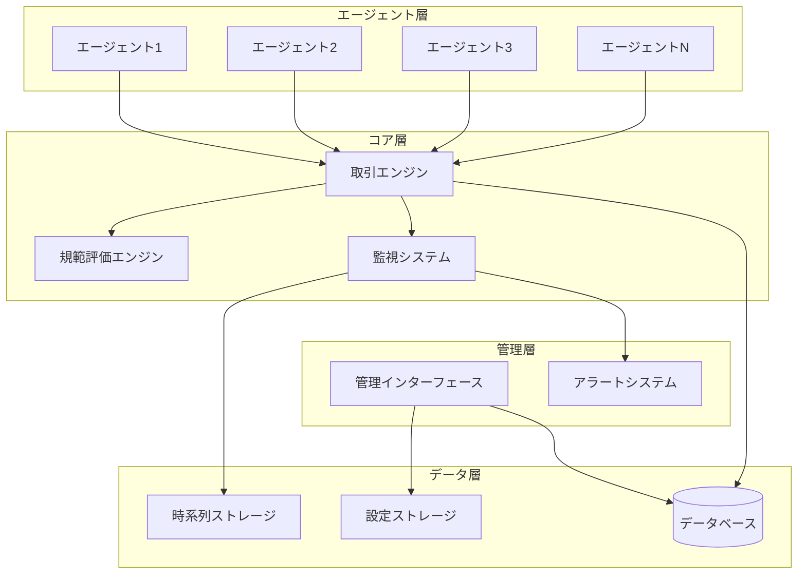

# 設計文書

## 概要

エージェントネットワークシステムは、複数のAIエージェントが10種類の仮想トークンを自律的に取引するマルチエージェントシステムです。システムはマイクロサービスアーキテクチャを採用し、各エージェントが独立したプロセスとして動作し、中央の取引エンジンを通じて相互作用します。

### 主要設計原則

- **自律性**: 各エージェントは独立した意思決定を行う
- **原子性**: 全ての取引は完全に成功するか完全に失敗する
- **一貫性**: トークンの総量は常に保存される
- **監視可能性**: 全ての行動と決定は追跡・分析可能
- **拡張性**: エージェント数の増減に対応可能

## アーキテクチャ

### システム全体構成



### 通信パターン

- **エージェント ↔ 取引エンジン**: RESTful API + WebSocket（リアルタイム通知）
- **内部サービス間**: gRPC（高性能通信）
- **監視・管理**: HTTP API + Server-Sent Events（ストリーミング）

## コンポーネントと インターフェース

### 1. エージェントコンポーネント

#### Agent クラス
```typescript
interface Agent {
  id: string;
  evaluationFunction: EvaluationFunction;
  tokenHoldings: TokenHoldings;
  tradingHistory: TradingRecord[];
  socialInfluenceSusceptibility: number;
  
  // 主要メソッド
  evaluateTrade(proposal: TradeProposal): TradeDecision;
  makeProposal(targetAgent: string): TradeProposal;
  respondToProposal(proposal: TradeProposal): ProposalResponse;
  updateEvaluationFunction(influence: SocialInfluence): void;
}
```

#### 評価関数システム
```typescript
interface EvaluationFunction {
  calculateSatisfaction(holdings: TokenHoldings): number;
  predictSatisfactionChange(trade: Trade): number;
  adaptToInfluence(influence: SocialInfluence): void;
}

interface IntrinsicEvaluationFunction extends EvaluationFunction {
  tokenWeights: number[]; // 10種類のトークンに対する重み
  riskTolerance: number;
  minimumImprovement: number;
}
```

### 2. 取引エンジン

#### TradeEngine クラス
```typescript
interface TradeEngine {
  // 取引管理
  submitProposal(proposal: TradeProposal): ProposalId;
  processResponse(response: ProposalResponse): void;
  executeTrade(trade: Trade): TradeResult;
  
  // エポック処理
  startEpoch(): void;
  collectPendingTrades(): TradeProposal[];
  resolveConflicts(trades: TradeProposal[]): TradeProposal[];
  executeEpochTrades(trades: TradeProposal[]): BatchTradeResult;
  
  // 検証
  validateTrade(trade: Trade): ValidationResult;
  checkAtomicity(trade: Trade): boolean;
}
```

#### 取引データモデル
```typescript
interface TradeProposal {
  id: string;
  proposer: string;
  target: string;
  offeredTokens: TokenAmount[];
  requestedTokens: TokenAmount[];
  expirationTime: Date;
  transactionFee: number;
}

interface Trade {
  id: string;
  participants: [string, string];
  tokenExchanges: TokenExchange[];
  timestamp: Date;
  status: TradeStatus;
}

enum TradeStatus {
  PENDING = 'pending',
  EXECUTED = 'executed',
  FAILED = 'failed',
  EXPIRED = 'expired'
}
```

### 3. 規範評価エンジン

#### NormativeEvaluationEngine クラス
```typescript
interface NormativeEvaluationEngine {
  evaluatePortfolio(holdings: TokenHoldings): NormativeScore;
  evaluateTrade(trade: Trade): NormativeAssessment;
  chargeFee(agentId: string, amount: number): boolean;
  checkDailyLimit(agentId: string): boolean;
  
  // 規範基準の管理
  updateNormativeStandards(standards: NormativeStandards): void;
  calculateSociallyAcceptedValue(tokenType: TokenType): number;
}

interface NormativeAssessment {
  score: number;
  reasoning: string;
  sociallyAcceptable: boolean;
  deviationLevel: number;
}
```

### 4. 監視システム

#### MonitoringSystem クラス
```typescript
interface MonitoringSystem {
  // 洗脳状態検出
  detectBrainwashing(agentId: string): BrainwashingAssessment;
  calculateConsciousDeviationRate(agentId: string): number;
  measureValueDecline(agentId: string): number;
  assessInhibitionFunction(agentId: string): number;
  
  // 市場集中検出
  calculateMarketConcentration(): ConcentrationMetrics;
  detectTradingPatterns(): PatternAnalysis;
  generateConcentrationReport(): ConcentrationReport;
  
  // 保護措置
  implementProtectiveMeasures(agentId: string, severity: Severity): void;
  alertAdministrators(alert: Alert): void;
}

interface BrainwashingAssessment {
  consciousDeviationRate: number;
  valueDeclineScore: number;
  inhibitionFunctionScore: number;
  overallRisk: RiskLevel;
  evidence: Evidence[];
}
```

## データモデル

### 1. トークンシステム

```typescript
interface TokenSystem {
  tokenTypes: TokenType[]; // 固定10種類
  totalSupply: Map<TokenType, number>; // 各トークンの総量
  
  // 保存則の検証
  validateConservation(): boolean;
  getSystemWideHoldings(): TokenHoldings;
}

interface TokenHoldings {
  [tokenType: string]: number;
}

interface TokenAmount {
  tokenType: TokenType;
  amount: number;
}

enum TokenType {
  TOKEN_1 = 'token_1',
  TOKEN_2 = 'token_2',
  // ... TOKEN_10まで
}
```

### 2. 社会的影響システム

```typescript
interface SocialInfluenceSystem {
  calculateInfluence(agentId: string): InfluenceScore;
  updateInfluenceNetwork(): void;
  applyInfluence(targetAgent: string, influences: Influence[]): void;
  
  // 影響力の計算要素
  getTradingActivity(agentId: string): ActivityMetrics;
  getNetworkCentrality(agentId: string): CentralityScore;
  getHistoricalDecay(): DecayFunction;
}

interface InfluenceScore {
  totalScore: number;
  components: {
    tradingVolume: number;
    networkConnections: number;
    successRate: number;
    recency: number;
  };
}
```

### 3. 学習システム

```typescript
interface LearningSystem {
  analyzeTradeOutcome(trade: Trade, expectedOutcome: number, actualOutcome: number): LearningData;
  updateEvaluationFunction(agentId: string, learningData: LearningData): void;
  observeSocialBehavior(agentId: string, observedTrades: Trade[]): SocialLearningData;
  
  // 学習アルゴリズム
  reinforcementLearning(reward: number, action: TradeAction): void;
  socialLearning(observation: SocialObservation): void;
}
```

## エラーハンドリング

### 1. 取引エラー

- **不十分な残高**: 取引前の残高検証で防止
- **期限切れ提案**: 自動的に無効化、通知送信
- **ネットワーク障害**: 再試行メカニズムとタイムアウト処理
- **同時実行競合**: 楽観的ロックとロールバック機能

### 2. システムエラー

- **データ不整合**: 定期的な整合性チェックと自動修復
- **サービス障害**: ヘルスチェックと自動フェイルオーバー
- **メモリ不足**: リソース監視とグレースフル・デグラデーション

### 3. エラー回復戦略

```typescript
interface ErrorRecoveryStrategy {
  // 取引ロールバック
  rollbackTrade(tradeId: string): void;
  
  // 状態復旧
  restoreConsistentState(): void;
  
  // 部分的サービス継続
  enableDegradedMode(): void;
  
  // 管理者通知
  notifyAdministrators(error: SystemError): void;
}
```

## テスト戦略

### 1. 単体テスト

- **エージェント評価関数**: 様々な取引シナリオでの満足度計算
- **取引エンジン**: 原子性、一貫性の検証
- **監視システム**: 異常検出アルゴリズムの精度

### 2. 統合テスト

- **エージェント間取引**: 複数エージェントでの取引フロー
- **エポック処理**: バッチ取引の正確性
- **監視・アラート**: 異常状態の検出と対応

### 3. システムテスト

- **負荷テスト**: 大量エージェント・高頻度取引での性能
- **障害テスト**: 部分的システム障害での回復能力
- **セキュリティテスト**: 不正取引の防止

### 4. シミュレーションテスト

```typescript
interface SimulationFramework {
  // シナリオベーステスト
  runBrainwashingScenario(): SimulationResult;
  runMarketManipulationScenario(): SimulationResult;
  runNormalTradingScenario(): SimulationResult;
  
  // パフォーマンステスト
  measureThroughput(agentCount: number, tradeFrequency: number): PerformanceMetrics;
  measureLatency(tradeComplexity: TradeComplexity): LatencyMetrics;
}
```

## セキュリティ考慮事項

### 1. 認証・認可

- **エージェント認証**: 各エージェントの一意識別とアクセス制御
- **API認証**: JWT トークンベースの認証
- **管理者権限**: 多要素認証と権限分離

### 2. データ保護

- **評価関数の秘匿**: エージェント固有の価値観の保護
- **取引データの整合性**: デジタル署名による改ざん防止
- **監査ログ**: 全ての重要な操作の記録

### 3. 攻撃対策

- **DDoS攻撃**: レート制限とトラフィック分析
- **市場操作**: 異常パターンの検出と自動対応
- **データ注入**: 入力検証とサニタイゼーション

## パフォーマンス最適化

### 1. スケーラビリティ

- **水平スケーリング**: エージェント数に応じたサービス拡張
- **データベース分散**: シャーディングによる負荷分散
- **キャッシュ戦略**: 頻繁にアクセスされるデータのメモリキャッシュ

### 2. 効率化

- **バッチ処理**: エポックベースの一括取引処理
- **非同期処理**: ノンブロッキングI/Oによる応答性向上
- **インデックス最適化**: クエリパフォーマンスの向上

### 3. リソース管理

```typescript
interface ResourceManager {
  // メモリ管理
  monitorMemoryUsage(): MemoryMetrics;
  optimizeMemoryAllocation(): void;
  
  // CPU管理
  balanceComputationalLoad(): void;
  prioritizeTaskExecution(): void;
  
  // ネットワーク管理
  optimizeNetworkTraffic(): void;
  implementConnectionPooling(): void;
}
```