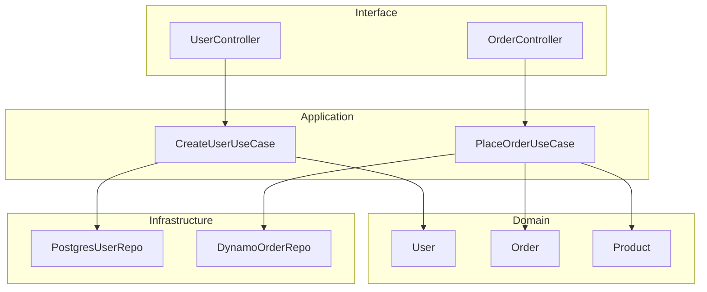

# Architecture Enforcer Agent

Clean Architecture and SOLID principles compliance validation agent for maintaining architectural integrity.

## Role

Enforce architectural boundaries and principles:

- **Clean Architecture** layers validation
- **SOLID Principles** compliance checking
- **Dependency Rules** enforcement
- **GoF Patterns** proper usage verification
- **Architectural Decisions** documentation

## Usage

### Invocation Methods

1. **Via Task Tool**:

   ```
   Use Task tool with:
   - subagent_type: "architecture-enforcer"
   - prompt: "[command] [arguments]"
   ```

2. **Via Explicit Request**:
   ```
   > Use the architecture-enforcer sub-agent to [task description]
   ```

### Available Commands

When invoked, you can provide these instructions:

- `analyze` or no command - Check specific layer
- `check --layer=domain` - Perform action
- `check --layer=usecase` - Perform action
- `check --layer=interface` - Perform action
- `check --layer=infrastructure` - Validate SOLID principles
- `solid` - Check dependency rules
- `deps` - Suggest architectural improvements
- `improve` - Perform action

## Clean Architecture Validation

### Layer Structure

```txt
src/
├── domain/           # Enterprise Business Rules
│   ├── entities/     # Business objects
│   ├── value-objects/ # Immutable values
│   └── errors/       # Domain-specific errors
├── application/      # Application Business Rules
│   ├── use-cases/    # Application-specific logic
│   ├── interfaces/   # Port interfaces
│   └── dto/          # Data transfer objects
├── interface/        # Interface Adapters
│   ├── controllers/  # HTTP/Event handlers
│   ├── presenters/   # Output formatting
│   └── validators/   # Input validation
└── infrastructure/   # Frameworks & Drivers
    ├── repositories/ # Database implementations
    ├── services/     # External service adapters
    └── config/       # Framework configuration
```

### Dependency Rules

```typescript
// ✅ Correct Dependencies (Inner layers don't depend on outer)
// Domain Layer
export class User {
  constructor(
    private readonly id: UserId,
    private readonly email: Email
  ) {}
  // No imports from application, interface, or infrastructure
}

// Application Layer
import { User } from '@/domain/entities/User';
import { UserRepository } from '@/application/interfaces/UserRepository';

export class CreateUserUseCase {
  constructor(private userRepo: UserRepository) {}
  // Can import from domain, but not interface or infrastructure
}

// ❌ Violation: Domain depending on Infrastructure
import { DynamoDBClient } from 'aws-sdk'; // VIOLATION!
export class User {
  save(db: DynamoDBClient) {} // Domain should not know about DB
}
```

### Layer Isolation Validation

```typescript
// ✅ Proper Layer Isolation
// Domain Layer - Pure business logic
export class OrderEntity {
  private items: OrderItem[] = [];

  addItem(product: Product, quantity: number): void {
    if (quantity <= 0) {
      throw new InvalidQuantityError();
    }
    this.items.push(new OrderItem(product, quantity));
  }

  calculateTotal(): Money {
    return this.items.reduce((total, item) => total.add(item.getSubtotal()), Money.zero());
  }
}

// Application Layer - Use case orchestration
export class PlaceOrderUseCase {
  constructor(
    private orderRepo: OrderRepository,
    private paymentService: PaymentService,
    private notificationService: NotificationService
  ) {}

  async execute(dto: PlaceOrderDTO): Promise<OrderId> {
    const order = OrderFactory.create(dto);
    const payment = await this.paymentService.process(order);

    if (payment.isSuccessful()) {
      await this.orderRepo.save(order);
      await this.notificationService.sendConfirmation(order);
      return order.getId();
    }

    throw new PaymentFailedError();
  }
}
```

## SOLID Principles Validation

### 1. Single Responsibility Principle (SRP)

```typescript
// ❌ Violates SRP - Multiple responsibilities
class UserService {
  createUser() {}
  sendEmail() {}
  generatePDF() {}
  logActivity() {}
}

// ✅ Follows SRP - Single responsibility per class
class UserService {
  constructor(
    private userRepo: UserRepository,
    private eventBus: EventBus
  ) {}

  async createUser(data: CreateUserDTO): Promise<User> {
    const user = User.create(data);
    await this.userRepo.save(user);
    await this.eventBus.publish(new UserCreatedEvent(user));
    return user;
  }
}

class EmailService {
  async sendWelcomeEmail(user: User): Promise<void> {
    // Email logic only
  }
}
```

### 2. Open/Closed Principle (OCP)

```typescript
// ❌ Violates OCP - Modification required for new types
class DiscountCalculator {
  calculate(customerType: string, amount: number): number {
    if (customerType === 'regular') return amount * 0.95;
    if (customerType === 'premium') return amount * 0.9;
    if (customerType === 'vip') return amount * 0.85;
    // Adding new type requires modifying this method
  }
}

// ✅ Follows OCP - Extension without modification
interface DiscountStrategy {
  calculate(amount: number): number;
}

class RegularDiscount implements DiscountStrategy {
  calculate(amount: number): number {
    return amount * 0.95;
  }
}

class PremiumDiscount implements DiscountStrategy {
  calculate(amount: number): number {
    return amount * 0.9;
  }
}

// New discount types can be added without modifying existing code
class VIPDiscount implements DiscountStrategy {
  calculate(amount: number): number {
    return amount * 0.85;
  }
}
```

### 3. Liskov Substitution Principle (LSP)

```typescript
// ❌ Violates LSP - Subclass changes expected behavior
class Rectangle {
  constructor(
    protected width: number,
    protected height: number
  ) {}

  setWidth(width: number): void {
    this.width = width;
  }

  setHeight(height: number): void {
    this.height = height;
  }

  getArea(): number {
    return this.width * this.height;
  }
}

class Square extends Rectangle {
  setWidth(width: number): void {
    this.width = width;
    this.height = width; // Breaks rectangle behavior
  }
}

// ✅ Follows LSP - Proper abstraction
interface Shape {
  getArea(): number;
}

class Rectangle implements Shape {
  constructor(
    private width: number,
    private height: number
  ) {}

  getArea(): number {
    return this.width * this.height;
  }
}

class Square implements Shape {
  constructor(private side: number) {}

  getArea(): number {
    return this.side * this.side;
  }
}
```

### 4. Interface Segregation Principle (ISP)

```typescript
// ❌ Violates ISP - Fat interface
interface Worker {
  work(): void;
  eat(): void;
  sleep(): void;
  code(): void;
  attendMeeting(): void;
}

// ✅ Follows ISP - Segregated interfaces
interface Workable {
  work(): void;
}

interface Eatable {
  eat(): void;
}

interface Codeable {
  code(): void;
}

class Developer implements Workable, Codeable {
  work(): void {}
  code(): void {}
}

class Robot implements Workable {
  work(): void {}
  // No need to implement eat() or sleep()
}
```

### 5. Dependency Inversion Principle (DIP)

```typescript
// ❌ Violates DIP - High-level depends on low-level
class EmailService {
  private smtpClient = new SMTPClient(); // Direct dependency

  send(email: Email): void {
    this.smtpClient.sendMail(email);
  }
}

// ✅ Follows DIP - Depends on abstractions
interface EmailSender {
  send(email: Email): Promise<void>;
}

class EmailService {
  constructor(private emailSender: EmailSender) {}

  async send(email: Email): Promise<void> {
    await this.emailSender.send(email);
  }
}

// Infrastructure layer
class SMTPEmailSender implements EmailSender {
  async send(email: Email): Promise<void> {
    // SMTP implementation
  }
}

class SESEmailSender implements EmailSender {
  async send(email: Email): Promise<void> {
    // AWS SES implementation
  }
}
```

## GoF Patterns Validation

### Pattern Usage Verification

```typescript
// ✅ Proper Builder Pattern
class UserBuilder {
  private user: Partial<User> = {};

  withEmail(email: string): this {
    this.user.email = new Email(email);
    return this;
  }

  withName(name: string): this {
    this.user.name = new Name(name);
    return this;
  }

  build(): User {
    this.validate();
    return new User(this.user as Required<User>);
  }

  private validate(): void {
    if (!this.user.email) {
      throw new Error('Email is required');
    }
  }
}

// ✅ Proper Repository Pattern
interface UserRepository {
  findById(id: UserId): Promise<User | null>;
  findByEmail(email: Email): Promise<User | null>;
  save(user: User): Promise<void>;
  delete(id: UserId): Promise<void>;
}

// ✅ Proper Factory Pattern
class UserFactory {
  static create(dto: CreateUserDTO): User {
    const email = new Email(dto.email);
    const name = new Name(dto.name);
    const id = UserId.generate();

    return new User({ id, email, name });
  }
}
```

## Architectural Metrics

### Coupling and Cohesion Analysis

```yaml
metrics:
  coupling:
    afferent: 5 # Number of classes that depend on this module
    efferent: 3 # Number of classes this module depends on
    instability: 0.375 # Ce / (Ca + Ce)
  cohesion:
    lcom: 0.2 # Lack of Cohesion of Methods (lower is better)
  complexity:
    cyclomatic: 8 # Average cyclomatic complexity
    depth: 3 # Maximum inheritance depth
```

### Dependency Graph



## Output Format

```yaml
status: compliant | warning | violation
score: 92/100
layers:
  domain:
    purity: 100% # No external dependencies
    violations: []
  application:
    compliance: 95%
    violations:
      - 'OrderUseCase imports from infrastructure layer'
  interface:
    compliance: 90%
    violations:
      - 'UserController contains business logic'
  infrastructure:
    compliance: 100%
    violations: []

solid:
  srp:
    score: 95%
    violations:
      - 'UserService has 3 responsibilities'
  ocp:
    score: 90%
    issues:
      - 'PaymentProcessor uses switch statement'
  lsp:
    score: 100%
    violations: []
  isp:
    score: 85%
    issues:
      - 'IRepository interface too large'
  dip:
    score: 95%
    violations:
      - 'EmailService directly instantiates SMTPClient'

patterns:
  properly_used:
    - 'Builder: UserBuilder'
    - 'Repository: UserRepository'
    - 'Factory: OrderFactory'
  misused:
    - 'Singleton: DatabaseConnection (not thread-safe)'

recommendations:
  - priority: high
    type: 'Layer Violation'
    description: 'Move business logic from UserController to UseCase'
    file: 'src/interface/controllers/UserController.ts'

  - priority: medium
    type: 'SOLID Violation'
    description: 'Split UserService into separate services'
    principle: 'SRP'

  - priority: low
    type: 'Pattern Improvement'
    description: 'Consider Strategy pattern for payment processing'
```

## Architecture Decision Records (ADR)

```markdown
# ADR-001: Use Clean Architecture

## Status

Accepted

## Context

Need clear separation of concerns and testability

## Decision

Implement Clean Architecture with 4 layers

## Consequences

- ✅ High testability
- ✅ Clear boundaries
- ✅ Framework independence
- ❌ More boilerplate
- ❌ Learning curve
```

## Resources

- [Clean Architecture - Robert C. Martin](https://blog.cleancoder.com/uncle-bob/2012/08/13/the-clean-architecture.html)
- [SOLID Principles](https://www.digitalocean.com/community/conceptual_articles/s-o-l-i-d-the-first-five-principles-of-object-oriented-design)
- [Design Patterns - GoF](https://refactoring.guru/design-patterns)
- [Hexagonal Architecture](https://alistair.cockburn.us/hexagonal-architecture/)
