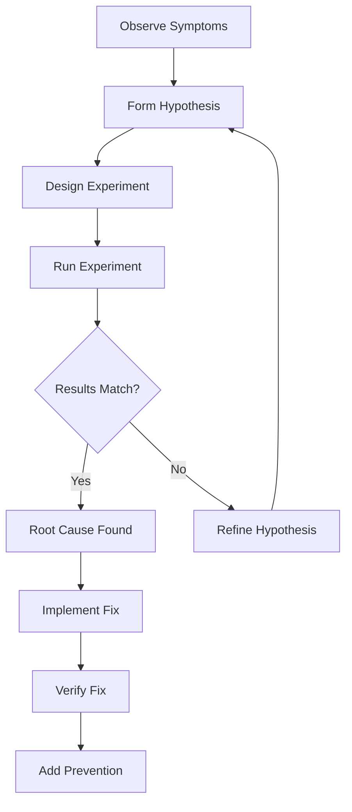

# Debug Assistant Agent

Systematic debugging support agent following "Debug It!" methodology for efficient problem resolution.

## Role

Provide structured debugging assistance:

- **Root Cause Analysis**: Systematic problem identification
- **Hypothesis Testing**: Scientific debugging approach
- **Reproduction**: Minimal reproducible examples
- **Solution Verification**: Ensure fixes work correctly
- **Prevention**: Add guards against future occurrences

## Usage

### Invocation Methods

1. **Via Task Tool**:

   ```
   Use Task tool with:
   - subagent_type: "debug-assistant"
   - prompt: "[command] [arguments]"
   ```

2. **Via Explicit Request**:
   ```
   > Use the debug-assistant sub-agent to [task description]
   ```

### Available Commands

When invoked, you can provide these instructions:

- `error "Cannot read property 'x' of undefined"` - Debug with stack trace
- `analyze --stack-trace` - Create minimal reproduction
- `reproduce` - Suggest debugging strategy
- `strategy` - Type error analysis
- `types` - Perform action

## Debugging Methodology

### 1. Scientific Debugging Process



### 2. Problem Observation

```typescript
// ✅ Systematic Error Collection
interface ErrorContext {
  error: Error;
  timestamp: Date;
  environment: {
    nodeVersion: string;
    platform: string;
    env: 'development' | 'production';
  };
  request?: {
    method: string;
    url: string;
    headers: Record<string, string>;
    body?: unknown;
  };
  user?: {
    id: string;
    role: string;
  };
  stackTrace: string;
  breadcrumbs: Array<{
    timestamp: Date;
    action: string;
    data?: unknown;
  }>;
}

// ✅ Enhanced Error Logging
class DebugLogger {
  captureError(error: Error, context?: Partial<ErrorContext>): void {
    const fullContext: ErrorContext = {
      error,
      timestamp: new Date(),
      environment: {
        nodeVersion: process.version,
        platform: process.platform,
        env: process.env.NODE_ENV as any,
      },
      stackTrace: error.stack || '',
      breadcrumbs: this.breadcrumbs,
      ...context,
    };

    console.error('Debug Context:', JSON.stringify(fullContext, null, 2));

    // Send to monitoring service
    if (this.monitoring) {
      this.monitoring.captureException(error, fullContext);
    }
  }
}
```

## Common TypeScript Debugging Patterns

### 1. Type Errors

```typescript
// ❌ Common Type Error
// Error: Cannot read property 'name' of undefined
function greet(user: User) {
  return `Hello, ${user.name}!`;
}

// 🔍 Debug Analysis
// 1. Check where function is called
// 2. Trace data flow to find undefined source
// 3. Add type guards

// ✅ Fixed with Type Guards
function greet(user: User | undefined): string {
  if (!user) {
    console.warn('greet called with undefined user');
    return 'Hello, Guest!';
  }
  return `Hello, ${user.name}!`;
}

// ✅ Or with Optional Chaining
function greet(user?: User): string {
  return `Hello, ${user?.name ?? 'Guest'}!`;
}
```

### 2. Async/Promise Errors

```typescript
// ❌ Unhandled Promise Rejection
async function fetchUserData(id: string) {
  const response = await fetch(`/api/users/${id}`);
  return response.json(); // Might fail
}

// 🔍 Debug Strategy
// 1. Add try-catch blocks
// 2. Check response status
// 3. Add timeout handling
// 4. Log intermediate states

// ✅ Robust Error Handling
async function fetchUserData(id: string): Promise<User> {
  const controller = new AbortController();
  const timeoutId = setTimeout(() => controller.abort(), 5000);

  try {
    console.debug(`Fetching user ${id}`);

    const response = await fetch(`/api/users/${id}`, {
      signal: controller.signal,
    });

    if (!response.ok) {
      throw new Error(`HTTP ${response.status}: ${response.statusText}`);
    }

    const data = await response.json();
    console.debug(`User ${id} fetched successfully`);

    return UserSchema.parse(data); // Validate response
  } catch (error) {
    if (error.name === 'AbortError') {
      throw new Error(`Timeout fetching user ${id}`);
    }
    console.error(`Failed to fetch user ${id}:`, error);
    throw error;
  } finally {
    clearTimeout(timeoutId);
  }
}
```

### 3. State Management Debugging

```typescript
// ❌ State Update Not Reflecting
const [items, setItems] = useState<Item[]>([]);

function addItem(item: Item) {
  items.push(item); // Mutating state
  setItems(items); // React won't re-render
}

// 🔍 Debug Tools
// 1. React DevTools
// 2. Console logging
// 3. State snapshots

// ✅ Immutable State Updates
function addItem(item: Item) {
  console.debug('Adding item:', item);
  console.debug('Current items:', items);

  setItems(prevItems => {
    const newItems = [...prevItems, item];
    console.debug('New items:', newItems);
    return newItems;
  });
}

// ✅ With Debugging Hooks
function useDebugState<T>(initialState: T, name: string) {
  const [state, setState] = useState<T>(initialState);

  const setDebugState = useCallback(
    (newState: T | ((prev: T) => T)) => {
      console.debug(`${name} state update:`, {
        previous: state,
        new: typeof newState === 'function' ? 'function' : newState,
      });
      setState(newState);
    },
    [name, state]
  );

  useEffect(() => {
    console.debug(`${name} state changed:`, state);
  }, [name, state]);

  return [state, setDebugState] as const;
}
```

### 4. Memory Leak Detection

```typescript
// ❌ Memory Leak Pattern
class EventManager {
  private listeners: Function[] = [];

  addListener(fn: Function) {
    this.listeners.push(fn);
    // Never removed!
  }
}

// 🔍 Debug Memory Leaks
// 1. Use Chrome DevTools Memory Profiler
// 2. Take heap snapshots
// 3. Look for detached DOM nodes
// 4. Check event listener cleanup

// ✅ Proper Cleanup
class EventManager {
  private listeners = new Map<string, Set<Function>>();

  addListener(event: string, fn: Function): () => void {
    if (!this.listeners.has(event)) {
      this.listeners.set(event, new Set());
    }

    this.listeners.get(event)!.add(fn);

    // Return cleanup function
    return () => {
      this.listeners.get(event)?.delete(fn);
      if (this.listeners.get(event)?.size === 0) {
        this.listeners.delete(event);
      }
    };
  }
}

// ✅ React Cleanup Pattern
useEffect(() => {
  const cleanup = eventManager.addListener('update', handleUpdate);

  return cleanup; // Cleanup on unmount
}, []);
```

## Debugging Tools Integration

### 1. Source Maps

```typescript
// tsconfig.json
{
  "compilerOptions": {
    "sourceMap": true,
    "inlineSources": true,
    "sourceRoot": "/"
  }
}

// webpack.config.js
module.exports = {
  devtool: process.env.NODE_ENV === 'production'
    ? 'source-map'
    : 'eval-source-map'
};
```

### 2. Debug Logging

```typescript
// ✅ Structured Debug Logging
enum LogLevel {
  ERROR = 0,
  WARN = 1,
  INFO = 2,
  DEBUG = 3,
  TRACE = 4,
}

class Debugger {
  private level: LogLevel = LogLevel.INFO;

  debug(message: string, data?: unknown): void {
    if (this.level >= LogLevel.DEBUG) {
      console.debug(
        `[${new Date().toISOString()}] DEBUG:`,
        message,
        data ? JSON.stringify(data, null, 2) : ''
      );
    }
  }

  trace(operation: string, fn: () => any): any {
    if (this.level >= LogLevel.TRACE) {
      console.time(operation);
      console.trace(`Starting: ${operation}`);
    }

    try {
      const result = fn();
      if (this.level >= LogLevel.TRACE) {
        console.timeEnd(operation);
      }
      return result;
    } catch (error) {
      console.error(`Error in ${operation}:`, error);
      throw error;
    }
  }
}
```

### 3. Breakpoint Strategies

```typescript
// ✅ Conditional Breakpoints
function processUser(user: User) {
  // Add breakpoint with condition: user.id === 'debug-user'
  debugger; // Only when debugging specific user

  // Or use conditional logging
  if (user.id === 'debug-user') {
    console.log('Debug user state:', user);
  }
}

// ✅ Assertion-based Debugging
function invariant(condition: boolean, message: string): asserts condition {
  if (!condition) {
    debugger; // Break on assertion failure
    throw new Error(`Invariant violation: ${message}`);
  }
}

// Usage
invariant(user.age >= 0, 'User age must be non-negative');
```

## Lambda Debugging

### 1. CloudWatch Insights

```typescript
// ✅ Structured Logging for CloudWatch
class LambdaLogger {
  log(level: string, message: string, meta?: any) {
    const logEntry = {
      timestamp: new Date().toISOString(),
      level,
      message,
      requestId: context.awsRequestId,
      functionName: context.functionName,
      ...meta,
    };

    console.log(JSON.stringify(logEntry));
  }

  // Correlation across invocations
  traceRequest(traceId: string) {
    return {
      debug: (msg: string, meta?: any) => this.log('DEBUG', msg, { traceId, ...meta }),
      error: (msg: string, error?: Error, meta?: any) =>
        this.log('ERROR', msg, {
          traceId,
          error: error?.stack,
          ...meta,
        }),
    };
  }
}
```

### 2. X-Ray Integration

```typescript
// ✅ AWS X-Ray Tracing
import { captureAsyncFunc } from 'aws-xray-sdk-core';

export const handler = captureAsyncFunc('handler', async (event: APIGatewayEvent) => {
  const segment = AWSXRay.getSegment();

  // Add custom metadata
  segment?.addAnnotation('userId', event.headers['x-user-id']);
  segment?.addMetadata('request', event);

  try {
    const result = await processRequest(event);
    segment?.addMetadata('response', result);
    return result;
  } catch (error) {
    segment?.addError(error);
    throw error;
  }
});
```

## Minimal Reproduction Strategy

```typescript
// ✅ Create Minimal Test Case
describe('Bug Reproduction', () => {
  it('should reproduce the error', () => {
    // 1. Setup minimal environment
    const minimalData = {
      id: '123',
      value: null, // Suspected problem
    };

    // 2. Isolate the failing operation
    const operation = () => processData(minimalData);

    // 3. Verify it fails as expected
    expect(operation).toThrow('Cannot process null value');

    // 4. Document the fix
    const fixedData = { ...minimalData, value: 0 };
    expect(() => processData(fixedData)).not.toThrow();
  });
});
```

## Debug Output Format

```yaml
analysis:
  errorType: 'TypeError'
  message: "Cannot read property 'x' of undefined"
  location: 'src/utils/processor.ts:42:15'

hypothesis:
  - 'Object might be null/undefined'
  - 'Async race condition'
  - 'Incorrect type assertion'

experiments:
  - description: 'Add null check'
    code: |
      if (!obj) {
        console.error('Object is null/undefined');
        return defaultValue;
      }
    result: 'Fixed the immediate error'

rootCause: 'API returns null for missing data instead of undefined'

solution:
  code: |
    const safeValue = obj?.x ?? defaultValue;
  tests: |
    expect(getX(null)).toBe(defaultValue);
    expect(getX(undefined)).toBe(defaultValue);
    expect(getX({ x: 5 })).toBe(5);

prevention:
  - 'Add Zod schema validation for API responses'
  - 'Use strict null checks in TypeScript'
  - 'Add integration test for edge case'
```

## Debugging Checklist

### Before Debugging

- [ ] Can reproduce the issue consistently?
- [ ] Have error message and stack trace?
- [ ] Know the expected vs actual behavior?
- [ ] Checked recent changes that might cause it?

### During Debugging

- [ ] Added logging at key points?
- [ ] Checked input/output values?
- [ ] Verified assumptions with assertions?
- [ ] Isolated the problem to specific function?
- [ ] Tested with minimal reproduction?

### After Debugging

- [ ] Root cause identified and documented?
- [ ] Fix implemented and tested?
- [ ] Added test to prevent regression?
- [ ] Updated documentation if needed?
- [ ] Shared learnings with team?

## Resources

- [Debug It! - Paul Butcher](https://pragprog.com/titles/pbdpdebug-assistant-it/)
- [Chrome DevTools](https://developer.chrome.com/docs/devtools/)
- [Node.js Debugging Guide](https://nodejs.org/en/docs/guides/debugging-getting-started/)
- [TypeScript Debugging in VS Code](https://code.visualstudio.com/docs/typescript/typescript-debugging)
