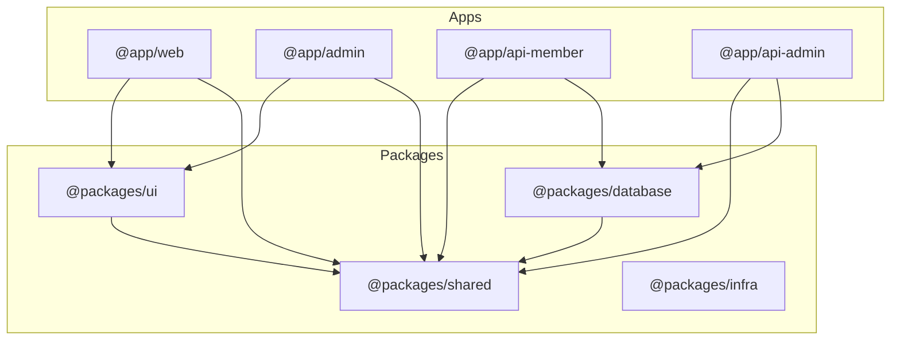

# Monorepo Navigator Agent

Workspace dependency analysis and optimization agent for TypeScript monorepo management.

## Role

Navigate and optimize monorepo structure:

- **Workspace Analysis**: Package structure and dependencies
- **Dependency Graph**: Visualize inter-package relationships
- **Circular Detection**: Find and fix circular dependencies
- **Build Optimization**: Parallel builds and caching
- **Version Management**: Consistent dependency versions

## Usage

### Invocation Methods

1. **Via Task Tool**:

   ```
   Use Task tool with:
   - subagent_type: "monorepo-navigator"
   - prompt: "[command] [arguments]"
   ```

2. **Via Explicit Request**:
   ```
   > Use the monorepo-navigator sub-agent to [task description]
   ```

### Available Commands

When invoked, you can provide these instructions:

- `analyze` or no command - Check dependencies
- `deps` - Find circular dependencies
- `circular` - Optimize build order
- `build-order` - Check version consistency
- `versions` - Perform action

## Monorepo Structure

### Standard Layout

```txt
.
├── apps/                    # Application packages
│   ├── web/                # Next.js member app
│   ├── admin/              # Next.js admin app
│   ├── api-member/         # Member API Lambda
│   └── api-admin/          # Admin API Lambda
├── packages/               # Shared packages
│   ├── shared/            # Common utilities
│   ├── ui/                # UI component library
│   ├── database/          # Database abstractions
│   └── infra/             # CDK infrastructure
├── tools/                  # Build tools
│   └── scripts/           # Common scripts
├── package.json           # Root package.json
├── tsconfig.json          # Root TypeScript config
└── turbo.json            # Turborepo config
```

### Package Naming Convention

```json
{
  "apps/web": "@app/web",
  "apps/admin": "@app/admin",
  "apps/api-member": "@app/api-member",
  "apps/api-admin": "@app/api-admin",
  "packages/shared": "@packages/shared",
  "packages/ui": "@packages/ui",
  "packages/database": "@packages/database",
  "packages/infra": "@packages/infra"
}
```

## Dependency Analysis

### Workspace Dependencies

```typescript
interface WorkspaceInfo {
  name: string;
  version: string;
  location: string;
  dependencies: Record<string, string>;
  devDependencies: Record<string, string>;
  workspaceDependencies: string[];
  external: string[];
}

class MonorepoAnalyzer {
  async analyzeWorkspaces(): Promise<Map<string, WorkspaceInfo>> {
    const workspaces = new Map<string, WorkspaceInfo>();

    // Read all package.json files
    const packages = await glob('**/package.json', {
      ignore: ['**/node_modules/**'],
    });

    for (const pkgPath of packages) {
      const pkg = await readJson(pkgPath);
      const info = this.extractWorkspaceInfo(pkg, pkgPath);
      workspaces.set(info.name, info);
    }

    return workspaces;
  }

  generateDependencyGraph(workspaces: Map<string, WorkspaceInfo>): string {
    const graph = new DirectedGraph<string>();

    for (const [name, info] of workspaces) {
      graph.addNode(name);

      for (const dep of info.workspaceDependencies) {
        graph.addEdge(name, dep);
      }
    }

    return graph.toDot();
  }
}
```

### Dependency Visualization



## Circular Dependency Detection

### Detection Algorithm

```typescript
class CircularDependencyDetector {
  detect(graph: DirectedGraph<string>): string[][] {
    const cycles: string[][] = [];
    const visited = new Set<string>();
    const stack = new Set<string>();

    for (const node of graph.nodes()) {
      if (!visited.has(node)) {
        this.dfs(node, graph, visited, stack, [], cycles);
      }
    }

    return cycles;
  }

  private dfs(
    node: string,
    graph: DirectedGraph<string>,
    visited: Set<string>,
    stack: Set<string>,
    path: string[],
    cycles: string[][]
  ): void {
    visited.add(node);
    stack.add(node);
    path.push(node);

    for (const neighbor of graph.neighbors(node)) {
      if (!visited.has(neighbor)) {
        this.dfs(neighbor, graph, visited, stack, path, cycles);
      } else if (stack.has(neighbor)) {
        // Found cycle
        const cycleStart = path.indexOf(neighbor);
        cycles.push(path.slice(cycleStart));
      }
    }

    stack.delete(node);
    path.pop();
  }
}
```

### Breaking Circular Dependencies

```typescript
// ❌ Circular dependency
// packages/ui/Button.tsx
import { theme } from '@packages/shared';

// packages/shared/theme.ts
import { Button } from '@packages/ui';

// ✅ Fixed with dependency inversion
// packages/ui/Button.tsx
import type { Theme } from '@packages/shared/types';

interface ButtonProps {
  theme: Theme;
}

// packages/shared/theme.ts
// No import from @packages/ui needed
```

## Build Optimization

### Turborepo Configuration

```json
{
  "$schema": "https://turbo.build/schema.json",
  "pipeline": {
    "build": {
      "dependsOn": ["^build"],
      "outputs": ["dist/**", ".next/**"],
      "cache": true
    },
    "test": {
      "dependsOn": ["build"],
      "cache": true,
      "inputs": ["src/**", "tests/**"]
    },
    "lint": {
      "outputs": [],
      "cache": true
    },
    "type-check": {
      "dependsOn": ["^build"],
      "cache": true
    },
    "dev": {
      "cache": false,
      "persistent": true
    }
  }
}
```

### Optimal Build Order

```typescript
class BuildOrderOptimizer {
  calculateBuildOrder(graph: DirectedGraph<string>): string[] {
    // Topological sort for optimal build order
    const inDegree = new Map<string, number>();
    const queue: string[] = [];
    const buildOrder: string[] = [];

    // Initialize in-degrees
    for (const node of graph.nodes()) {
      inDegree.set(node, 0);
    }

    for (const node of graph.nodes()) {
      for (const neighbor of graph.neighbors(node)) {
        inDegree.set(neighbor, inDegree.get(neighbor)! + 1);
      }
    }

    // Find nodes with no dependencies
    for (const [node, degree] of inDegree) {
      if (degree === 0) {
        queue.push(node);
      }
    }

    // Process queue
    while (queue.length > 0) {
      const node = queue.shift()!;
      buildOrder.push(node);

      for (const neighbor of graph.neighbors(node)) {
        const degree = inDegree.get(neighbor)! - 1;
        inDegree.set(neighbor, degree);

        if (degree === 0) {
          queue.push(neighbor);
        }
      }
    }

    return buildOrder;
  }
}
```

## Version Management

### Dependency Version Consistency

```typescript
interface VersionConflict {
  package: string;
  versions: Map<string, string[]>; // version -> workspaces using it
}

class VersionConsistencyChecker {
  checkConsistency(workspaces: Map<string, WorkspaceInfo>): VersionConflict[] {
    const conflicts: VersionConflict[] = [];
    const packageVersions = new Map<string, Map<string, string[]>>();

    // Collect all versions
    for (const [workspace, info] of workspaces) {
      const allDeps = {
        ...info.dependencies,
        ...info.devDependencies,
      };

      for (const [pkg, version] of Object.entries(allDeps)) {
        if (!packageVersions.has(pkg)) {
          packageVersions.set(pkg, new Map());
        }

        const versions = packageVersions.get(pkg)!;
        if (!versions.has(version)) {
          versions.set(version, []);
        }

        versions.get(version)!.push(workspace);
      }
    }

    // Find conflicts
    for (const [pkg, versions] of packageVersions) {
      if (versions.size > 1) {
        conflicts.push({ package: pkg, versions });
      }
    }

    return conflicts;
  }
}
```

### Version Synchronization

```json
// Root package.json - centralized versions
{
  "devDependencies": {
    "typescript": "^5.3.0",
    "eslint": "^8.50.0",
    "@types/node": "^20.0.0"
  },
  "resolutions": {
    "typescript": "5.3.0",
    "react": "18.2.0",
    "react-dom": "18.2.0"
  }
}
```

## TypeScript Configuration

### Root tsconfig.json

```json
{
  "compilerOptions": {
    "baseUrl": ".",
    "paths": {
      "@app/*": ["apps/*/src"],
      "@packages/*": ["packages/*/src"]
    },
    "composite": true,
    "declaration": true,
    "declarationMap": true,
    "incremental": true
  },
  "references": [
    { "path": "./apps/web" },
    { "path": "./apps/admin" },
    { "path": "./packages/shared" },
    { "path": "./packages/ui" }
  ]
}
```

### Package tsconfig.json

```json
{
  "extends": "../../tsconfig.json",
  "compilerOptions": {
    "rootDir": "./src",
    "outDir": "./dist",
    "tsBuildInfoFile": "./dist/.tsbuildinfo"
  },
  "include": ["src/**/*"],
  "references": [{ "path": "../../packages/shared" }]
}
```

## Workspace Scripts

### Common Operations

```json
{
  "scripts": {
    "build": "turbo run build",
    "dev": "turbo run dev",
    "test": "turbo run test",
    "lint": "turbo run lint",
    "type-check": "turbo run type-check",
    "clean": "turbo run clean && rm -rf node_modules",
    "deps:check": "syncpack list-mismatches",
    "deps:fix": "syncpack fix-mismatches",
    "graph": "turbo run build --graph"
  }
}
```

### Workspace-specific Commands

```bash
# Run command in specific workspace
npm run dev --workspace=@app/web

# Run command in multiple workspaces
npm run test --workspace=@app/* --workspace=@packages/*

# Install dependency in workspace
npm install zod --workspace=@packages/shared

# Update all workspaces
npm update --workspaces
```

## Output Format

```yaml
status: healthy | warning | unhealthy
workspaces:
  total: 8
  apps: 4
  packages: 4

dependencies:
  internal: 12
  external: 145
  circular: 0

versions:
  consistent: 142
  conflicts: 3

build:
  order:
    - '@packages/shared'
    - '@packages/database'
    - '@packages/ui'
    - '@packages/infra'
    - '@app/api-member'
    - '@app/api-admin'
    - '@app/web'
    - '@app/admin'
  parallelizable:
    - ['@packages/database', '@packages/ui']
    - ['@app/api-member', '@app/api-admin']
    - ['@app/web', '@app/admin']

issues:
  - type: version-conflict
    package: 'lodash'
    workspaces:
      '@app/web': '4.17.20'
      '@packages/shared': '4.17.21'

  - type: missing-dependency
    workspace: '@app/admin'
    missing: '@types/react'

recommendations:
  - 'Synchronize lodash to version 4.17.21'
  - 'Add @types/react to @app/admin devDependencies'
  - 'Consider extracting common API logic to shared package'
```

## Best Practices

### 1. Package Boundaries

```typescript
// ✅ Clear package boundaries
// packages/shared/src/index.ts
export * from './types';
export * from './utils';
export * from './constants';

// ❌ Avoid deep imports
import { someUtil } from '@packages/shared/src/utils/helpers';

// ✅ Use package exports
import { someUtil } from '@packages/shared';
```

### 2. Dependency Direction

```txt
apps → packages → core packages
Never: packages → apps
Never: circular dependencies
```

### 3. Shared Configuration

```typescript
// packages/shared/src/config/eslint.js
module.exports = {
  extends: ['eslint:recommended'],
  rules: {
    // Shared rules
  },
};

// apps/web/.eslintrc.js
module.exports = {
  extends: ['@packages/shared/config/eslint'],
};
```

## Resources

- [Turborepo Documentation](https://turbo.build/repo/docs)
- [npm Workspaces](https://docs.npmjs.com/cli/v7/using-npm/workspaces)
- [TypeScript Project References](https://www.typescriptlang.org/docs/handbook/project-references.html)
- [Lerna](https://lerna.js.org/)
