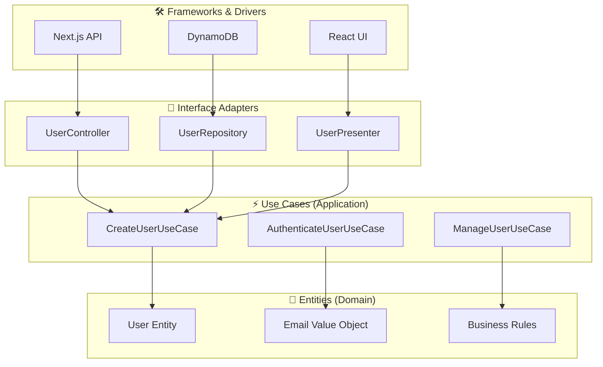
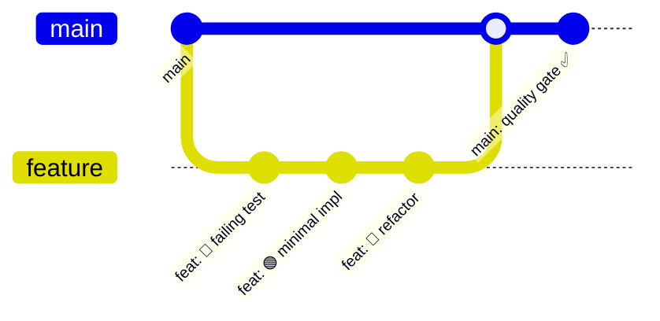

# Design Document

## Overview

サーバレスアプリケーションテンプレートプロジェクトは、**究極の型安全開発環境**を基盤とした、TypeScriptベースのフルスタックサーバレスアプリケーションを迅速に開始するための包括的なテンプレートです。**実行時エラーを設計時に排除する**ことを最優先目標とし、保守性・拡張性・安全性を最大化します。

## Core Philosophy: Ultimate Type Safety

### 🎯 Zero Runtime Error Strategy

```typescript
// ❌ 従来の危険なコード（実行時エラーの温床）
function processUser(user: any) {
  return user.name.toUpperCase(); // 実行時エラーの可能性
}

// ✅ 究極の型安全アプローチ
function processUser(user: User): string {
  const name = user.getName(); // User.getName()は必ず文字列を返すことが保証
  return name.toUpperCase(); // 100%安全
}
```

### 🔬 Type-Driven Development Principles

1. **Design by Contract**: 型がコントラクト、実装がその証明
2. **Fail Fast Principle**: コンパイル時に全ての問題を発見
3. **Defensive Programming**: 型システムによる境界での完全な防御

### Key Features

- **🎯 Ultimate Type Safety**: `any`完全排除、null安全性、Promise安全性を実現する究極の型安全開発環境
- **🚀 TDD-First**: t_wadaのTDD practicesに基づく、テストファーストな開発環境
- **🏗️ Clean Architecture**: SOLID原則とClean Architectureによる保守性の最大化
- **🐳 Docker-Native**: 一貫した開発環境をDocker Composeで提供
- **📚 Self-Documenting**: 型とTSDocによる自己文書化コード
- **☁️ Serverless-First**: 12-Factor App準拠のサーバレスアーキテクチャ

## Requirements Analysis

### Requirement 1: CDK Infrastructure Template

**User Story**: 開発者として、サーバレスアプリケーションの基盤となるインフラストラクチャを迅速にセットアップしたい

**Design Response**:

- **オプション機能対応**: プロジェクト初期化時に非同期Job・スケジュールタスク機能の選択的有効化
- **統一インフラ管理**: 単一CDKプロジェクトで全リソース（CloudFront+S3×2、API Gateway+Lambda×2、DynamoDB、S3）を管理
- **ビヘイビア分離**: CloudFrontレベルでメンバー画面（`/*`）・管理画面（`/admin/*`）・API（`/api/*`）を適切に振り分け
- **機能別Lambda**: メンバーAPI用・管理API用・非同期Job用・スケジュール用の明確な責任分離

**Implementation**: → [`impl/infrastructure/cdk-stacks.md`](impl/infrastructure/cdk-stacks.md)

### Requirement 2: Ultimate Type Safety with ESLint

**User Story**: 開発者として、型安全で高品質なコードを書きたい

**Design Response**:

#### 🎯 Ultimate Type Safety Architecture

**Level 1: Complete `any` Elimination**

- `@typescript-eslint/no-explicit-any: 'error'` - 明示的`any`の完全禁止
- `@typescript-eslint/no-unsafe-*: 'error'` - unsafe操作（assignment・call・return等）の全面禁止
- **哲学**: `any`型は型システムの穴であり、実行時エラーの最大要因。完全排除により予測可能なコードを実現

**Level 2: Function Boundary Safety**

- `@typescript-eslint/explicit-module-boundary-types: 'error'` - モジュール境界での型明示強制
- **哲学**: モジュール境界は契約であり、型がその契約の仕様書。内部実装では型推論を活用し、公開APIでのみ型を明示化

**Level 3: Null/Undefined Complete Safety**

- `@typescript-eslint/no-non-null-assertion: 'error'` - `!`演算子の完全禁止
- `@typescript-eslint/prefer-nullish-coalescing: 'error'` - `??`演算子の強制使用
- `@typescript-eslint/prefer-optional-chain: 'error'` - `?.`演算子の強制使用
- **哲学**: null・undefinedは「10億ドルの間違い」。型システムレベルでの完全な安全性保証により、NullPointerExceptionを設計時に排除

**Level 4: Promise/Async Complete Safety**

- `@typescript-eslint/await-thenable: 'error'` - awaitableでない値のawait禁止
- `@typescript-eslint/no-floating-promises: 'error'` - 未処理Promiseの完全禁止
- `@typescript-eslint/no-misused-promises: 'error'` - Promise誤用（条件式・forEach等）の禁止
- `@typescript-eslint/require-await: 'error'` - async関数内でのawait強制
- **哲学**: 非同期処理は複雑性の源泉。Promise安全性により、非同期バグを設計時に発見・防止

**Level 5: Code Quality Gates**

- `complexity: ['error', 15]` - 複雑度15以下強制（認知負荷の制限）
- `max-lines-per-function: ['error', { max: 100 }]` - 関数100行以下強制（実用的な単一責任の原則）
- `max-lines: ['error', { max: 300 }]` - ファイル300行以下強制（モジュールサイズ制御）
- `no-console: 'error'` - デバッグコードの本番流入防止
- **哲学**: 量的制約による質的向上。Claude Code生成に最適化された実用的な制約により、理解可能で保守可能なコードを強制

**Level 6: Exhaustiveness Checking**

- `@typescript-eslint/switch-exhaustiveness-check: 'error'` - switch文の網羅性チェック
- **哲学**: Claude Codeの論理的思考を支援。全ケースの網羅により、エッジケースの見落としを防止

**Level 7: Dependency Management**

- `import/order`, `import/no-cycle`, `import/no-duplicates` - モジュール依存関係の厳格管理
- **哲学**: モジュール境界の明確化により、結合度を最小化し、保守性を最大化

**Level 8: Automatic Code Formatting**

- **Prettier統合**: ESLintとPrettierの完全な統合による一貫したコードフォーマット
- **保存時自動実行**: VS Code・エディタでの保存時自動フォーマット
- **Pre-commit enforcement**: Git hookによるフォーマット済みコードの強制
- **チーム統一**: 開発者間での完全に統一されたコードスタイル
- **哲学**: コードスタイルの議論を排除し、開発者がビジネスロジックに集中できる環境を構築

#### 🛡️ Zero Runtime Error Philosophy

この究極型安全性戦略の最終目標は**実行時エラーをゼロにする**ことです：

```typescript
// ❌ 従来アプローチ（実行時エラーのリスク）
function processUserData(data: any) {
  const user = data.user; // undefined可能性
  return user.name.toUpperCase(); // 実行時クラッシュの可能性
}

// ✅ 究極型安全アプローチ（実行時エラー不可能）
interface UserData {
  readonly user: {
    readonly name: string;
  };
}

function processUserData(data: UserData): string {
  return data.user.name.toUpperCase(); // 100%安全保証
}
```

**Implementation**: → [`impl/type-safety/eslint-strategy.md`](impl/type-safety/eslint-strategy.md)

### Requirement 3: Next.js + shadcn/ui + Tailwind CSS

**User Story**: 開発者として、フロントエンドとバックエンドの両方でNext.jsを使用したい

**Design Response**:

- **統一Next.js環境**: フロントエンド（メンバー・管理）とバックエンドAPI（メンバー・管理）で一貫したNext.js使用
- **Design System**: shadcn/uiベースの統一デザインシステムによる一貫したUI/UX
- **型安全CSS**: Tailwind CSSの型安全な活用とコンポーネント駆動開発
- **コンポーネント戦略**: 再利用可能なUIコンポーネントライブラリの構築

**Implementation**: → [`impl/ui/shadcn-tailwind.md`](impl/ui/shadcn-tailwind.md)

### Requirement 4: Zod Schema + OpenAPI Auto-generation

**User Story**: 開発者として、APIの型安全性とドキュメント生成を自動化したい

**Design Response**:

- **Schema-First API**: Zodスキーマを真実の源泉（Single Source of Truth）とするAPI設計
- **型安全バリデーション**: リクエスト・レスポンス・データベースの全境界での型安全なバリデーション
- **自動ドキュメント生成**: zod-to-openapiによるOpenAPI仕様の自動生成・同期
- **統一スキーマ戦略**: バリデーション・型定義・ドキュメント・テストでの単一スキーマ活用

**Implementation**: → [`impl/api/zod-schemas.md`](impl/api/zod-schemas.md)

### Requirement 5: Comprehensive Testing Environment

**User Story**: 開発者として、コードの品質を保証したい

**Design Response**:

- **TDD-First Development**: t_wadaのTDD practicesに基づくRED-GREEN-BLUEサイクル
- **Test Pyramid Strategy**: ユニット80%・統合15%・E2E5%の効率的テスト配分
- **型安全テスト**: テストコード自体も究極の型安全性を適用
- **包括的カバレッジ**: Jest（ユニット）・RTL（コンポーネント）・Cypress（E2E）の完全統合

**Implementation**: → [`impl/testing/test-pyramid.md`](impl/testing/test-pyramid.md)

### Requirement 6: Automatic Documentation Generation

**User Story**: 開発者として、コードドキュメントを自動生成したい

**Design Response**:

- **TSDoc標準化**: 全パブリックAPIでのTSDoc強制による自己文書化
- **自動生成パイプライン**: TypeDocによるコードドキュメント自動生成・デプロイ
- **スキーマ連動**: Zodスキーマ変更時のAPI文書自動更新
- **構造化ドキュメント**: アーキテクチャ・開発・デプロイガイドの体系的整理

**Implementation**: → [`impl/api/zod-schemas.md`](impl/api/zod-schemas.md)

### Requirement 7: Google OAuth Authentication

**User Story**: エンドユーザーとして、Googleアカウントでログインしたい

**Design Response**:

- **OAuth 2.0 + PKCE**: セキュアなGoogle OAuth認証フローの実装
- **JWT戦略**: ステートレスなJWTトークンによるセッション管理
- **DynamoDB統合**: Single Table Designによる効率的なユーザーデータ管理
- **型安全認証**: 認証フロー全体での型安全性保証

**Implementation**: → [`impl/auth/google-oauth.md`](impl/auth/google-oauth.md)

### Requirement 8: Admin CRUD Operations

**User Story**: 管理者として、ユーザーの作成・読み取り・更新・削除を行いたい

**Design Response**:

- **権限ベースアクセス制御**: 管理者権限の厳格な検証・制御
- **型安全CRUD**: 全CRUD操作での型安全性とバリデーション
- **リアルタイムフィードバック**: 操作結果の即座な画面反映とユーザーフィードバック
- **監査ログ**: 管理操作の完全な追跡・記録

**Implementation**: → [`impl/auth/admin-crud.md`](impl/auth/admin-crud.md)

### Requirement 9: Template Project Quick Start

**User Story**: 開発者として、プロジェクトを迅速に開始したい

**Design Response**:

- **対話式初期化**: `npm run init`による機能選択・環境設定の自動化
- **サンプル実装**: 認証・CRUD機能の完全な動作例提供
- **自動セットアップ**: 依存関係・環境設定・初期デプロイの完全自動化
- **即座開発開始**: クローン後数分で開発開始可能な完全環境

**Implementation**: → [`impl/workflow/project-init.md`](impl/workflow/project-init.md)

### Requirement 10: Docker Development Environment

**User Story**: 開発者として、一貫した開発環境で作業したい

**Design Response**:

- **完全コンテナ化**: 全アプリケーション・サービスのDocker化
- **Profile機能**: オプション機能の選択的起動による効率的開発
- **ホットリロード**: コード変更のリアルタイム反映
- **環境一貫性**: 開発・CI/CD・本番環境での同一Docker環境保証
- **node:22-bookworm基盤**: Debian 12ベースの安定したNode.js環境

**Implementation**:

- → [`impl/docker/dockerfile-strategy.md`](impl/docker/dockerfile-strategy.md) - Node.js 22 Bookwormベースのマルチステージビルド戦略
- → [`impl/docker/compose-architecture.md`](impl/docker/compose-architecture.md) - Profile機能を活用した柔軟な開発環境
- → [`impl/docker/security-hardening.md`](impl/docker/security-hardening.md) - コンテナセキュリティ強化策

## Architecture Strategy

### Clean Architecture + SOLID + GoF Patterns Implementation



**SOLID Principles Implementation**:

- **Single Responsibility**: 各クラス・関数が単一の明確な責任を持つ
- **Open/Closed**: 拡張に開放、修正に閉鎖（インターフェース駆動設計）
- **Liskov Substitution**: 派生クラスが基底クラスと置換可能
- **Interface Segregation**: 細粒度インターフェースによる依存関係最小化
- **Dependency Inversion**: 抽象に依存、具象に依存しない

**GoF Patterns Strategy**:

- **Builder Pattern**: 複雑なドメインオブジェクトの段階的構築とバリデーション
- **Strategy Pattern**: テーマ切り替え・認証プロバイダー選択の柔軟な実装
- **Facade Pattern**: 複雑なAPI操作の単純化・統一インターフェース提供
- **Repository Pattern**: データアクセス層の抽象化・テスタビリティ向上

**DRY Principles (Don't Repeat Yourself)**:

- **Code Duplication Elimination**: 共通ロジックのユーティリティ関数・フック化
- **Configuration Centralization**: 環境設定・定数の一元管理
- **Component Reusability**: 再利用可能UIコンポーネントライブラリ
- **Schema Sharing**: Zodスキーマの全境界での統一活用

**Design Principles**:

- **依存関係の逆転**: 全層が内側の層に依存、外側からの依存なし
- **単一責任**: 各層・各クラスが明確で単一の責任を持つ
- **テスタビリティ**: 全ビジネスロジックが独立してテスト可能
- **保守性最大化**: 変更影響範囲の局所化と予測可能性

**Implementation**: 実装ドキュメント準備中

### 12-Factor App Compliance

| Factor                   | Implementation Strategy        |
| ------------------------ | ------------------------------ |
| **I. Codebase**          | 単一モノレポ、環境別デプロイ   |
| **II. Dependencies**     | package.json + Docker分離      |
| **III. Config**          | 環境変数による設定外部化       |
| **IV. Backing Services** | サービス抽象化・接続可能性     |
| **V. Build/Release/Run** | 厳格な段階分離                 |
| **VI. Processes**        | ステートレスプロセス           |
| **VII. Port Binding**    | ポートバインディング           |
| **VIII. Concurrency**    | プロセスモデルスケーリング     |
| **IX. Disposability**    | 高速起動・優雅なシャットダウン |
| **X. Dev/Prod Parity**   | 環境一致の最大化               |
| **XI. Logs**             | イベントストリーム化           |
| **XII. Admin Processes** | ワンオフプロセス               |

**Implementation**: 実装ドキュメント準備中

## Technical Decisions

### Type Safety Architecture

**Decision**: TypeScriptの型システムを最大限活用し、実行時エラーを設計時に排除

**Rationale**:

- `.eslintrc.js`で示される究極の型安全性追求
- あらゆる`any`型の排除による予測可能なコード
- null/undefined安全性による堅牢性向上
- 開発効率と品質の両立

### Database Design Strategy

**Decision**: DynamoDB Single Table Designによるスケーラブルなデータ管理

**Rationale**:

- サーバレス環境での最適なパフォーマンス
- スケーラビリティとコスト効率の両立
- 型安全なクエリパターンの実現

### Authentication Strategy

**Decision**: Google OAuth + JWT + DynamoDBによるステートレス認証

**Rationale**:

- エンドユーザーの利便性（既存Googleアカウント活用）
- セキュリティベストプラクティス準拠
- サーバレス環境でのステートレス性

### UI Framework Strategy

**Decision**: Next.js + shadcn/ui + Tailwind CSSによる統一開発体験

**Rationale**:

- フロントエンド・バックエンドの技術統一
- 型安全なCSS（Tailwind CSS）
- 再利用可能なコンポーネントシステム
- 開発者体験の最大化

## Development Workflow

### GitHub Flow Implementation



**Atomic Commit Strategy**:

- **TDD Cycle**: RED→GREEN→BLUE各段階でのatomic commit
- **Quality Gates**: pre-commit hooks + CI/CDでの品質保証
- **Zero Tolerance**: lint error・type error・test failureの完全排除

**Implementation**: → [`impl/workflow/github-flow.md`](impl/workflow/github-flow.md)

### Quality Assurance Pipeline

```yaml
Quality Gates:
  Pre-commit:
    - TypeScript type check
    - ESLint (zero warnings)
    - Unit tests (90%+ coverage)
    - Knip (unused code detection)

  CI/CD:
    - Integration tests
    - E2E tests
    - Security scan
    - Performance audit

  Pre-deploy:
    - Smoke tests
    - Health checks
    - Rollback readiness
```

## Implementation Bridges

### Quick Start Implementation Path

1. **Project Initialization** → [`impl/workflow/project-init.md`](impl/workflow/project-init.md)
2. **Type Safety Setup** → [`impl/type-safety/eslint-strategy.md`](impl/type-safety/eslint-strategy.md)
3. **Authentication Flow** → [`impl/auth/google-oauth.md`](impl/auth/google-oauth.md)
4. **UI Components** → [`impl/ui/shadcn-tailwind.md`](impl/ui/shadcn-tailwind.md)
5. **API Development** → [`impl/api/zod-schemas.md`](impl/api/zod-schemas.md)
6. **Testing Strategy** → [`impl/testing/test-pyramid.md`](impl/testing/test-pyramid.md)
7. **Infrastructure Deployment** → [`impl/infrastructure/cdk-stacks.md`](impl/infrastructure/cdk-stacks.md)

### Key Implementation Files

| Component          | Primary Implementation | Supporting Files                                                |
| ------------------ | ---------------------- | --------------------------------------------------------------- |
| **Type Safety**    | `impl/type-safety/`    | `.eslintrc.js`, `tsconfig.json`                                 |
| **Authentication** | `impl/auth/`           | `packages/shared/src/auth/`                                     |
| **UI System**      | `impl/ui/`             | `packages/ui/src/components/`                                   |
| **API Layer**      | `impl/api/`            | `apps/api-member/src/handlers/`, `apps/api-admin/src/handlers/` |
| **Database**       | 実装ドキュメント準備中  | `packages/shared/src/repository/`                               |
| **Infrastructure** | `impl/infrastructure/` | `packages/infra/lib/`                                           |
| **Docker**         | `impl/docker/`         | `docker/`, `compose.yml`, `.dockerignore`                       |
| **Testing**        | `impl/testing/`        | `**/*.test.ts`, `cypress/`                                      |
| **Workflow**       | `impl/workflow/`       | `.github/workflows/`, `.husky/`                                 |

### Success Metrics

**Type Safety Metrics**:

- ESLint Errors: 0 (zero tolerance)
- ESLint Warnings: 0 (zero tolerance)
- TypeScript Errors: 0 (zero tolerance)
- Test Coverage: 90%+ (high quality assurance)

**Development Velocity Metrics**:

- Time to First Deploy: <30 minutes (from clone to deployment)
- Developer Onboarding: <1 hour (from zero to productive)
- Feature Development Cycle: TDD RED-GREEN-BLUE in <2 hours

**Quality Metrics**:

- Production Runtime Errors: Target 0 (ultimate type safety goal)
- Security Vulnerabilities: 0 (defensive programming)
- Performance: Core Web Vitals 90+ (optimized user experience)

---

_This design document provides the architectural foundation and strategic direction for implementation. For concrete code examples and detailed configurations, refer to the linked implementation files in the [`impl/`](impl/) directory._
