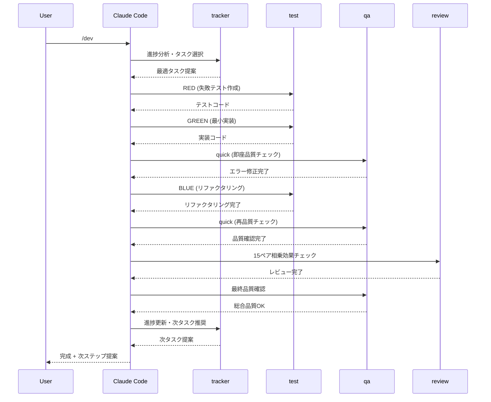
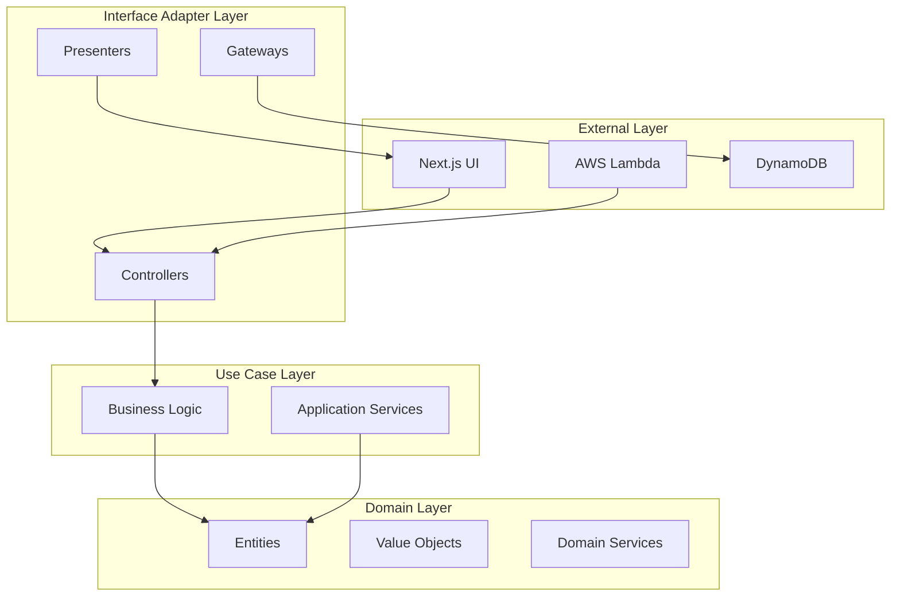
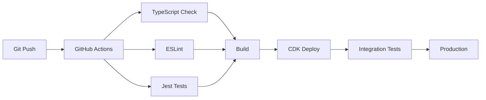

# 🏗️ システムアーキテクチャ

Claude Code自動化環境の詳細なアーキテクチャと設計思想です。

## 🎯 アーキテクチャ概要

### 全体構成
```mermaid
graph TB
    subgraph "Claude Code Environment"
        R[requirement.md<br/>要件定義] --> DS[design.md<br/>設計]
        DS --> T[tasks/<br/>タスク分割]
        T --> P[/dev command<br/>開発実行]
        A[CLAUDE.md<br/>6キーワード最適化] --> P
        B[prompt.md<br/>実行プロンプト] --> P
        P --> C[12-SubAgent System]
    end
    
    subgraph "Quality Layers"
        D[Phase 1: Solution Research<br/>Don't Reinvent the Wheel]
        E[Phase 2: Design Foundation<br/>UNIX + KISS + TypeScript]
        F[Phase 3: Implementation Quality<br/>DRY + Orthogonality]
    end
    
    subgraph "SubAgent Categories"
        G[Core Development<br/>test, review, security]
        H[Quality Assurance<br/>architect, typesafe, qa]
        I[Infrastructure<br/>perf, docker, monorepo]
        J[Support<br/>debug, guide, tracker]
    end
    
    A --> D
    D --> E
    E --> F
    C --> G
    C --> H
    C --> I
    C --> J
```

## 🧠 6キーワード最適化システム

### Phase-Based Quality Application

#### レイヤー分離設計
```yaml
Process Layer (SubAgent):
  - TDD自動化: test-creator.md
  - 品質ゲート: qa.md
  - 進捗管理: tracker.md
  
Quality Layer (CLAUDE.md):
  - Phase 1: Don't Reinvent the Wheel
  - Phase 2: UNIX + KISS + Effective TypeScript  
  - Phase 3: DRY + Orthogonality
```

#### 責任分離の利点
1. **認知負荷軽減**: プロセス vs 品質の明確分離
2. **拡張性**: 各レイヤー独立進化
3. **メンテナンス性**: 責任範囲明確化

### 15ペア相乗効果マトリクス

#### 数学的根拠
```
6キーワード = C(6,2) = 15通りの組み合わせ
各ペアが創発的品質向上を実現
```

#### 主要相乗効果
```yaml
High-Impact Synergies:
  1. DRY × Orthogonality: 適切な抽象化粒度
  2. UNIX × KISS: 強化されたシンプリシティ確信  
  3. KISS × Effective TypeScript: 実用的型設計
  4. Don't Reinvent × Effective TypeScript: ライブラリ型活用
  5. Orthogonality × UNIX: 完璧なモジュラー設計
```

## 🤖 12-SubAgent システム

### アーキテクチャ分類

#### Core Development Agents
```yaml
test-creator:
  role: TDD自動化
  features: RED-GREEN-BLUE cycle, 6キーワード統合
  input: 要件・機能仕様
  output: テスト + 実装コード

code-reviewer:  
  role: 品質レビュー
  features: 15ペア相乗効果チェック, SOLID原則
  input: ソースコード
  output: 品質スコア + 改善提案

security-auditor:
  role: セキュリティ監査  
  features: OWASP Top 10, 脆弱性検出
  input: アプリケーションコード
  output: セキュリティレポート
```

#### Quality Assurance Agents
```yaml
architect:
  role: アーキテクチャ検証
  features: Clean Architecture, SOLID原則
  input: システム設計
  output: アーキテクチャ適合性レポート

typesafe:
  role: 型安全性強制
  features: 8レベル型安全性, any排除
  input: TypeScriptコード  
  output: 型安全性レポート + 修正提案

qa:
  role: 品質保証
  features: 包括的品質チェック
  input: 全成果物
  output: 総合品質レポート
```

#### Infrastructure & Optimization Agents
```yaml
perf:
  role: パフォーマンス最適化
  features: Core Web Vitals, サーバレス最適化
  input: アプリケーション
  output: パフォーマンス改善提案

monorepo:
  role: モノレポ管理
  features: 依存関係分析, ワークスペース最適化
  input: モノレポ構成
  output: 依存関係最適化提案

docker:
  role: コンテナ最適化
  features: Docker最適化, トラブルシューティング
  input: Dockerファイル・設定
  output: 最適化提案
```

#### Support Agents
```yaml
debug:
  role: デバッグ支援
  features: 体系的デバッグ, "Debug It!" 手法
  input: エラー・バグ報告
  output: デバッグ手順 + 解決策

guide:
  role: 実装ガイド
  features: ベストプラクティス提案
  input: 実装要件
  output: 実装ガイダンス

tracker:
  role: 進捗管理
  features: タスク管理, プログレス追跡
  input: プロジェクト状況
  output: 次タスク推奨
```

## 🔄 実行フローアーキテクチャ

### Standard Mode実行シーケンス


### エージェント間連携
```yaml
Synchronous (順次実行):
  - tracker → test → qa → review
  - 品質ゲート: qa (quick) 
  - エラー時: 即座中断・修正

Parallel (並列実行可能):
  - architect + typesafe (設計フェーズ)
  - security + perf (最適化フェーズ)
  - 大規模チェック時の効率化

Conditional (条件付き実行):
  - guide: 複雑実装時のみ
  - debug: エラー発生時のみ
  - docker: コンテナ使用時のみ
```

## 🎯 Type Safety Architecture

### 8-Level Type Safety System
```yaml
Level 1: Strict TypeScript
  - noImplicitAny: true
  - strict: true
  - 基本型安全性確保

Level 2: ESLint Enforcement (7層アーキテクチャ)
  - Layer 1: 完全な any 排除
  - Layer 2: 関数境界の安全性
  - Layer 3: Null/Undefined 完全安全性
  - Layer 4: Promise/Async 完全安全性
  - Layer 5: コード品質ゲート（複雑度制限）
  - Layer 6: ドキュメント強制
  - Layer 7: 依存関係管理
  - 実装: eslint.config.js

Level 3: Runtime Validation
  - Zod schemas
  - 実行時型検証

Level 4: Branded Types
  - type UserId = string & { __brand: 'UserId' }
  - ビジネスロジック型安全性

Level 5: Template Literal Types
  - type APIRoute = `/api/${string}`
  - コンパイル時文字列検証

Level 6: Conditional Types
  - type IsArray<T> = T extends any[] ? true : false
  - 複雑型ロジック

Level 7: Mapped Types
  - type Readonly<T> = { readonly [P in keyof T]: T[P] }
  - 型変換

Level 8: Type-Level Programming
  - 最高レベル型安全性
  - 不正状態をコンパイル時に排除
```

### Type Safety Integration
```typescript
// 例: 6キーワード × 型安全性統合
interface UserCreationCommand {
  // Don't Reinvent: 既存型ライブラリ活用
  readonly email: Email; // Branded type
  readonly name: NonEmptyString; // Template literal type
}

// UNIX: 単一責任
class UserCreator {
  // KISS: シンプルなインターフェース
  create(command: UserCreationCommand): Result<User, ValidationError> {
    // DRY: 共通バリデーション抽象化
    // Orthogonality: 他システムとの独立性
    // Effective TypeScript: 型レベル安全性
  }
}
```

## 🏢 Clean Architecture Integration

### レイヤー分離


### Dependency Rule
```yaml
Allowed Dependencies:
  - External → Interface Adapter ✅
  - Interface Adapter → Use Case ✅  
  - Use Case → Domain ✅

Prohibited Dependencies:
  - Domain → Use Case ❌
  - Use Case → Interface Adapter ❌
  - Domain → External ❌
```

## 🚀 Performance Architecture

### サーバレス最適化
```yaml
Lambda最適化:
  - Cold Start軽減: Provisioned Concurrency
  - メモリ最適化: 使用量に応じた設定
  - バンドルサイズ: Tree Shaking + 最小化

Next.js最適化:
  - Static Generation: ISR活用
  - Image Optimization: next/image
  - Code Splitting: Dynamic Import

CDK最適化:
  - リソース効率化: 適切なサイジング
  - コスト最適化: Reserved Capacity
  - モニタリング: CloudWatch統合
```

### Core Web Vitals
```yaml
LCP (Largest Contentful Paint):
  - Target: < 2.5s
  - 最適化: 画像最適化, CDN活用

FID (First Input Delay):
  - Target: < 100ms  
  - 最適化: Code Splitting, Worker活用

CLS (Cumulative Layout Shift):
  - Target: < 0.1
  - 最適化: レイアウト安定化
```

## 🔒 Security Architecture

### 多層防御
```yaml
Application Layer:
  - Input Validation: Zod schemas
  - Authentication: JWT + Refresh Token
  - Authorization: RBAC

API Layer:
  - Rate Limiting: AWS API Gateway
  - CORS: 適切な設定
  - HTTPS: 全通信暗号化

Infrastructure Layer:
  - VPC: ネットワーク分離
  - IAM: 最小権限原則
  - CloudTrail: 監査ログ
```

### OWASP Top 10対応
```yaml
A01 - Broken Access Control:
  - 認可チェック自動化
  - リソースレベル権限制御

A02 - Cryptographic Failures:
  - AWS KMS活用
  - 適切な暗号化実装

A03 - Injection:
  - パラメータ化クエリ
  - 入力値検証
```

## 📊 Monitoring Architecture

### 3つの観測可能性
```yaml
Metrics (メトリクス):
  - CloudWatch Metrics
  - カスタムメトリクス
  - パフォーマンス指標

Logs (ログ):
  - CloudWatch Logs
  - 構造化ログ
  - エラートレーシング

Traces (トレース):
  - AWS X-Ray
  - 分散トレーシング
  - リクエスト追跡
```

## 🔧 Development Tooling Architecture

### CI/CD Pipeline


### Quality Gates
```yaml
Pre-commit:
  - TypeScript型チェック
  - ESLint
  - Prettier
  - Test実行

Pre-merge:
  - 全テスト実行
  - セキュリティスキャン
  - 依存関係監査

Pre-deploy:
  - 統合テスト
  - パフォーマンステスト
  - セキュリティテスト
```

---

**🏗️ 世界最高レベルのアーキテクチャ**

次は [`synergy-effects.md`](synergy-effects.md) で相乗効果詳細を確認してください。