# Google OAuth + JWT + DynamoDB Authentication Implementation

## Overview

Google OAuth 2.0 + PKCE、JWT、DynamoDBを組み合わせたステートレス認証システムの実装。member/admin両APIで統一された認証戦略を提供します。

## Authentication Flow

```mermaid
sequenceDiagram
    participant U as User
    participant F as Frontend
    participant A as API (member/admin)
    participant G as Google OAuth
    participant D as DynamoDB
    participant J as JWT Service

    U->>F: ログインボタンクリック
    F->>G: OAuth認証開始 (PKCE)
    G->>U: Google認証画面表示
    U->>G: 認証情報入力
    G->>F: 認証コード返却
    F->>A: 認証コード送信
    A->>G: トークン交換
    G->>A: ユーザー情報返却
    A->>D: ユーザー情報保存/更新
    A->>J: JWT生成
    J->>A: JWT返却
    A->>F: JWT + ユーザー情報返却
    F->>U: ログイン完了
```



## Core Implementation

### Google OAuth Configuration

```typescript
// packages/shared/src/config/oauth.ts
import { z } from 'zod';

const OAuthConfigSchema = z.object({
  google: z.object({
    clientId: z.string().min(1),
    clientSecret: z.string().min(1),
    redirectUri: z.string().url(),
    scopes: z.array(z.string()),
  }),
});

export const oauthConfig = OAuthConfigSchema.parse({
  google: {
    clientId: process.env.GOOGLE_CLIENT_ID!,
    clientSecret: process.env.GOOGLE_CLIENT_SECRET!,
    redirectUri: process.env.GOOGLE_REDIRECT_URI!,
    scopes: ['openid', 'email', 'profile'],
  },
});

export type OAuthConfig = z.infer<typeof OAuthConfigSchema>;
```

### JWT Service

```typescript
// packages/shared/src/services/jwt-service.ts
import jwt from 'jsonwebtoken';
import { z } from 'zod';
import { JWTPayloadSchema } from '../schemas/auth';

const JWT_CONFIG = {
  secret: process.env.JWT_SECRET!,
  expiresIn: '1h',
  refreshExpiresIn: '7d',
};

export class JWTService {
  /**
   * アクセストークンを生成
   */
  static generateAccessToken(payload: {
    userId: string;
    email: string;
    role: 'member' | 'admin';
  }): string {
    const jwtPayload = {
      ...payload,
      iat: Math.floor(Date.now() / 1000),
      exp: Math.floor(Date.now() / 1000) + 60 * 60, // 1時間
    };

    // JWTペイロードのバリデーション
    JWTPayloadSchema.parse(jwtPayload);

    return jwt.sign(jwtPayload, JWT_CONFIG.secret);
  }

  /**
   * リフレッシュトークンを生成
   */
  static generateRefreshToken(userId: string): string {
    return jwt.sign(
      {
        userId,
        type: 'refresh',
        iat: Math.floor(Date.now() / 1000),
        exp: Math.floor(Date.now() / 1000) + 60 * 60 * 24 * 7, // 7日間
      },
      JWT_CONFIG.secret
    );
  }

  /**
   * トークンを検証し、ペイロードを返す
   */
  static verifyAccessToken(token: string):
    | {
        success: true;
        payload: z.infer<typeof JWTPayloadSchema>;
      }
    | { success: false; error: string } {
    try {
      const decoded = jwt.verify(token, JWT_CONFIG.secret);

      // ペイロードの型安全性を保証
      const payload = JWTPayloadSchema.parse(decoded);

      return { success: true, payload };
    } catch (error) {
      if (error instanceof jwt.TokenExpiredError) {
        return { success: false, error: 'Token expired' };
      }
      if (error instanceof jwt.JsonWebTokenError) {
        return { success: false, error: 'Invalid token' };
      }
      return { success: false, error: 'Token verification failed' };
    }
  }

  /**
   * リフレッシュトークンを検証
   */
  static verifyRefreshToken(token: string):
    | {
        success: true;
        userId: string;
      }
    | { success: false; error: string } {
    try {
      const decoded = jwt.verify(token, JWT_CONFIG.secret) as any;

      if (decoded.type !== 'refresh') {
        return { success: false, error: 'Invalid refresh token' };
      }

      return { success: true, userId: decoded.userId };
    } catch (error) {
      return { success: false, error: 'Invalid refresh token' };
    }
  }
}
```

### Google OAuth Service

```typescript
// packages/shared/src/services/google-oauth-service.ts
import { OAuth2Client } from 'google-auth-library';
import { z } from 'zod';
import { oauthConfig } from '../config/oauth';

const GoogleUserInfoSchema = z.object({
  id: z.string(),
  email: z.string().email(),
  name: z.string(),
  picture: z.string().url().optional(),
  verified_email: z.boolean(),
});

export type GoogleUserInfo = z.infer<typeof GoogleUserInfoSchema>;

export class GoogleOAuthService {
  private static client = new OAuth2Client(
    oauthConfig.google.clientId,
    oauthConfig.google.clientSecret,
    oauthConfig.google.redirectUri
  );

  /**
   * Google OAuth認証URLを生成
   */
  static generateAuthUrl(state?: string): string {
    return this.client.generateAuthUrl({
      access_type: 'offline',
      scope: oauthConfig.google.scopes,
      state,
      // PKCE対応
      code_challenge_method: 'S256',
    });
  }

  /**
   * 認証コードからアクセストークンを取得
   */
  static async exchangeCodeForTokens(code: string): Promise<
    | {
        success: true;
        tokens: { access_token: string; id_token?: string };
      }
    | { success: false; error: string }
  > {
    try {
      const { tokens } = await this.client.getToken(code);

      if (!tokens.access_token) {
        return { success: false, error: 'No access token received' };
      }

      return {
        success: true,
        tokens: {
          access_token: tokens.access_token,
          id_token: tokens.id_token,
        },
      };
    } catch (error) {
      return { success: false, error: 'Failed to exchange code for tokens' };
    }
  }

  /**
   * Googleからユーザー情報を取得
   */
  static async getUserInfo(accessToken: string): Promise<
    | {
        success: true;
        userInfo: GoogleUserInfo;
      }
    | { success: false; error: string }
  > {
    try {
      this.client.setCredentials({ access_token: accessToken });

      const userInfoResponse = await fetch('https://www.googleapis.com/oauth2/v2/userinfo', {
        headers: {
          Authorization: `Bearer ${accessToken}`,
        },
      });

      if (!userInfoResponse.ok) {
        return { success: false, error: 'Failed to fetch user info' };
      }

      const userData = await userInfoResponse.json();

      // レスポンスの型安全性を保証
      const userInfo = GoogleUserInfoSchema.parse(userData);

      return { success: true, userInfo };
    } catch (error) {
      return { success: false, error: 'Failed to get user info' };
    }
  }

  /**
   * ID トークンを検証（JWT形式）
   */
  static async verifyIdToken(idToken: string): Promise<
    | {
        success: true;
        payload: any;
      }
    | { success: false; error: string }
  > {
    try {
      const ticket = await this.client.verifyIdToken({
        idToken,
        audience: oauthConfig.google.clientId,
      });

      const payload = ticket.getPayload();

      if (!payload) {
        return { success: false, error: 'Invalid ID token' };
      }

      return { success: true, payload };
    } catch (error) {
      return { success: false, error: 'ID token verification failed' };
    }
  }
}
```

### User Repository (DynamoDB)

```typescript
// packages/shared/src/repositories/user-repository.ts
import { DynamoDBClient } from '@aws-sdk/client-dynamodb';
import {
  DynamoDBDocumentClient,
  GetCommand,
  PutCommand,
  UpdateCommand,
  ScanCommand,
} from '@aws-sdk/lib-dynamodb';
import { v4 as uuidv4 } from 'uuid';
import { User, CreateUserInput } from '../schemas/user';

const client = new DynamoDBClient({});
const docClient = DynamoDBDocumentClient.from(client);

const TABLE_NAME = process.env.USER_TABLE_NAME!;

export class UserRepository {
  /**
   * ユーザーをメールアドレスで取得
   */
  static async findByEmail(email: string): Promise<User | null> {
    try {
      const response = await docClient.send(
        new ScanCommand({
          TableName: TABLE_NAME,
          FilterExpression: 'email = :email',
          ExpressionAttributeValues: {
            ':email': email,
          },
        })
      );

      if (!response.Items || response.Items.length === 0) {
        return null;
      }

      return response.Items[0] as User;
    } catch (error) {
      throw new Error(`Failed to find user by email: ${error}`);
    }
  }

  /**
   * ユーザーをIDで取得
   */
  static async findById(id: string): Promise<User | null> {
    try {
      const response = await docClient.send(
        new GetCommand({
          TableName: TABLE_NAME,
          Key: {
            PK: `USER#${id}`,
            SK: `USER#${id}`,
          },
        })
      );

      if (!response.Item) {
        return null;
      }

      return response.Item as User;
    } catch (error) {
      throw new Error(`Failed to find user by ID: ${error}`);
    }
  }

  /**
   * 新規ユーザーを作成
   */
  static async create(input: CreateUserInput & { googleId: string }): Promise<User> {
    const now = new Date().toISOString();
    const userId = uuidv4();

    const user: User = {
      id: userId,
      name: input.name,
      email: input.email,
      role: input.role,
      isActive: true,
      createdAt: now,
      updatedAt: now,
      lastLoginAt: null,
    };

    try {
      await docClient.send(
        new PutCommand({
          TableName: TABLE_NAME,
          Item: {
            PK: `USER#${userId}`,
            SK: `USER#${userId}`,
            GSI1PK: `EMAIL#${input.email}`,
            GSI1SK: `USER#${userId}`,
            googleId: input.googleId,
            ...user,
          },
        })
      );

      return user;
    } catch (error) {
      throw new Error(`Failed to create user: ${error}`);
    }
  }

  /**
   * ユーザーの最終ログイン時刻を更新
   */
  static async updateLastLogin(userId: string): Promise<void> {
    const now = new Date().toISOString();

    try {
      await docClient.send(
        new UpdateCommand({
          TableName: TABLE_NAME,
          Key: {
            PK: `USER#${userId}`,
            SK: `USER#${userId}`,
          },
          UpdateExpression: 'SET lastLoginAt = :lastLoginAt, updatedAt = :updatedAt',
          ExpressionAttributeValues: {
            ':lastLoginAt': now,
            ':updatedAt': now,
          },
        })
      );
    } catch (error) {
      throw new Error(`Failed to update last login: ${error}`);
    }
  }

  /**
   * ユーザー情報を更新
   */
  static async update(
    userId: string,
    updates: Partial<Pick<User, 'name' | 'role' | 'isActive'>>
  ): Promise<User> {
    const now = new Date().toISOString();

    try {
      const updateExpressions: string[] = ['updatedAt = :updatedAt'];
      const expressionAttributeValues: Record<string, any> = {
        ':updatedAt': now,
      };

      Object.entries(updates).forEach(([key, value]) => {
        updateExpressions.push(`${key} = :${key}`);
        expressionAttributeValues[`:${key}`] = value;
      });

      await docClient.send(
        new UpdateCommand({
          TableName: TABLE_NAME,
          Key: {
            PK: `USER#${userId}`,
            SK: `USER#${userId}`,
          },
          UpdateExpression: `SET ${updateExpressions.join(', ')}`,
          ExpressionAttributeValues: expressionAttributeValues,
          ReturnValues: 'ALL_NEW',
        })
      );

      // 更新後のユーザー情報を取得
      const updatedUser = await this.findById(userId);
      if (!updatedUser) {
        throw new Error('User not found after update');
      }

      return updatedUser;
    } catch (error) {
      throw new Error(`Failed to update user: ${error}`);
    }
  }
}
```

### Authentication Service

```typescript
// packages/shared/src/services/auth-service.ts
import { GoogleOAuthService, GoogleUserInfo } from './google-oauth-service';
import { JWTService } from './jwt-service';
import { UserRepository } from '../repositories/user-repository';
import { User } from '../schemas/user';

export class AuthService {
  /**
   * Google OAuth認証フローを実行
   */
  static async authenticateWithGoogle(
    authCode: string,
    defaultRole: 'member' | 'admin' = 'member'
  ): Promise<
    | {
        success: true;
        user: User;
        accessToken: string;
        refreshToken: string;
        expiresIn: number;
      }
    | { success: false; error: string }
  > {
    try {
      // 1. 認証コードをトークンに交換
      const tokenResult = await GoogleOAuthService.exchangeCodeForTokens(authCode);
      if (!tokenResult.success) {
        return { success: false, error: tokenResult.error };
      }

      // 2. Googleからユーザー情報を取得
      const userInfoResult = await GoogleOAuthService.getUserInfo(tokenResult.tokens.access_token);
      if (!userInfoResult.success) {
        return { success: false, error: userInfoResult.error };
      }

      const googleUserInfo = userInfoResult.userInfo;

      // 3. メールアドレスの検証
      if (!googleUserInfo.verified_email) {
        return { success: false, error: 'Email not verified' };
      }

      // 4. ユーザーを取得または作成
      let user = await UserRepository.findByEmail(googleUserInfo.email);

      if (!user) {
        // 新規ユーザーの場合は作成
        user = await UserRepository.create({
          name: googleUserInfo.name,
          email: googleUserInfo.email,
          role: defaultRole, // API種別に応じたデフォルトロール
          googleId: googleUserInfo.id,
        });
      } else {
        // 既存ユーザーの場合は最終ログイン時刻を更新
        await UserRepository.updateLastLogin(user.id);
      }

      // 5. JWTトークンを生成
      const accessToken = JWTService.generateAccessToken({
        userId: user.id,
        email: user.email,
        role: user.role,
      });

      const refreshToken = JWTService.generateRefreshToken(user.id);

      return {
        success: true,
        user,
        accessToken,
        refreshToken,
        expiresIn: 3600, // 1時間
      };
    } catch (error) {
      return { success: false, error: 'Authentication failed' };
    }
  }

  /**
   * リフレッシュトークンでアクセストークンを更新
   */
  static async refreshAccessToken(refreshToken: string): Promise<
    | {
        success: true;
        accessToken: string;
        expiresIn: number;
      }
    | { success: false; error: string }
  > {
    const verifyResult = JWTService.verifyRefreshToken(refreshToken);

    if (!verifyResult.success) {
      return { success: false, error: verifyResult.error };
    }

    const user = await UserRepository.findById(verifyResult.userId);
    if (!user) {
      return { success: false, error: 'User not found' };
    }

    const accessToken = JWTService.generateAccessToken({
      userId: user.id,
      email: user.email,
      role: user.role,
    });

    return {
      success: true,
      accessToken,
      expiresIn: 3600,
    };
  }

  /**
   * アクセストークンを検証し、ユーザー情報を返す
   */
  static async validateAccessToken(token: string): Promise<
    | {
        success: true;
        user: User;
      }
    | { success: false; error: string }
  > {
    const verifyResult = JWTService.verifyAccessToken(token);

    if (!verifyResult.success) {
      return { success: false, error: verifyResult.error };
    }

    const user = await UserRepository.findById(verifyResult.payload.userId);
    if (!user) {
      return { success: false, error: 'User not found' };
    }

    if (!user.isActive) {
      return { success: false, error: 'User is inactive' };
    }

    return { success: true, user };
  }
}
```

## API Implementation

### Member API Authentication

```typescript
// apps/api-member/src/handlers/auth.ts
import { NextRequest, NextResponse } from 'next/server';
import {
  LoginInputSchema,
  RefreshTokenInputSchema,
  LoginResponseSchema,
  RefreshTokenResponseSchema,
  ErrorResponseSchema,
} from '@/shared/schemas/auth';
import { AuthService } from '@/shared/services/auth-service';

/**
 * Member Google OAuth認証
 */
export async function POST(request: NextRequest): Promise<NextResponse> {
  try {
    const body = await request.json();
    const inputResult = LoginInputSchema.safeParse(body);

    if (!inputResult.success) {
      const errorResponse = ErrorResponseSchema.parse({
        success: false,
        message: 'Invalid input',
        error: {
          code: 'VALIDATION_ERROR',
          details: inputResult.error.format(),
        },
        timestamp: new Date().toISOString(),
      });
      return NextResponse.json(errorResponse, { status: 400 });
    }

    // Member APIでは強制的にdefaultRole='member'
    const authResult = await AuthService.authenticateWithGoogle(
      inputResult.data.googleAuthCode,
      'member'
    );

    if (!authResult.success) {
      const errorResponse = ErrorResponseSchema.parse({
        success: false,
        message: 'Authentication failed',
        error: {
          code: 'AUTH_ERROR',
        },
        timestamp: new Date().toISOString(),
      });
      return NextResponse.json(errorResponse, { status: 401 });
    }

    const response = LoginResponseSchema.parse({
      success: true,
      data: {
        user: authResult.user,
        accessToken: authResult.accessToken,
        refreshToken: authResult.refreshToken,
        expiresIn: authResult.expiresIn,
      },
      timestamp: new Date().toISOString(),
    });

    return NextResponse.json(response);
  } catch (error) {
    const errorResponse = ErrorResponseSchema.parse({
      success: false,
      message: 'Internal server error',
      error: {
        code: 'INTERNAL_ERROR',
      },
      timestamp: new Date().toISOString(),
    });
    return NextResponse.json(errorResponse, { status: 500 });
  }
}
```

### Admin API Authentication

```typescript
// apps/api-admin/src/handlers/auth.ts
import { NextRequest, NextResponse } from 'next/server';
import { LoginInputSchema, LoginResponseSchema, ErrorResponseSchema } from '@/shared/schemas/auth';
import { AuthService } from '@/shared/services/auth-service';

/**
 * Admin Google OAuth認証
 */
export async function POST(request: NextRequest): Promise<NextResponse> {
  try {
    const body = await request.json();
    const inputResult = LoginInputSchema.safeParse(body);

    if (!inputResult.success) {
      const errorResponse = ErrorResponseSchema.parse({
        success: false,
        message: 'Invalid input',
        error: {
          code: 'VALIDATION_ERROR',
          details: inputResult.error.format(),
        },
        timestamp: new Date().toISOString(),
      });
      return NextResponse.json(errorResponse, { status: 400 });
    }

    // Admin APIでは新規ユーザーにもdefaultRole='admin'を設定
    const authResult = await AuthService.authenticateWithGoogle(
      inputResult.data.googleAuthCode,
      'admin'
    );

    if (!authResult.success) {
      const errorResponse = ErrorResponseSchema.parse({
        success: false,
        message: 'Authentication failed',
        error: {
          code: 'AUTH_ERROR',
        },
        timestamp: new Date().toISOString(),
      });
      return NextResponse.json(errorResponse, { status: 401 });
    }

    // Admin APIでは管理者権限のチェック
    if (authResult.user.role !== 'admin') {
      const errorResponse = ErrorResponseSchema.parse({
        success: false,
        message: 'Admin access required',
        error: {
          code: 'INSUFFICIENT_PERMISSIONS',
        },
        timestamp: new Date().toISOString(),
      });
      return NextResponse.json(errorResponse, { status: 403 });
    }

    const response = LoginResponseSchema.parse({
      success: true,
      data: {
        user: authResult.user,
        accessToken: authResult.accessToken,
        refreshToken: authResult.refreshToken,
        expiresIn: authResult.expiresIn,
      },
      timestamp: new Date().toISOString(),
    });

    return NextResponse.json(response);
  } catch (error) {
    const errorResponse = ErrorResponseSchema.parse({
      success: false,
      message: 'Internal server error',
      error: {
        code: 'INTERNAL_ERROR',
      },
      timestamp: new Date().toISOString(),
    });
    return NextResponse.json(errorResponse, { status: 500 });
  }
}
```

### Authentication Middleware (Legacy - Authorization Header)

**Note: This implementation has been replaced with the secure httpOnly cookie approach shown in the Frontend Integration section above.**

```typescript
// packages/shared/src/middleware/auth-middleware.ts (Legacy)
// ⚠️ DEPRECATED: Use the httpOnly cookie-based middleware instead
import { NextRequest, NextResponse } from 'next/server';
import { AuthService } from '../services/auth-service';
import { ErrorResponseSchema } from '../schemas/base';

/**
 * JWT認証ミドルウェア (旧実装 - Authorization Header使用)
 * @deprecated httpOnly cookieベースの実装を使用してください
 */
export async function authMiddlewareLegacy(request: NextRequest): Promise<
  | {
      success: true;
      user: any;
    }
  | { success: false; response: NextResponse }
> {
  const authHeader = request.headers.get('authorization');

  if (!authHeader || !authHeader.startsWith('Bearer ')) {
    const errorResponse = ErrorResponseSchema.parse({
      success: false,
      message: 'Authorization header required',
      error: {
        code: 'MISSING_AUTH_HEADER',
      },
      timestamp: new Date().toISOString(),
    });
    return {
      success: false,
      response: NextResponse.json(errorResponse, { status: 401 }),
    };
  }

  const token = authHeader.substring(7);
  const validateResult = await AuthService.validateAccessToken(token);

  if (!validateResult.success) {
    const errorResponse = ErrorResponseSchema.parse({
      success: false,
      message: 'Invalid or expired token',
      error: {
        code: 'INVALID_TOKEN',
      },
      timestamp: new Date().toISOString(),
    });
    return {
      success: false,
      response: NextResponse.json(errorResponse, { status: 401 }),
    };
  }

  return { success: true, user: validateResult.user };
}

/**
 * 管理者権限チェック
 */
export function requireAdminRole(user: any): boolean {
  return user.role === 'admin';
}
```

## Frontend Integration

### Secure Token Handling with httpOnly Cookies

```typescript
// packages/shared/src/utils/cookie-config.ts
export const COOKIE_CONFIG = {
  ACCESS_TOKEN: 'access_token',
  REFRESH_TOKEN: 'refresh_token',
  ACCESS_TOKEN_MAX_AGE: 60 * 60, // 1 hour
  REFRESH_TOKEN_MAX_AGE: 60 * 60 * 24 * 7, // 7 days
  SECURE_OPTIONS: {
    httpOnly: true,
    secure: process.env.NODE_ENV === 'production',
    sameSite: 'strict' as const,
    path: '/',
  },
};
```

### Updated API Authentication Handlers

```typescript
// apps/api-member/src/handlers/auth.ts (Updated login response)
import { cookies } from 'next/headers';
import { COOKIE_CONFIG } from '@/shared/utils/cookie-config';

export async function POST(request: NextRequest): Promise<NextResponse> {
  try {
    // ... existing authentication logic ...

    if (!authResult.success) {
      // ... existing error handling ...
    }

    // Set httpOnly cookies instead of returning tokens in response body
    const cookieStore = cookies();

    cookieStore.set(COOKIE_CONFIG.ACCESS_TOKEN, authResult.accessToken, {
      ...COOKIE_CONFIG.SECURE_OPTIONS,
      maxAge: COOKIE_CONFIG.ACCESS_TOKEN_MAX_AGE,
    });

    cookieStore.set(COOKIE_CONFIG.REFRESH_TOKEN, authResult.refreshToken, {
      ...COOKIE_CONFIG.SECURE_OPTIONS,
      maxAge: COOKIE_CONFIG.REFRESH_TOKEN_MAX_AGE,
    });

    // Return only user data, not tokens
    const response = LoginResponseSchema.parse({
      success: true,
      data: {
        user: authResult.user,
        expiresIn: authResult.expiresIn,
      },
      timestamp: new Date().toISOString(),
    });

    return NextResponse.json(response);
  } catch (error) {
    // ... existing error handling ...
  }
}

// Logout endpoint
export async function DELETE(request: NextRequest): Promise<NextResponse> {
  const cookieStore = cookies();

  // Clear auth cookies
  cookieStore.delete(COOKIE_CONFIG.ACCESS_TOKEN);
  cookieStore.delete(COOKIE_CONFIG.REFRESH_TOKEN);

  return NextResponse.json({ success: true });
}
```

### Updated Authentication Middleware

```typescript
// packages/shared/src/middleware/auth-middleware.ts
import { NextRequest, NextResponse } from 'next/server';
import { cookies } from 'next/headers';
import { AuthService } from '../services/auth-service';
import { ErrorResponseSchema } from '../schemas/base';
import { COOKIE_CONFIG } from '../utils/cookie-config';

/**
 * JWT認証ミドルウェア（httpOnly cookieベース）
 */
export async function authMiddleware(request: NextRequest): Promise<
  | {
      success: true;
      user: any;
    }
  | { success: false; response: NextResponse }
> {
  const cookieStore = cookies();
  const token = cookieStore.get(COOKIE_CONFIG.ACCESS_TOKEN)?.value;

  if (!token) {
    const errorResponse = ErrorResponseSchema.parse({
      success: false,
      message: 'Authentication required',
      error: {
        code: 'MISSING_AUTH_TOKEN',
      },
      timestamp: new Date().toISOString(),
    });
    return {
      success: false,
      response: NextResponse.json(errorResponse, { status: 401 }),
    };
  }

  const validateResult = await AuthService.validateAccessToken(token);

  if (!validateResult.success) {
    // Try refresh token if access token is expired
    const refreshToken = cookieStore.get(COOKIE_CONFIG.REFRESH_TOKEN)?.value;

    if (refreshToken) {
      const refreshResult = await AuthService.refreshAccessToken(refreshToken);

      if (refreshResult.success) {
        // Set new access token cookie
        cookieStore.set(COOKIE_CONFIG.ACCESS_TOKEN, refreshResult.accessToken, {
          ...COOKIE_CONFIG.SECURE_OPTIONS,
          maxAge: COOKIE_CONFIG.ACCESS_TOKEN_MAX_AGE,
        });

        // Retry validation with new token
        const retryValidation = await AuthService.validateAccessToken(refreshResult.accessToken);
        if (retryValidation.success) {
          return { success: true, user: retryValidation.user };
        }
      }
    }

    const errorResponse = ErrorResponseSchema.parse({
      success: false,
      message: 'Invalid or expired token',
      error: {
        code: 'INVALID_TOKEN',
      },
      timestamp: new Date().toISOString(),
    });
    return {
      success: false,
      response: NextResponse.json(errorResponse, { status: 401 }),
    };
  }

  return { success: true, user: validateResult.user };
}
```

### React Hook for Secure Authentication

```typescript
// packages/ui/src/hooks/useAuth.ts
import { useState, useEffect, useCallback } from 'react';
import { User } from '@/shared/schemas/auth';

export function useAuth() {
  const [user, setUser] = useState<User | null>(null);
  const [loading, setLoading] = useState(true);

  const login = async (
    googleAuthCode: string,
    apiType: 'member' | 'admin'
  ): Promise<{
    success: boolean;
    error?: string;
  }> => {
    try {
      const endpoint = apiType === 'member' ? '/api/member/auth' : '/api/admin/auth';

      const response = await fetch(endpoint, {
        method: 'POST',
        headers: {
          'Content-Type': 'application/json',
        },
        credentials: 'include', // Important: include cookies
        body: JSON.stringify({
          googleAuthCode,
        }),
      });

      const data = await response.json();

      if (data.success) {
        setUser(data.data.user);
        return { success: true };
      } else {
        return { success: false, error: data.message };
      }
    } catch (error) {
      return { success: false, error: 'Login failed' };
    }
  };

  const logout = async () => {
    try {
      const endpoint = '/api/auth/logout';
      await fetch(endpoint, {
        method: 'DELETE',
        credentials: 'include',
      });
      setUser(null);
    } catch (error) {
      console.error('Logout failed:', error);
    }
  };

  const checkAuth = useCallback(async () => {
    try {
      // Call an endpoint that uses authMiddleware to verify current session
      const response = await fetch('/api/auth/me', {
        credentials: 'include',
      });

      if (response.ok) {
        const data = await response.json();
        setUser(data.user);
      } else {
        setUser(null);
      }
    } catch (error) {
      setUser(null);
    } finally {
      setLoading(false);
    }
  }, []);

  useEffect(() => {
    // Check authentication status on mount
    checkAuth();
  }, [checkAuth]);

  return {
    user,
    loading,
    login,
    logout,
    checkAuth,
  };
}
```

### API Client with Automatic Token Handling

```typescript
// packages/ui/src/utils/api-client.ts
export class ApiClient {
  private baseUrl: string;

  constructor(baseUrl: string) {
    this.baseUrl = baseUrl;
  }

  async request<T>(
    path: string,
    options: RequestInit = {}
  ): Promise<{ success: true; data: T } | { success: false; error: string }> {
    try {
      const response = await fetch(`${this.baseUrl}${path}`, {
        ...options,
        headers: {
          'Content-Type': 'application/json',
          ...options.headers,
        },
        credentials: 'include', // Always include cookies
      });

      const data = await response.json();

      if (!response.ok) {
        return { success: false, error: data.message || 'Request failed' };
      }

      return { success: true, data };
    } catch (error) {
      return { success: false, error: 'Network error' };
    }
  }

  get<T>(path: string) {
    return this.request<T>(path, { method: 'GET' });
  }

  post<T>(path: string, body: any) {
    return this.request<T>(path, {
      method: 'POST',
      body: JSON.stringify(body),
    });
  }

  put<T>(path: string, body: any) {
    return this.request<T>(path, {
      method: 'PUT',
      body: JSON.stringify(body),
    });
  }

  delete<T>(path: string) {
    return this.request<T>(path, { method: 'DELETE' });
  }
}

// Usage example
const apiClient = new ApiClient('/api');

// All requests automatically include httpOnly cookies
const result = await apiClient.get('/member/profile');
```

## Security Features

### 1. PKCE (Proof Key for Code Exchange)

- **CSRFプロテクション**: stateパラメータによる攻撃防止
- **コード傍受対策**: code_challengeによるセキュリティ強化

### 2. JWT Security

- **短期有効期限**: 1時間の短期アクセストークン
- **リフレッシュ戦略**: 7日間のリフレッシュトークン
- **ペイロード検証**: Zodスキーマによる型安全な検証
- **httpOnly Cookie**: XSS攻撃からトークンを保護

### 3. Secure Token Storage

- **httpOnly Cookies**: JavaScriptからアクセス不可能なCookie使用
- **Secure Flag**: HTTPS通信時のみCookie送信（本番環境）
- **SameSite=Strict**: CSRF攻撃の防止
- **自動リフレッシュ**: ミドルウェアでの透過的なトークン更新

### 4. Database Security

- **データ暗号化**: DynamoDB暗号化有効
- **アクセス制御**: IAMロールによる最小権限
- **監査ログ**: CloudTrailによる全アクセス記録

### 5. API Security

- **CORS制御**: 厳格なオリジン制限
- **Rate Limiting**: API Gateway スロットリング
- **入力検証**: Zodによる完全なバリデーション
- **Credentials Include**: 全APIリクエストでCookie自動送信

## Benefits

### 1. Member/Admin Unified Authentication

- **共通認証フロー**: 両APIで同一の認証メカニズム
- **ロールベース制御**: API種別に応じた適切なデフォルトロール
- **権限による差分**: 管理者権限の適切な制御

### 2. Type Safety

- **スキーマファースト**: Zodによる型安全な認証フロー
- **JWT検証**: ペイロードの型安全性保証
- **エラーハンドリング**: 統一されたエラーレスポンス

### 3. Scalability

- **ステートレス**: JWTによるサーバー状態なし
- **DynamoDB**: 無限スケールするユーザー管理
- **CDNキャッシュ**: 静的コンテンツの高速配信

### 4. Developer Experience

- **統一API**: member/adminで一貫した認証API
- **型補完**: 完全なTypeScript型サポート
- **デバッグ支援**: 構造化ログとエラー情報

## Practical Examples

### 1. Complete Authentication Flow Implementation

```typescript
// Real-world login component example
import React, { useState } from 'react';
import { useAuth } from '@/hooks/useAuth';
import { Button } from '@/ui/components/ui/button';
import { Alert, AlertDescription } from '@/ui/components/ui/alert';

export function LoginPage() {
  const [isLoading, setIsLoading] = useState(false);
  const [error, setError] = useState<string | null>(null);
  const { login } = useAuth();

  const handleGoogleLogin = async () => {
    setIsLoading(true);
    setError(null);

    try {
      // 1. Initialize Google OAuth with PKCE
      const codeVerifier = generateCodeVerifier();
      const codeChallenge = await generateCodeChallenge(codeVerifier);

      sessionStorage.setItem('code_verifier', codeVerifier);

      // 2. Build OAuth URL
      const authUrl = new URL('https://accounts.google.com/o/oauth2/v2/auth');
      authUrl.searchParams.set('client_id', process.env.NEXT_PUBLIC_GOOGLE_CLIENT_ID!);
      authUrl.searchParams.set('redirect_uri', `${window.location.origin}/auth/callback`);
      authUrl.searchParams.set('response_type', 'code');
      authUrl.searchParams.set('scope', 'openid email profile');
      authUrl.searchParams.set('code_challenge', codeChallenge);
      authUrl.searchParams.set('code_challenge_method', 'S256');
      authUrl.searchParams.set('state', crypto.randomUUID());

      // 3. Redirect to Google
      window.location.href = authUrl.toString();
    } catch (error) {
      setError('Failed to initialize Google login');
      setIsLoading(false);
    }
  };

  return (
    <div className="flex min-h-screen items-center justify-center bg-gray-50">
      <div className="w-full max-w-md space-y-8">
        <div className="text-center">
          <h2 className="text-3xl font-bold">Sign in to your account</h2>
        </div>

        {error && (
          <Alert variant="destructive">
            <AlertDescription>{error}</AlertDescription>
          </Alert>
        )}

        <Button
          onClick={handleGoogleLogin}
          disabled={isLoading}
          className="w-full"
          size="lg"
        >
          {isLoading ? 'Signing in...' : 'Continue with Google'}
        </Button>
      </div>
    </div>
  );
}
```

### 2. OAuth Callback Handler

```typescript
// pages/auth/callback.tsx
import { useEffect, useState } from 'react';
import { useRouter } from 'next/router';
import { useAuth } from '@/hooks/useAuth';

export default function AuthCallback() {
  const router = useRouter();
  const { login } = useAuth();
  const [status, setStatus] = useState<'loading' | 'success' | 'error'>('loading');

  useEffect(() => {
    const handleCallback = async () => {
      try {
        const { code, state, error } = router.query;

        // 1. Check for OAuth errors
        if (error) {
          throw new Error(`OAuth error: ${error}`);
        }

        if (!code || typeof code !== 'string') {
          throw new Error('Authorization code not received');
        }

        // 2. Exchange code for tokens
        const result = await login(code);

        if (result.success) {
          setStatus('success');
          // Redirect to dashboard after successful login
          router.replace('/dashboard');
        } else {
          throw new Error(result.error);
        }
      } catch (error) {
        console.error('Auth callback error:', error);
        setStatus('error');
        // Redirect to login with error
        router.replace('/login?error=auth_failed');
      }
    };

    if (router.isReady) {
      handleCallback();
    }
  }, [router, login]);

  if (status === 'loading') {
    return (
      <div className="flex min-h-screen items-center justify-center">
        <div className="text-center">
          <div className="animate-spin rounded-full h-8 w-8 border-b-2 border-gray-900 mx-auto"></div>
          <p className="mt-4">Completing sign in...</p>
        </div>
      </div>
    );
  }

  if (status === 'error') {
    return (
      <div className="flex min-h-screen items-center justify-center">
        <div className="text-center text-red-600">
          <p>Authentication failed. Redirecting to login...</p>
        </div>
      </div>
    );
  }

  return null;
}
```

### 3. Authentication Middleware Usage

```typescript
// Real authentication middleware example
import { NextRequest, NextResponse } from 'next/server';
import { AuthService } from '@/shared/services/auth-service';
import { ErrorCode, ApiError } from '@/shared/utils/error-handler';

export async function authMiddleware(
  request: NextRequest,
  requiredRole?: 'member' | 'admin'
): Promise<NextResponse | { user: User }> {
  try {
    // 1. Extract token from httpOnly cookie
    const accessToken = request.cookies.get('accessToken')?.value;

    if (!accessToken) {
      return NextResponse.json(
        { success: false, error: { code: ErrorCode.UNAUTHORIZED, message: 'No access token' } },
        { status: 401 }
      );
    }

    // 2. Validate token and get user
    const authResult = await AuthService.validateAccessToken(accessToken);

    if (!authResult.success) {
      // Try to refresh token
      const refreshToken = request.cookies.get('refreshToken')?.value;

      if (refreshToken) {
        const refreshResult = await AuthService.refreshAccessToken(refreshToken);

        if (refreshResult.success) {
          // Set new access token in response
          const response = NextResponse.next();
          response.cookies.set('accessToken', refreshResult.accessToken, {
            httpOnly: true,
            secure: process.env.NODE_ENV === 'production',
            sameSite: 'strict',
            maxAge: 3600, // 1 hour
          });

          // Re-validate with new token
          const newAuthResult = await AuthService.validateAccessToken(refreshResult.accessToken);
          if (newAuthResult.success) {
            return { user: newAuthResult.user };
          }
        }
      }

      return NextResponse.json(
        { success: false, error: { code: ErrorCode.UNAUTHORIZED, message: authResult.error } },
        { status: 401 }
      );
    }

    // 3. Check role authorization
    if (requiredRole && authResult.user.role !== requiredRole) {
      return NextResponse.json(
        {
          success: false,
          error: { code: ErrorCode.FORBIDDEN, message: 'Insufficient permissions' },
        },
        { status: 403 }
      );
    }

    return { user: authResult.user };
  } catch (error) {
    return NextResponse.json(
      {
        success: false,
        error: { code: ErrorCode.INTERNAL_ERROR, message: 'Authentication error' },
      },
      { status: 500 }
    );
  }
}

// Usage in API routes
export async function GET(request: NextRequest) {
  const authResult = await authMiddleware(request, 'admin');

  if (authResult instanceof NextResponse) {
    return authResult; // Error response
  }

  const { user } = authResult;

  // Proceed with authenticated user
  return NextResponse.json({ message: `Hello ${user.name}!` });
}
```

### 4. Production Environment Setup

```bash
#!/bin/bash
# scripts/setup-auth.sh - Production authentication setup

echo "🔐 Setting up production authentication..."

# 1. Create Google OAuth credentials
echo "Please create Google OAuth credentials at:"
echo "https://console.developers.google.com/apis/credentials"
echo ""
echo "Required redirect URIs:"
echo "- https://yourdomain.com/auth/callback"
echo "- https://admin.yourdomain.com/auth/callback"

# 2. Generate JWT secrets
JWT_SECRET=$(openssl rand -base64 32)
REFRESH_SECRET=$(openssl rand -base64 32)

echo ""
echo "Generated secrets (add to AWS Secrets Manager):"
echo "JWT_SECRET=${JWT_SECRET}"
echo "REFRESH_SECRET=${REFRESH_SECRET}"

# 3. Create AWS Secrets Manager entries
aws secretsmanager create-secret \
  --name "prod/auth/jwt-secret" \
  --description "JWT signing secret for production" \
  --secret-string "${JWT_SECRET}"

aws secretsmanager create-secret \
  --name "prod/auth/refresh-secret" \
  --description "Refresh token secret for production" \
  --secret-string "${REFRESH_SECRET}"

# 4. Create DynamoDB table with proper indexes
aws dynamodb create-table \
  --table-name "prod-users" \
  --attribute-definitions \
    AttributeName=id,AttributeType=S \
    AttributeName=email,AttributeType=S \
    AttributeName=googleId,AttributeType=S \
  --key-schema \
    AttributeName=id,KeyType=HASH \
  --global-secondary-indexes \
    IndexName=EmailIndex,KeySchema="[{AttributeName=email,KeyType=HASH}]",Projection="{ProjectionType=ALL}",ProvisionedThroughput="{ReadCapacityUnits=5,WriteCapacityUnits=5}" \
    IndexName=GoogleIdIndex,KeySchema="[{AttributeName=googleId,KeyType=HASH}]",Projection="{ProjectionType=ALL}",ProvisionedThroughput="{ReadCapacityUnits=5,WriteCapacityUnits=5}" \
  --provisioned-throughput ReadCapacityUnits=5,WriteCapacityUnits=5

echo "✅ Authentication setup complete!"
```

## Troubleshooting Guide

### Common Issues and Solutions

#### 1. Google OAuth Configuration Issues

**Problem**: "Invalid redirect URI" error

```
Error: redirect_uri_mismatch
```

**Solution**:

```typescript
// Verify redirect URI configuration
const VALID_REDIRECT_URIS = {
  development: 'http://localhost:3000/auth/callback',
  staging: 'https://staging.yourdomain.com/auth/callback',
  production: 'https://yourdomain.com/auth/callback',
};

// Ensure environment-specific URIs are configured in Google Console
const redirectUri = VALID_REDIRECT_URIS[process.env.NODE_ENV];
```

**Prevention**:

- Add all redirect URIs to Google OAuth configuration
- Use environment-specific configuration
- Verify HTTPS in production

#### 2. JWT Token Issues

**Problem**: Token validation failures

```
Error: JsonWebTokenError: invalid signature
```

**Solution**:

```typescript
// Debug JWT issues
import jwt from 'jsonwebtoken';

export function debugJWT(token: string) {
  try {
    // Decode without verification to inspect payload
    const decoded = jwt.decode(token, { complete: true });
    console.log('JWT Header:', decoded?.header);
    console.log('JWT Payload:', decoded?.payload);

    // Check token expiration
    const payload = decoded?.payload as any;
    if (payload?.exp) {
      const expDate = new Date(payload.exp * 1000);
      console.log('Token expires:', expDate);
      console.log('Is expired:', expDate < new Date());
    }
  } catch (error) {
    console.error('JWT decode error:', error);
  }
}
```

**Common fixes**:

- Verify JWT_SECRET consistency across environments
- Check token expiration times
- Ensure proper token encoding/decoding

#### 3. Cookie and CORS Issues

**Problem**: Cookies not being sent with requests

```
Warning: No authentication cookie found
```

**Solution**:

```typescript
// Fix CORS and cookie configuration
// next.config.js
module.exports = {
  async headers() {
    return [
      {
        source: '/api/:path*',
        headers: [
          { key: 'Access-Control-Allow-Credentials', value: 'true' },
          { key: 'Access-Control-Allow-Origin', value: process.env.FRONTEND_URL },
          { key: 'Access-Control-Allow-Methods', value: 'GET,DELETE,PATCH,POST,PUT' },
          { key: 'Access-Control-Allow-Headers', value: 'Content-Type, Authorization' },
        ],
      },
    ];
  },
};

// Ensure credentials: 'include' in all fetch requests
fetch('/api/endpoint', {
  credentials: 'include', // Essential for cookies
  headers: {
    'Content-Type': 'application/json',
  },
});
```

#### 4. DynamoDB Connection Issues

**Problem**: User data not persisting

```
Error: ValidationException: One or more parameter values were invalid
```

**Solution**:

```typescript
// Debug DynamoDB operations
import { DynamoDBClient } from '@aws-sdk/client-dynamodb';
import { DynamoDBDocumentClient } from '@aws-sdk/lib-dynamodb';

export function createDynamoDBClient() {
  const client = new DynamoDBClient({
    region: process.env.AWS_REGION,
    ...(process.env.NODE_ENV === 'development' && {
      endpoint: 'http://localhost:8000',
      credentials: {
        accessKeyId: 'local',
        secretAccessKey: 'local',
      },
    }),
  });

  return DynamoDBDocumentClient.from(client, {
    marshallOptions: {
      removeUndefinedValues: true, // Important: remove undefined values
      convertEmptyValues: false,
    },
  });
}

// Test DynamoDB connection
export async function testDynamoDBConnection() {
  try {
    const client = createDynamoDBClient();
    const result = await client.send(new ListTablesCommand({}));
    console.log('DynamoDB tables:', result.TableNames);
    return true;
  } catch (error) {
    console.error('DynamoDB connection failed:', error);
    return false;
  }
}
```

#### 5. Performance and Monitoring

**Problem**: Slow authentication responses

**Solution**:

```typescript
// Add performance monitoring
export class AuthPerformanceMonitor {
  static async measureAuthFlow<T>(operation: string, fn: () => Promise<T>): Promise<T> {
    const start = performance.now();

    try {
      const result = await fn();
      const duration = performance.now() - start;

      // Log performance metrics
      console.log(`Auth ${operation} took ${duration.toFixed(2)}ms`);

      // Alert if operation is too slow
      if (duration > 2000) {
        // 2 seconds
        console.warn(`Slow auth operation: ${operation} took ${duration}ms`);
      }

      return result;
    } catch (error) {
      const duration = performance.now() - start;
      console.error(`Auth ${operation} failed after ${duration.toFixed(2)}ms:`, error);
      throw error;
    }
  }
}

// Usage
const user = await AuthPerformanceMonitor.measureAuthFlow('google-oauth-exchange', () =>
  GoogleOAuthService.exchangeCodeForTokens(code)
);
```

### Debugging Commands

```bash
# Test Google OAuth configuration
curl -X POST https://oauth2.googleapis.com/token \
  -H "Content-Type: application/x-www-form-urlencoded" \
  -d "client_id=YOUR_CLIENT_ID" \
  -d "client_secret=YOUR_CLIENT_SECRET" \
  -d "code=YOUR_AUTH_CODE" \
  -d "grant_type=authorization_code" \
  -d "redirect_uri=YOUR_REDIRECT_URI"

# Test JWT token validation
node -e "
const jwt = require('jsonwebtoken');
const token = 'YOUR_JWT_TOKEN';
const secret = 'YOUR_JWT_SECRET';
try {
  const decoded = jwt.verify(token, secret);
  console.log('Valid token:', decoded);
} catch (error) {
  console.error('Invalid token:', error.message);
}
"

# Test DynamoDB local connection
aws dynamodb list-tables --endpoint-url http://localhost:8000

# Monitor authentication logs
tail -f /var/log/auth.log | grep -E "(login|oauth|jwt)"
```

### Environment-Specific Configuration

```typescript
// config/auth.ts - Environment-specific configuration
interface AuthConfig {
  google: {
    clientId: string;
    clientSecret: string;
    redirectUri: string;
  };
  jwt: {
    secret: string;
    expiresIn: string;
    refreshSecret: string;
    refreshExpiresIn: string;
  };
  cookies: {
    secure: boolean;
    domain?: string;
  };
}

export const authConfig: AuthConfig = {
  google: {
    clientId: process.env.GOOGLE_CLIENT_ID!,
    clientSecret: process.env.GOOGLE_CLIENT_SECRET!,
    redirectUri:
      process.env.NODE_ENV === 'production'
        ? 'https://yourdomain.com/auth/callback'
        : 'http://localhost:3000/auth/callback',
  },
  jwt: {
    secret: process.env.JWT_SECRET!,
    expiresIn: '1h',
    refreshSecret: process.env.REFRESH_SECRET!,
    refreshExpiresIn: '7d',
  },
  cookies: {
    secure: process.env.NODE_ENV === 'production',
    domain: process.env.NODE_ENV === 'production' ? '.yourdomain.com' : undefined,
  },
};
```

---

_This implementation provides a secure, scalable, and unified authentication system for both member/admin APIs with comprehensive troubleshooting support._
