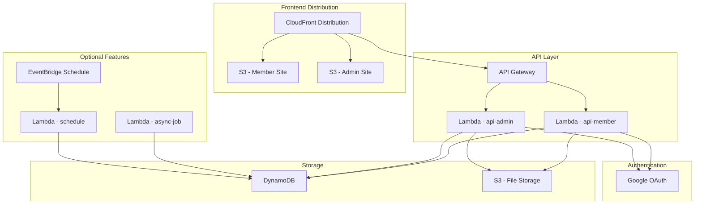

# CDK Infrastructure Stacks Implementation

## Overview

サーバレスアプリケーションテンプレートの完全なインフラストラクチャをCDKで構築します。member/adminの対称性を保ち、オプション機能の選択的有効化をサポートします。

## Stack Architecture



## Core Stack Implementation

### Main Stack

```typescript
// packages/infra/lib/main-stack.ts
import { Stack, StackProps } from 'aws-cdk-lib';
import { Construct } from 'constructs';
import { FrontendStack } from './frontend-stack';
import { ApiStack } from './api-stack';
import { DatabaseStack } from './database-stack';
import { OptionalFeaturesStack } from './optional-features-stack';

export interface MainStackProps extends StackProps {
  readonly enableAsyncJob: boolean;
  readonly enableSchedule: boolean;
}

export class MainStack extends Stack {
  constructor(scope: Construct, id: string, props: MainStackProps) {
    super(scope, id, props);

    // 1. Database Layer (依存関係の基盤)
    const databaseStack = new DatabaseStack(this, 'Database');

    // 2. API Layer (member/admin対称性)
    const apiStack = new ApiStack(this, 'Api', {
      userTable: databaseStack.userTable,
      filesBucket: databaseStack.filesBucket,
    });

    // 3. Frontend Layer
    const frontendStack = new FrontendStack(this, 'Frontend', {
      apiGateway: apiStack.apiGateway,
    });

    // 4. Optional Features (設定に基づく条件付き作成)
    if (props.enableAsyncJob || props.enableSchedule) {
      new OptionalFeaturesStack(this, 'OptionalFeatures', {
        userTable: databaseStack.userTable,
        enableAsyncJob: props.enableAsyncJob,
        enableSchedule: props.enableSchedule,
      });
    }
  }
}
```

### Frontend Stack

```typescript
// packages/infra/lib/frontend-stack.ts
import { NestedStack, NestedStackProps } from 'aws-cdk-lib';
import { Construct } from 'constructs';
import * as s3 from 'aws-cdk-lib/aws-s3';
import * as cloudfront from 'aws-cdk-lib/aws-cloudfront';
import * as origins from 'aws-cdk-lib/aws-cloudfront-origins';
import * as apigateway from 'aws-cdk-lib/aws-apigateway';

export interface FrontendStackProps extends NestedStackProps {
  readonly apiGateway: apigateway.RestApi;
}

export class FrontendStack extends NestedStack {
  public readonly distribution: cloudfront.Distribution;
  public readonly memberBucket: s3.Bucket;
  public readonly adminBucket: s3.Bucket;

  constructor(scope: Construct, id: string, props: FrontendStackProps) {
    super(scope, id, props);

    // Create Origin Access Identity for CloudFront
    const oai = new cloudfront.OriginAccessIdentity(this, 'OAI', {
      comment: 'OAI for Admin S3 Bucket Access',
    });

    // Member Site S3 Bucket
    this.memberBucket = new s3.Bucket(this, 'MemberSiteBucket', {
      bucketName: `${this.stackName}-member-site`,
      websiteIndexDocument: 'index.html',
      websiteErrorDocument: 'error.html',
      publicReadAccess: true,
      blockPublicAccess: {
        blockPublicAcls: false,
        blockPublicPolicy: false,
        ignorePublicAcls: false,
        restrictPublicBuckets: false,
      },
    });

    // Admin Site S3 Bucket
    this.adminBucket = new s3.Bucket(this, 'AdminSiteBucket', {
      bucketName: `${this.stackName}-admin-site`,
      websiteIndexDocument: 'index.html',
      websiteErrorDocument: 'error.html',
      publicReadAccess: false,
      blockPublicAccess: s3.BlockPublicAccess.BLOCK_ALL,
    });

    // Grant OAI access to Admin bucket
    this.adminBucket.grantRead(oai);

    // CloudFront Distribution with Behavior-based Routing
    this.distribution = new cloudfront.Distribution(this, 'Distribution', {
      defaultBehavior: {
        origin: new origins.S3Origin(this.memberBucket),
        viewerProtocolPolicy: cloudfront.ViewerProtocolPolicy.REDIRECT_TO_HTTPS,
        cachePolicy: cloudfront.CachePolicy.CACHING_OPTIMIZED,
      },
      additionalBehaviors: {
        // Admin Site Routing
        '/admin/*': {
          origin: new origins.S3Origin(this.adminBucket, {
            originAccessIdentity: oai,
          }),
          viewerProtocolPolicy: cloudfront.ViewerProtocolPolicy.REDIRECT_TO_HTTPS,
          cachePolicy: cloudfront.CachePolicy.CACHING_DISABLED, // Admin content should not be cached
        },
        // API Gateway Routing
        '/api/*': {
          origin: new origins.RestApiOrigin(props.apiGateway),
          viewerProtocolPolicy: cloudfront.ViewerProtocolPolicy.REDIRECT_TO_HTTPS,
          cachePolicy: cloudfront.CachePolicy.CACHING_DISABLED,
          originRequestPolicy: cloudfront.OriginRequestPolicy.ALL_VIEWER,
        },
      },
      enableLogging: true,
      comment: 'Serverless Template - Member/Admin/API Distribution',
    });
  }
}
```

### API Stack

```typescript
// packages/infra/lib/api-stack.ts
import { NestedStack, NestedStackProps } from 'aws-cdk-lib';
import { Construct } from 'constructs';
import * as lambda from 'aws-cdk-lib/aws-lambda';
import * as apigateway from 'aws-cdk-lib/aws-apigateway';
import * as dynamodb from 'aws-cdk-lib/aws-dynamodb';
import * as s3 from 'aws-cdk-lib/aws-s3';

export interface ApiStackProps extends NestedStackProps {
  readonly userTable: dynamodb.Table;
  readonly filesBucket: s3.Bucket;
}

export class ApiStack extends NestedStack {
  public readonly apiGateway: apigateway.RestApi;
  public readonly memberLambda: lambda.Function;
  public readonly adminLambda: lambda.Function;

  constructor(scope: Construct, id: string, props: ApiStackProps) {
    super(scope, id, props);

    // Member API Lambda
    this.memberLambda = new lambda.Function(this, 'MemberApiLambda', {
      runtime: lambda.Runtime.NODEJS_18_X,
      handler: 'index.handler',
      code: lambda.Code.fromAsset('apps/api-member/dist'),
      environment: {
        USER_TABLE_NAME: props.userTable.tableName,
        FILES_BUCKET_NAME: props.filesBucket.bucketName,
        NODE_ENV: 'production',
        API_TYPE: 'member',
      },
      functionName: `${this.stackName}-api-member`,
    });

    // Admin API Lambda
    this.adminLambda = new lambda.Function(this, 'AdminApiLambda', {
      runtime: lambda.Runtime.NODEJS_18_X,
      handler: 'index.handler',
      code: lambda.Code.fromAsset('apps/api-admin/dist'),
      environment: {
        USER_TABLE_NAME: props.userTable.tableName,
        FILES_BUCKET_NAME: props.filesBucket.bucketName,
        NODE_ENV: 'production',
        API_TYPE: 'admin',
      },
      functionName: `${this.stackName}-api-admin`,
    });

    // Grant permissions
    props.userTable.grantReadWriteData(this.memberLambda);
    props.userTable.grantReadWriteData(this.adminLambda);
    props.filesBucket.grantReadWrite(this.memberLambda);
    props.filesBucket.grantReadWrite(this.adminLambda);

    // API Gateway
    this.apiGateway = new apigateway.RestApi(this, 'ApiGateway', {
      restApiName: `${this.stackName}-api`,
      description: 'Serverless Template API Gateway',
      defaultCorsPreflightOptions: {
        allowOrigins: apigateway.Cors.ALL_ORIGINS,
        allowMethods: apigateway.Cors.ALL_METHODS,
        allowHeaders: ['Content-Type', 'Authorization'],
      },
    });

    // Member API Integration
    const memberIntegration = new apigateway.LambdaIntegration(this.memberLambda);
    const memberResource = this.apiGateway.root.addResource('member');
    memberResource.addProxy({
      defaultIntegration: memberIntegration,
      anyMethod: true,
    });

    // Admin API Integration
    const adminIntegration = new apigateway.LambdaIntegration(this.adminLambda);
    const adminResource = this.apiGateway.root.addResource('admin');
    adminResource.addProxy({
      defaultIntegration: adminIntegration,
      anyMethod: true,
    });
  }
}
```

### Database Stack

```typescript
// packages/infra/lib/database-stack.ts
import { NestedStack, NestedStackProps, RemovalPolicy } from 'aws-cdk-lib';
import { Construct } from 'constructs';
import * as dynamodb from 'aws-cdk-lib/aws-dynamodb';
import * as s3 from 'aws-cdk-lib/aws-s3';

export class DatabaseStack extends NestedStack {
  public readonly userTable: dynamodb.Table;
  public readonly filesBucket: s3.Bucket;

  constructor(scope: Construct, id: string, props?: NestedStackProps) {
    super(scope, id, props);

    // DynamoDB Single Table Design
    this.userTable = new dynamodb.Table(this, 'UserTable', {
      tableName: `${this.stackName}-users`,
      partitionKey: { name: 'PK', type: dynamodb.AttributeType.STRING },
      sortKey: { name: 'SK', type: dynamodb.AttributeType.STRING },
      billingMode: dynamodb.BillingMode.PAY_PER_REQUEST,
      pointInTimeRecovery: true,
      removalPolicy: RemovalPolicy.DESTROY, // 開発環境用
    });

    // GSI for efficient queries
    this.userTable.addGlobalSecondaryIndex({
      indexName: 'GSI1',
      partitionKey: { name: 'GSI1PK', type: dynamodb.AttributeType.STRING },
      sortKey: { name: 'GSI1SK', type: dynamodb.AttributeType.STRING },
    });

    // File Storage S3 Bucket
    this.filesBucket = new s3.Bucket(this, 'FilesBucket', {
      bucketName: `${this.stackName}-files`,
      versioned: true,
      publicReadAccess: false,
      blockPublicAccess: s3.BlockPublicAccess.BLOCK_ALL,
      removalPolicy: RemovalPolicy.DESTROY, // 開発環境用
    });
  }
}
```

### Optional Features Stack

```typescript
// packages/infra/lib/optional-features-stack.ts
import { NestedStack, NestedStackProps } from 'aws-cdk-lib';
import { Construct } from 'constructs';
import * as lambda from 'aws-cdk-lib/aws-lambda';
import * as events from 'aws-cdk-lib/aws-events';
import * as targets from 'aws-cdk-lib/aws-events-targets';
import * as dynamodb from 'aws-cdk-lib/aws-dynamodb';

export interface OptionalFeaturesStackProps extends NestedStackProps {
  readonly userTable: dynamodb.Table;
  readonly enableAsyncJob: boolean;
  readonly enableSchedule: boolean;
}

export class OptionalFeaturesStack extends NestedStack {
  public readonly asyncJobLambda?: lambda.Function;
  public readonly scheduleLambda?: lambda.Function;
  public readonly scheduleRule?: events.Rule;

  constructor(scope: Construct, id: string, props: OptionalFeaturesStackProps) {
    super(scope, id, props);

    // Async Job Lambda (条件付き作成)
    if (props.enableAsyncJob) {
      this.asyncJobLambda = new lambda.Function(this, 'AsyncJobLambda', {
        runtime: lambda.Runtime.NODEJS_18_X,
        handler: 'index.handler',
        code: lambda.Code.fromAsset('apps/async-job/dist'),
        environment: {
          USER_TABLE_NAME: props.userTable.tableName,
          NODE_ENV: 'production',
        },
        functionName: `${this.stackName}-async-job`,
      });

      props.userTable.grantReadWriteData(this.asyncJobLambda);
    }

    // Schedule Lambda (条件付き作成)
    if (props.enableSchedule) {
      this.scheduleLambda = new lambda.Function(this, 'ScheduleLambda', {
        runtime: lambda.Runtime.NODEJS_18_X,
        handler: 'index.handler',
        code: lambda.Code.fromAsset('apps/schedule/dist'),
        environment: {
          USER_TABLE_NAME: props.userTable.tableName,
          NODE_ENV: 'production',
        },
        functionName: `${this.stackName}-schedule`,
      });

      props.userTable.grantReadWriteData(this.scheduleLambda);

      // EventBridge Schedule Rule
      this.scheduleRule = new events.Rule(this, 'ScheduleRule', {
        schedule: events.Schedule.rate(Duration.minutes(15)),
        description: 'Trigger schedule lambda every 15 minutes',
      });

      this.scheduleRule.addTarget(new targets.LambdaFunction(this.scheduleLambda));
    }
  }
}
```

## Deployment Configuration

### CDK App

```typescript
// packages/infra/bin/infra.ts
#!/usr/bin/env node
import 'source-map-support/register';
import * as cdk from 'aws-cdk-lib';
import { MainStack } from '../lib/main-stack';

const app = new cdk.App();

// Environment Configuration
const environment = app.node.tryGetContext('environment') || 'dev';
const enableAsyncJob = app.node.tryGetContext('enableAsyncJob') === 'true';
const enableSchedule = app.node.tryGetContext('enableSchedule') === 'true';

new MainStack(app, `ServerlessTemplate-${environment}`, {
  env: {
    account: process.env.CDK_DEFAULT_ACCOUNT,
    region: process.env.CDK_DEFAULT_REGION,
  },
  enableAsyncJob,
  enableSchedule,
});
```

### Deployment Commands

```bash
# 基本デプロイ (member/adminのみ)
npx cdk deploy --context environment=dev

# 非同期Job機能を有効にしてデプロイ
npx cdk deploy --context environment=dev --context enableAsyncJob=true

# 全機能を有効にしてデプロイ
npx cdk deploy --context environment=dev --context enableAsyncJob=true --context enableSchedule=true

# 本番環境デプロイ
npx cdk deploy --context environment=prod --context enableAsyncJob=true --context enableSchedule=true
```

## Architecture Benefits

### 1. Member/Admin Symmetry

- **命名一貫性**: `api-member` / `api-admin` の対称的命名
- **構造一貫性**: 同一の Lambda 構成・環境変数・権限設定
- **認知負荷軽減**: 予測可能なリソース命名・構造

### 2. Optional Features

- **選択的有効化**: 必要な機能のみをデプロイ
- **コスト効率**: 未使用リソースの課金回避
- **段階的拡張**: プロジェクト成長に応じた機能追加

### 3. Separation of Concerns

- **Stack分離**: 依存関係の明確化
- **リソース管理**: 責任範囲の明確化
- **デプロイ効率**: 変更影響範囲の局所化

### 4. Production Readiness

- **セキュリティ**: 最小権限の原則
- **可観測性**: CloudWatch ログ・メトリクス
- **拡張性**: Auto Scaling 対応

## Monitoring and Operations

### CloudWatch Dashboards

```typescript
// packages/infra/lib/monitoring-stack.ts
import * as cloudwatch from 'aws-cdk-lib/aws-cloudwatch';

export class MonitoringStack extends NestedStack {
  createDashboard(): cloudwatch.Dashboard {
    return new cloudwatch.Dashboard(this, 'Dashboard', {
      dashboardName: 'ServerlessTemplate-Monitoring',
      widgets: [
        [
          // Member API メトリクス
          new cloudwatch.GraphWidget({
            title: 'Member API Performance',
            left: [this.memberLambda.metricDuration()],
            right: [this.memberLambda.metricErrors()],
          }),
          // Admin API メトリクス
          new cloudwatch.GraphWidget({
            title: 'Admin API Performance',
            left: [this.adminLambda.metricDuration()],
            right: [this.adminLambda.metricErrors()],
          }),
        ],
      ],
    });
  }
}
```

---

_この実装により、member/adminの対称性を保ちながら、スケーラブルで保守性の高いサーバレスインフラストラクチャを構築できます。_
