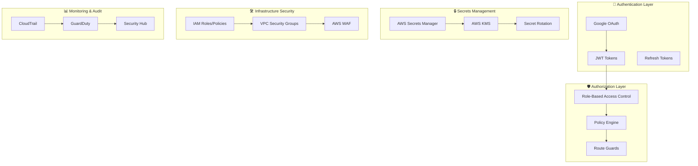

# Security Best Practices Implementation Guide

## Overview

Ultimate Type Safety Templateにおけるセキュリティベストプラクティスの包括的な実装ガイドです。AWS Secrets Manager、IAMポリシー、認証・認可、データ保護などの実装パターンを提供します。

## Security Architecture



## 1. Secrets Management

### AWS Secrets Manager Integration

```typescript
// packages/shared/src/services/secrets-manager.ts
import { 
  SecretsManagerClient, 
  GetSecretValueCommand,
  CreateSecretCommand,
  UpdateSecretCommand,
  RotateSecretCommand 
} from '@aws-sdk/client-secrets-manager';
import { z } from 'zod';

// Secret schemas for type safety
const OAuthSecretsSchema = z.object({
  googleClientSecret: z.string().min(1),
  googleClientId: z.string().min(1),
});

const JWTSecretSchema = z.object({
  jwtSecret: z.string().min(32),
  jwtRefreshSecret: z.string().min(32),
});

export class SecretManagerService {
  private client: SecretsManagerClient;
  private cache: Map<string, { value: any; expiry: number }> = new Map();
  private readonly CACHE_TTL = 300000; // 5 minutes

  constructor(region: string) {
    this.client = new SecretsManagerClient({ 
      region,
      maxAttempts: 3,
      retryMode: 'adaptive'
    });
  }

  async getOAuthSecrets(): Promise<z.infer<typeof OAuthSecretsSchema>> {
    const secretArn = process.env.OAUTH_SECRETS_ARN;
    if (!secretArn) {
      throw new Error('OAuth secrets ARN not configured');
    }

    const secrets = await this.getSecret(secretArn);
    return OAuthSecretsSchema.parse(secrets);
  }

  async getJWTSecrets(): Promise<z.infer<typeof JWTSecretSchema>> {
    const secretArn = process.env.JWT_SECRETS_ARN;
    if (!secretArn) {
      throw new Error('JWT secrets ARN not configured');
    }

    const secrets = await this.getSecret(secretArn);
    return JWTSecretSchema.parse(secrets);
  }

  private async getSecret(secretArn: string): Promise<any> {
    // Check cache first
    const cached = this.cache.get(secretArn);
    if (cached && cached.expiry > Date.now()) {
      return cached.value;
    }

    try {
      const command = new GetSecretValueCommand({
        SecretId: secretArn,
        VersionStage: 'AWSCURRENT',
      });

      const response = await this.client.send(command);
      
      if (!response.SecretString) {
        throw new Error('Secret value is empty');
      }

      const secretValue = JSON.parse(response.SecretString);

      // Cache the secret
      this.cache.set(secretArn, {
        value: secretValue,
        expiry: Date.now() + this.CACHE_TTL,
      });

      return secretValue;
    } catch (error) {
      console.error(`Failed to retrieve secret ${secretArn}:`, error);
      throw new Error('Failed to retrieve secret');
    }
  }

  async rotateSecret(secretArn: string): Promise<void> {
    const command = new RotateSecretCommand({
      SecretId: secretArn,
      RotationLambdaARN: process.env.ROTATION_LAMBDA_ARN,
      RotationRules: {
        AutomaticallyAfterDays: 90,
      },
    });

    await this.client.send(command);
    
    // Clear cache after rotation
    this.cache.delete(secretArn);
  }
}
```

### CDK Secret Management Stack

```typescript
// packages/infra/lib/secrets-stack.ts
import { NestedStack, NestedStackProps } from 'aws-cdk-lib';
import { Construct } from 'constructs';
import * as secretsmanager from 'aws-cdk-lib/aws-secretsmanager';
import * as iam from 'aws-cdk-lib/aws-iam';
import * as lambda from 'aws-cdk-lib/aws-lambda';

export interface SecretsStackProps extends NestedStackProps {
  readonly projectName: string;
  readonly environment: string;
}

export class SecretsStack extends NestedStack {
  public readonly oauthSecret: secretsmanager.Secret;
  public readonly jwtSecret: secretsmanager.Secret;
  public readonly databaseSecret: secretsmanager.Secret;

  constructor(scope: Construct, id: string, props: SecretsStackProps) {
    super(scope, id, props);

    // OAuth Secrets
    this.oauthSecret = new secretsmanager.Secret(this, 'OAuthSecret', {
      secretName: `${props.projectName}-${props.environment}-oauth`,
      description: 'OAuth client credentials',
      generateSecretString: {
        secretStringTemplate: JSON.stringify({
          googleClientId: 'PLACEHOLDER',
        }),
        generateStringKey: 'googleClientSecret',
        passwordLength: 32,
      },
    });

    // JWT Secrets with automatic rotation
    this.jwtSecret = new secretsmanager.Secret(this, 'JWTSecret', {
      secretName: `${props.projectName}-${props.environment}-jwt`,
      description: 'JWT signing secrets',
      generateSecretString: {
        secretStringTemplate: JSON.stringify({}),
        generateStringKey: 'jwtSecret',
        passwordLength: 64,
      },
    });

    // Enable automatic rotation for JWT secret
    const rotationLambda = new lambda.Function(this, 'RotationLambda', {
      runtime: lambda.Runtime.NODEJS_22_X,
      handler: 'index.handler',
      code: lambda.Code.fromAsset('lambda/secret-rotation'),
      environment: {
        SECRETS_MANAGER_ENDPOINT: `https://secretsmanager.${this.region}.amazonaws.com`,
      },
    });

    this.jwtSecret.addRotationSchedule('RotationSchedule', {
      automaticallyAfter: cdk.Duration.days(90),
      lambda: rotationLambda,
    });

    // Database Secrets
    this.databaseSecret = new secretsmanager.Secret(this, 'DatabaseSecret', {
      secretName: `${props.projectName}-${props.environment}-database`,
      description: 'Database connection credentials',
      generateSecretString: {
        secretStringTemplate: JSON.stringify({
          engine: 'dynamodb',
          region: this.region,
        }),
        generateStringKey: 'encryptionKey',
        passwordLength: 32,
      },
    });
  }

  grantRead(grantee: iam.IGrantable): void {
    this.oauthSecret.grantRead(grantee);
    this.jwtSecret.grantRead(grantee);
    this.databaseSecret.grantRead(grantee);
  }
}
```

## 2. Authentication & Authorization

### JWT Token Management

```typescript
// packages/shared/src/services/auth/jwt-service.ts
import * as jose from 'jose';
import { z } from 'zod';
import { SecretManagerService } from '../secrets-manager';

const TokenPayloadSchema = z.object({
  sub: z.string().uuid(),
  email: z.string().email(),
  role: z.enum(['member', 'admin']),
  iat: z.number(),
  exp: z.number(),
  jti: z.string().uuid(),
});

export class JWTService {
  private secretManager: SecretManagerService;
  private signingKey: Uint8Array | null = null;
  private verificationKey: Uint8Array | null = null;

  constructor(secretManager: SecretManagerService) {
    this.secretManager = secretManager;
  }

  async generateAccessToken(payload: {
    userId: string;
    email: string;
    role: 'member' | 'admin';
  }): Promise<string> {
    const key = await this.getSigningKey();
    
    const jwt = await new jose.SignJWT({
      sub: payload.userId,
      email: payload.email,
      role: payload.role,
      jti: crypto.randomUUID(),
    })
      .setProtectedHeader({ alg: 'HS256' })
      .setIssuedAt()
      .setExpirationTime('1h')
      .setIssuer('ultimate-type-safety')
      .setAudience(payload.role)
      .sign(key);

    return jwt;
  }

  async generateRefreshToken(userId: string): Promise<string> {
    const key = await this.getSigningKey();
    
    const jwt = await new jose.SignJWT({
      sub: userId,
      type: 'refresh',
      jti: crypto.randomUUID(),
    })
      .setProtectedHeader({ alg: 'HS256' })
      .setIssuedAt()
      .setExpirationTime('30d')
      .setIssuer('ultimate-type-safety')
      .sign(key);

    return jwt;
  }

  async verifyAccessToken(token: string): Promise<z.infer<typeof TokenPayloadSchema>> {
    const key = await this.getVerificationKey();
    
    try {
      const { payload } = await jose.jwtVerify(token, key, {
        issuer: 'ultimate-type-safety',
        algorithms: ['HS256'],
      });

      return TokenPayloadSchema.parse(payload);
    } catch (error) {
      throw new Error('Invalid token');
    }
  }

  private async getSigningKey(): Promise<Uint8Array> {
    if (!this.signingKey) {
      const secrets = await this.secretManager.getJWTSecrets();
      this.signingKey = new TextEncoder().encode(secrets.jwtSecret);
    }
    return this.signingKey;
  }

  private async getVerificationKey(): Promise<Uint8Array> {
    if (!this.verificationKey) {
      const secrets = await this.secretManager.getJWTSecrets();
      this.verificationKey = new TextEncoder().encode(secrets.jwtSecret);
    }
    return this.verificationKey;
  }
}
```

### Role-Based Access Control (RBAC)

```typescript
// packages/shared/src/auth/rbac.ts
import { z } from 'zod';

// Permission definitions
export const PermissionSchema = z.enum([
  // User permissions
  'user:read:own',
  'user:update:own',
  'user:delete:own',
  
  // Admin permissions
  'user:read:all',
  'user:create',
  'user:update:all',
  'user:delete:all',
  
  // System permissions
  'system:read:config',
  'system:update:config',
  'system:read:logs',
  'system:manage:secrets',
]);

export type Permission = z.infer<typeof PermissionSchema>;

// Role definitions with permissions
export const RolePermissions: Record<'member' | 'admin', Permission[]> = {
  member: [
    'user:read:own',
    'user:update:own',
  ],
  admin: [
    'user:read:own',
    'user:update:own',
    'user:delete:own',
    'user:read:all',
    'user:create',
    'user:update:all',
    'user:delete:all',
    'system:read:config',
    'system:update:config',
    'system:read:logs',
    'system:manage:secrets',
  ],
};

export class RBACService {
  static hasPermission(
    userRole: 'member' | 'admin',
    requiredPermission: Permission
  ): boolean {
    const permissions = RolePermissions[userRole];
    return permissions.includes(requiredPermission);
  }

  static hasAnyPermission(
    userRole: 'member' | 'admin',
    requiredPermissions: Permission[]
  ): boolean {
    const permissions = RolePermissions[userRole];
    return requiredPermissions.some(permission => permissions.includes(permission));
  }

  static hasAllPermissions(
    userRole: 'member' | 'admin',
    requiredPermissions: Permission[]
  ): boolean {
    const permissions = RolePermissions[userRole];
    return requiredPermissions.every(permission => permissions.includes(permission));
  }
}
```

### API Route Guards

```typescript
// packages/shared/src/middleware/auth-guard.ts
import { NextRequest, NextResponse } from 'next/server';
import { JWTService } from '../services/auth/jwt-service';
import { RBACService, Permission } from '../auth/rbac';
import { SecretManagerService } from '../services/secrets-manager';

export interface AuthGuardOptions {
  permissions?: Permission[];
  requireAll?: boolean;
}

export function createAuthGuard(options: AuthGuardOptions = {}) {
  return async function authGuard(
    request: NextRequest,
    context: { params: Record<string, string> }
  ): Promise<NextResponse | null> {
    const authHeader = request.headers.get('authorization');
    
    if (!authHeader || !authHeader.startsWith('Bearer ')) {
      return NextResponse.json(
        { error: 'Unauthorized' },
        { status: 401 }
      );
    }

    const token = authHeader.substring(7);
    const secretManager = new SecretManagerService(process.env.AWS_REGION!);
    const jwtService = new JWTService(secretManager);

    try {
      const payload = await jwtService.verifyAccessToken(token);
      
      // Check permissions if specified
      if (options.permissions && options.permissions.length > 0) {
        const hasPermission = options.requireAll
          ? RBACService.hasAllPermissions(payload.role, options.permissions)
          : RBACService.hasAnyPermission(payload.role, options.permissions);

        if (!hasPermission) {
          return NextResponse.json(
            { error: 'Forbidden' },
            { status: 403 }
          );
        }
      }

      // Add user context to request
      (request as any).user = payload;
      
      return null; // Continue to the handler
    } catch (error) {
      return NextResponse.json(
        { error: 'Invalid token' },
        { status: 401 }
      );
    }
  };
}

// Usage example
export const withAuth = createAuthGuard();
export const withAdminAuth = createAuthGuard({ 
  permissions: ['user:read:all'] 
});
```

## 3. Data Protection

### Encryption at Rest

```typescript
// packages/shared/src/services/encryption-service.ts
import * as crypto from 'crypto';
import { SecretManagerService } from './secrets-manager';

export class EncryptionService {
  private secretManager: SecretManagerService;
  private algorithm = 'aes-256-gcm';
  private encryptionKey: Buffer | null = null;

  constructor(secretManager: SecretManagerService) {
    this.secretManager = secretManager;
  }

  async encrypt(data: string): Promise<{
    encrypted: string;
    iv: string;
    authTag: string;
  }> {
    const key = await this.getEncryptionKey();
    const iv = crypto.randomBytes(16);
    
    const cipher = crypto.createCipheriv(this.algorithm, key, iv);
    
    let encrypted = cipher.update(data, 'utf8', 'hex');
    encrypted += cipher.final('hex');
    
    const authTag = cipher.getAuthTag();

    return {
      encrypted,
      iv: iv.toString('hex'),
      authTag: authTag.toString('hex'),
    };
  }

  async decrypt(encryptedData: {
    encrypted: string;
    iv: string;
    authTag: string;
  }): Promise<string> {
    const key = await this.getEncryptionKey();
    const iv = Buffer.from(encryptedData.iv, 'hex');
    const authTag = Buffer.from(encryptedData.authTag, 'hex');
    
    const decipher = crypto.createDecipheriv(this.algorithm, key, iv);
    decipher.setAuthTag(authTag);
    
    let decrypted = decipher.update(encryptedData.encrypted, 'hex', 'utf8');
    decrypted += decipher.final('utf8');
    
    return decrypted;
  }

  private async getEncryptionKey(): Promise<Buffer> {
    if (!this.encryptionKey) {
      const secrets = await this.secretManager.getDatabaseSecrets();
      this.encryptionKey = Buffer.from(secrets.encryptionKey, 'hex');
    }
    return this.encryptionKey;
  }
}
```

### Field-Level Encryption for DynamoDB

```typescript
// packages/shared/src/repositories/encrypted-repository.ts
import { DynamoDBDocumentClient, PutCommand, GetCommand } from '@aws-sdk/lib-dynamodb';
import { EncryptionService } from '../services/encryption-service';

interface SensitiveUserData {
  id: string;
  email: string;
  name: string;
  ssn?: string; // Sensitive field
  creditCard?: string; // Sensitive field
  medicalRecord?: string; // Sensitive field
}

export class EncryptedUserRepository {
  private client: DynamoDBDocumentClient;
  private encryptionService: EncryptionService;
  private tableName: string;
  
  // Fields that should be encrypted
  private sensitiveFields = ['ssn', 'creditCard', 'medicalRecord'];

  constructor(
    client: DynamoDBDocumentClient,
    encryptionService: EncryptionService,
    tableName: string
  ) {
    this.client = client;
    this.encryptionService = encryptionService;
    this.tableName = tableName;
  }

  async save(userData: SensitiveUserData): Promise<void> {
    const encryptedData = await this.encryptSensitiveFields(userData);
    
    const command = new PutCommand({
      TableName: this.tableName,
      Item: {
        PK: `USER#${encryptedData.id}`,
        SK: 'PROFILE',
        ...encryptedData,
        _encrypted: true,
        _encryptedFields: this.sensitiveFields,
      },
    });

    await this.client.send(command);
  }

  async findById(userId: string): Promise<SensitiveUserData | null> {
    const command = new GetCommand({
      TableName: this.tableName,
      Key: {
        PK: `USER#${userId}`,
        SK: 'PROFILE',
      },
    });

    const result = await this.client.send(command);
    
    if (!result.Item) {
      return null;
    }

    return this.decryptSensitiveFields(result.Item as any);
  }

  private async encryptSensitiveFields(
    data: SensitiveUserData
  ): Promise<Record<string, any>> {
    const result: Record<string, any> = { ...data };

    for (const field of this.sensitiveFields) {
      if (data[field as keyof SensitiveUserData]) {
        const encrypted = await this.encryptionService.encrypt(
          data[field as keyof SensitiveUserData] as string
        );
        result[field] = encrypted;
      }
    }

    return result;
  }

  private async decryptSensitiveFields(
    data: Record<string, any>
  ): Promise<SensitiveUserData> {
    const result: Record<string, any> = { ...data };

    for (const field of this.sensitiveFields) {
      if (data[field] && typeof data[field] === 'object') {
        result[field] = await this.encryptionService.decrypt(data[field]);
      }
    }

    delete result.PK;
    delete result.SK;
    delete result._encrypted;
    delete result._encryptedFields;

    return result as SensitiveUserData;
  }
}
```

## 4. Infrastructure Security

### Least Privilege IAM Policies

```typescript
// packages/infra/lib/security-policies.ts
import * as iam from 'aws-cdk-lib/aws-iam';
import { Construct } from 'constructs';

export class SecurityPolicies extends Construct {
  public readonly lambdaExecutionPolicy: iam.ManagedPolicy;
  public readonly secretsReadPolicy: iam.ManagedPolicy;
  public readonly dynamoDBAccessPolicy: iam.ManagedPolicy;

  constructor(scope: Construct, id: string, props: {
    projectName: string;
    environment: string;
    tableName: string;
  }) {
    super(scope, id);

    // Lambda execution policy with least privilege
    this.lambdaExecutionPolicy = new iam.ManagedPolicy(this, 'LambdaExecutionPolicy', {
      managedPolicyName: `${props.projectName}-${props.environment}-lambda-execution`,
      statements: [
        new iam.PolicyStatement({
          effect: iam.Effect.ALLOW,
          actions: [
            'logs:CreateLogGroup',
            'logs:CreateLogStream',
            'logs:PutLogEvents',
          ],
          resources: [
            `arn:aws:logs:${this.node.stack.region}:${this.node.stack.account}:log-group:/aws/lambda/${props.projectName}-${props.environment}-*`,
          ],
        }),
        new iam.PolicyStatement({
          effect: iam.Effect.ALLOW,
          actions: ['xray:PutTraceSegments', 'xray:PutTelemetryRecords'],
          resources: ['*'],
        }),
      ],
    });

    // Secrets read policy with specific resource constraints
    this.secretsReadPolicy = new iam.ManagedPolicy(this, 'SecretsReadPolicy', {
      managedPolicyName: `${props.projectName}-${props.environment}-secrets-read`,
      statements: [
        new iam.PolicyStatement({
          effect: iam.Effect.ALLOW,
          actions: ['secretsmanager:GetSecretValue', 'secretsmanager:DescribeSecret'],
          resources: [
            `arn:aws:secretsmanager:${this.node.stack.region}:${this.node.stack.account}:secret:${props.projectName}-${props.environment}-*`,
          ],
        }),
        new iam.PolicyStatement({
          effect: iam.Effect.ALLOW,
          actions: ['kms:Decrypt'],
          resources: ['*'],
          conditions: {
            StringEquals: {
              'kms:ViaService': `secretsmanager.${this.node.stack.region}.amazonaws.com`,
            },
          },
        }),
      ],
    });

    // DynamoDB access policy with table-specific permissions
    this.dynamoDBAccessPolicy = new iam.ManagedPolicy(this, 'DynamoDBAccessPolicy', {
      managedPolicyName: `${props.projectName}-${props.environment}-dynamodb-access`,
      statements: [
        new iam.PolicyStatement({
          effect: iam.Effect.ALLOW,
          actions: [
            'dynamodb:GetItem',
            'dynamodb:PutItem',
            'dynamodb:UpdateItem',
            'dynamodb:DeleteItem',
            'dynamodb:Query',
            'dynamodb:Scan',
          ],
          resources: [
            `arn:aws:dynamodb:${this.node.stack.region}:${this.node.stack.account}:table/${props.tableName}`,
            `arn:aws:dynamodb:${this.node.stack.region}:${this.node.stack.account}:table/${props.tableName}/index/*`,
          ],
        }),
      ],
    });
  }
}
```

### API Gateway Security

```typescript
// packages/infra/lib/api-security-stack.ts
import { NestedStack, NestedStackProps } from 'aws-cdk-lib';
import { Construct } from 'constructs';
import * as apigateway from 'aws-cdk-lib/aws-apigateway';
import * as wafv2 from 'aws-cdk-lib/aws-wafv2';

export class ApiSecurityStack extends NestedStack {
  public readonly webAcl: wafv2.CfnWebACL;

  constructor(scope: Construct, id: string, props: NestedStackProps & {
    apiGateway: apigateway.RestApi;
    projectName: string;
    environment: string;
  }) {
    super(scope, id, props);

    // Create WAF Web ACL
    this.webAcl = new wafv2.CfnWebACL(this, 'WebACL', {
      scope: 'REGIONAL',
      defaultAction: { allow: {} },
      rules: [
        // Rate limiting rule
        {
          name: 'RateLimitRule',
          priority: 1,
          statement: {
            rateBasedStatement: {
              limit: 2000, // 2000 requests per 5 minutes
              aggregateKeyType: 'IP',
            },
          },
          action: { block: {} },
          visibilityConfig: {
            sampledRequestsEnabled: true,
            cloudWatchMetricsEnabled: true,
            metricName: 'RateLimitRule',
          },
        },
        // SQL injection protection
        {
          name: 'SQLiProtectionRule',
          priority: 2,
          statement: {
            managedRuleGroupStatement: {
              vendorName: 'AWS',
              name: 'AWSManagedRulesSQLiRuleSet',
            },
          },
          overrideAction: { none: {} },
          visibilityConfig: {
            sampledRequestsEnabled: true,
            cloudWatchMetricsEnabled: true,
            metricName: 'SQLiProtectionRule',
          },
        },
        // XSS protection
        {
          name: 'XSSProtectionRule',
          priority: 3,
          statement: {
            managedRuleGroupStatement: {
              vendorName: 'AWS',
              name: 'AWSManagedRulesKnownBadInputsRuleSet',
            },
          },
          overrideAction: { none: {} },
          visibilityConfig: {
            sampledRequestsEnabled: true,
            cloudWatchMetricsEnabled: true,
            metricName: 'XSSProtectionRule',
          },
        },
      ],
      visibilityConfig: {
        sampledRequestsEnabled: true,
        cloudWatchMetricsEnabled: true,
        metricName: `${props.projectName}-${props.environment}-web-acl`,
      },
    });

    // Associate WAF with API Gateway
    new wafv2.CfnWebACLAssociation(this, 'WebACLAssociation', {
      resourceArn: props.apiGateway.deploymentStage.stageArn,
      webAclArn: this.webAcl.attrArn,
    });

    // Request validation
    const requestValidator = new apigateway.RequestValidator(this, 'RequestValidator', {
      restApi: props.apiGateway,
      requestValidatorName: 'validate-request-body-and-params',
      validateRequestBody: true,
      validateRequestParameters: true,
    });

    // API Key for additional security
    const apiKey = new apigateway.ApiKey(this, 'ApiKey', {
      apiKeyName: `${props.projectName}-${props.environment}-api-key`,
      description: 'API key for additional security layer',
    });

    const usagePlan = new apigateway.UsagePlan(this, 'UsagePlan', {
      name: `${props.projectName}-${props.environment}-usage-plan`,
      apiStages: [
        {
          api: props.apiGateway,
          stage: props.apiGateway.deploymentStage,
        },
      ],
      throttle: {
        burstLimit: 1000,
        rateLimit: 500,
      },
      quota: {
        limit: 100000,
        period: apigateway.Period.DAY,
      },
    });

    usagePlan.addApiKey(apiKey);
  }
}
```

## 5. Security Monitoring

### CloudTrail Integration

```typescript
// packages/infra/lib/monitoring-stack.ts
import { NestedStack, NestedStackProps } from 'aws-cdk-lib';
import { Construct } from 'constructs';
import * as cloudtrail from 'aws-cdk-lib/aws-cloudtrail';
import * as s3 from 'aws-cdk-lib/aws-s3';
import * as sns from 'aws-cdk-lib/aws-sns';
import * as cloudwatch from 'aws-cdk-lib/aws-cloudwatch';
import * as cloudwatch_actions from 'aws-cdk-lib/aws-cloudwatch-actions';

export class SecurityMonitoringStack extends NestedStack {
  constructor(scope: Construct, id: string, props: NestedStackProps & {
    projectName: string;
    environment: string;
  }) {
    super(scope, id, props);

    // S3 bucket for CloudTrail logs
    const trailBucket = new s3.Bucket(this, 'TrailBucket', {
      bucketName: `${props.projectName}-${props.environment}-cloudtrail`,
      encryption: s3.BucketEncryption.S3_MANAGED,
      lifecycleRules: [
        {
          id: 'delete-old-logs',
          expiration: cdk.Duration.days(90),
          transitions: [
            {
              storageClass: s3.StorageClass.INFREQUENT_ACCESS,
              transitionAfter: cdk.Duration.days(30),
            },
          ],
        },
      ],
    });

    // CloudTrail
    const trail = new cloudtrail.Trail(this, 'SecurityTrail', {
      trailName: `${props.projectName}-${props.environment}-trail`,
      bucket: trailBucket,
      includeGlobalServiceEvents: true,
      enableFileValidation: true,
      eventSelectors: [
        {
          readWriteType: cloudtrail.ReadWriteType.ALL,
          includeManagementEvents: true,
          dataResources: [
            {
              dataResourceType: cloudtrail.DataResourceType.S3_OBJECT,
              values: ['arn:aws:s3:::*/*'],
            },
            {
              dataResourceType: cloudtrail.DataResourceType.LAMBDA_FUNCTION,
              values: ['arn:aws:lambda:*:*:function/*'],
            },
          ],
        },
      ],
    });

    // SNS topic for security alerts
    const securityAlertTopic = new sns.Topic(this, 'SecurityAlertTopic', {
      topicName: `${props.projectName}-${props.environment}-security-alerts`,
    });

    // CloudWatch alarms for security events
    const unauthorizedApiCallsAlarm = new cloudwatch.Alarm(this, 'UnauthorizedApiCalls', {
      alarmName: `${props.projectName}-${props.environment}-unauthorized-api-calls`,
      metric: new cloudwatch.Metric({
        namespace: 'CloudTrailMetrics',
        metricName: 'UnauthorizedAPICalls',
        statistic: 'Sum',
      }),
      threshold: 1,
      evaluationPeriods: 1,
      treatMissingData: cloudwatch.TreatMissingData.NOT_BREACHING,
    });

    unauthorizedApiCallsAlarm.addAlarmAction(
      new cloudwatch_actions.SnsAction(securityAlertTopic)
    );

    // Root account usage alarm
    const rootAccountUsageAlarm = new cloudwatch.Alarm(this, 'RootAccountUsage', {
      alarmName: `${props.projectName}-${props.environment}-root-account-usage`,
      metric: new cloudwatch.Metric({
        namespace: 'CloudTrailMetrics',
        metricName: 'RootAccountUsage',
        statistic: 'Sum',
      }),
      threshold: 1,
      evaluationPeriods: 1,
      treatMissingData: cloudwatch.TreatMissingData.NOT_BREACHING,
    });

    rootAccountUsageAlarm.addAlarmAction(
      new cloudwatch_actions.SnsAction(securityAlertTopic)
    );
  }
}
```

### Security Event Processing

```typescript
// packages/shared/src/services/security-event-processor.ts
import { CloudWatchLogsClient, PutMetricDataCommand } from '@aws-sdk/client-cloudwatch-logs';
import { z } from 'zod';

const SecurityEventSchema = z.object({
  eventType: z.enum([
    'unauthorized_access',
    'failed_login',
    'suspicious_activity',
    'data_breach_attempt',
    'privilege_escalation',
  ]),
  userId: z.string().optional(),
  ipAddress: z.string().ip(),
  userAgent: z.string(),
  resource: z.string(),
  action: z.string(),
  timestamp: z.string().datetime(),
  severity: z.enum(['low', 'medium', 'high', 'critical']),
  metadata: z.record(z.any()).optional(),
});

export type SecurityEvent = z.infer<typeof SecurityEventSchema>;

export class SecurityEventProcessor {
  private cloudWatchClient: CloudWatchLogsClient;

  constructor(region: string) {
    this.cloudWatchClient = new CloudWatchLogsClient({ region });
  }

  async logSecurityEvent(event: SecurityEvent): Promise<void> {
    // Validate event
    const validatedEvent = SecurityEventSchema.parse(event);

    // Log to CloudWatch
    await this.sendMetric(validatedEvent);

    // Additional processing based on severity
    if (validatedEvent.severity === 'critical') {
      await this.handleCriticalEvent(validatedEvent);
    }
  }

  private async sendMetric(event: SecurityEvent): Promise<void> {
    const command = new PutMetricDataCommand({
      Namespace: 'SecurityEvents',
      MetricData: [
        {
          MetricName: event.eventType,
          Value: 1,
          Unit: 'Count',
          Timestamp: new Date(event.timestamp),
          Dimensions: [
            {
              Name: 'Severity',
              Value: event.severity,
            },
          ],
        },
      ],
    });

    await this.cloudWatchClient.send(command);
  }

  private async handleCriticalEvent(event: SecurityEvent): Promise<void> {
    // Implement critical event handling
    // - Send immediate notifications
    // - Trigger incident response
    // - Lock affected accounts
    console.error('CRITICAL SECURITY EVENT:', event);
  }
}
```

## 6. Security Best Practices Checklist

### Development Phase
- [ ] Never commit secrets to version control
- [ ] Use environment-specific secrets
- [ ] Implement proper input validation
- [ ] Enable TypeScript strict mode
- [ ] Use parameterized queries for database access
- [ ] Implement rate limiting
- [ ] Enable CORS with specific origins
- [ ] Use HTTPS everywhere
- [ ] Implement proper error handling (no stack traces in production)

### Deployment Phase
- [ ] Enable AWS CloudTrail
- [ ] Configure AWS GuardDuty
- [ ] Set up AWS Security Hub
- [ ] Enable VPC Flow Logs
- [ ] Configure AWS WAF
- [ ] Enable automatic secret rotation
- [ ] Set up security monitoring alarms
- [ ] Configure least privilege IAM policies
- [ ] Enable MFA for all admin accounts
- [ ] Regular security audits

### Runtime Phase
- [ ] Monitor security events in real-time
- [ ] Respond to security alerts promptly
- [ ] Regular security patches
- [ ] Periodic security assessments
- [ ] Incident response plan
- [ ] Regular backup and recovery tests
- [ ] Security training for team members

## Benefits

### 1. Defense in Depth
- Multiple layers of security controls
- Redundant security mechanisms
- Comprehensive threat protection

### 2. Compliance Ready
- Audit trail with CloudTrail
- Encryption at rest and in transit
- Access control and authorization

### 3. Automated Security
- Automatic secret rotation
- Real-time threat detection
- Automated incident response

### 4. Type-Safe Security
- Zod schemas for validation
- TypeScript for compile-time checks
- No runtime security surprises

---

_このセキュリティ実装により、エンタープライズグレードのセキュリティを実現し、本番環境での安全な運用を保証します。_