# Test Pyramid Implementation Strategy

## Overview

Efficient and comprehensive test pyramid strategy based on t_wada's TDD practices. Ensures quality for both member/admin APIs with 80% unit, 15% integration, and 5% E2E test distribution.

## Test Pyramid Architecture

```mermaid
graph TB
    subgraph "🔺 Test Pyramid"
        E2E[E2E Tests - 5%<br/>Cypress<br/>User Journey]
        INT[Integration Tests - 15%<br/>Jest + Testing Library<br/>API + Component]
        UNIT[Unit Tests - 80%<br/>Jest + Vitest<br/>Functions + Classes]
    end

    subgraph "🎯 TDD Cycle"
        RED[🔴 RED<br/>Failing Test]
        GREEN[🟢 GREEN<br/>Minimal Implementation]
        BLUE[🔵 BLUE<br/>Refactor]
    end

    subgraph "📊 Quality Metrics"
        COV[90%+ Coverage]
        SPEED[< 10s Unit Tests]
        RELIABILITY[99.9% Test Reliability]
    end

    UNIT --> INT
    INT --> E2E
    RED --> GREEN
    GREEN --> BLUE
    BLUE --> RED
    E2E --> COV
    INT --> SPEED
    UNIT --> RELIABILITY
```



## Test Infrastructure Setup

### Jest Configuration (Monorepo Root)

```javascript
// jest.config.js
const { createJestConfig } = require('./jest.config.base');

module.exports = {
  projects: [
    // Apps
    createJestConfig('apps/member'),
    createJestConfig('apps/admin'),
    createJestConfig('apps/api-member'),
    createJestConfig('apps/api-admin'),

    // Packages
    createJestConfig('packages/ui'),
    createJestConfig('packages/shared'),
    createJestConfig('packages/infra'),
  ],

  // Global coverage settings
  collectCoverageFrom: [
    '**/src/**/*.{ts,tsx}',
    '!**/src/**/*.d.ts',
    '!**/src/**/*.stories.{ts,tsx}',
    '!**/src/**/index.{ts,tsx}',
  ],

  coverageThreshold: {
    global: {
      branches: 90,
      functions: 90,
      lines: 90,
      statements: 90,
    },
  },

  // Test environment
  testEnvironment: 'node',

  // Setup files
  setupFilesAfterEnv: ['<rootDir>/jest.setup.ts'],
};
```

### Base Jest Configuration

```javascript
// jest.config.base.js
const path = require('path');

function createJestConfig(packagePath) {
  const packageDir = path.resolve(__dirname, packagePath);
  const packageJson = require(path.join(packageDir, 'package.json'));

  return {
    displayName: packageJson.name,
    rootDir: packageDir,

    // Transform settings
    preset: 'ts-jest',
    testEnvironment: 'jsdom',

    // Module resolution
    moduleNameMapping: {
      '^@/(.*)$': '<rootDir>/src/$1',
      '^@/shared/(.*)$': '<rootDir>/../../packages/shared/src/$1',
      '^@/ui/(.*)$': '<rootDir>/../../packages/ui/src/$1',
    },

    // Transform settings
    transform: {
      '^.+\\.(ts|tsx)$': [
        'ts-jest',
        {
          tsconfig: path.join(packageDir, 'tsconfig.json'),
        },
      ],
    },

    // Test patterns
    testMatch: [
      '<rootDir>/src/**/__tests__/**/*.{ts,tsx}',
      '<rootDir>/src/**/*.(test|spec).{ts,tsx}',
    ],

    // Coverage settings
    collectCoverageFrom: [
      'src/**/*.{ts,tsx}',
      '!src/**/*.d.ts',
      '!src/**/*.stories.{ts,tsx}',
      '!src/**/index.{ts,tsx}',
    ],

    // Setup files
    setupFilesAfterEnv: ['<rootDir>/../../jest.setup.ts'],
  };
}

module.exports = { createJestConfig };
```

### Global Test Setup

```typescript
// jest.setup.ts
import '@testing-library/jest-dom';
import { configure } from '@testing-library/react';
import { server } from './src/test-utils/msw-server';

// TypeScript型定義の拡張
declare global {
  var testUser: {
    id: string;
    name: string;
    email: string;
    role: 'member' | 'admin';
    isActive: boolean;
    createdAt: string;
    updatedAt: string;
    lastLoginAt: string | null;
  };
  var testAdminUser: typeof testUser;
}

// React Testing Library configuration
configure({ testIdAttribute: 'data-testid' });

// MSW server setup
beforeAll(() => server.listen());
afterEach(() => server.resetHandlers());
afterAll(() => server.close());

// Mock environment variables
process.env.JWT_SECRET = 'test-secret';
process.env.GOOGLE_CLIENT_ID = 'test-google-client-id';
process.env.USER_TABLE_NAME = 'test-users-table';

// Mock Next.js router
jest.mock('next/router', () => ({
  useRouter: () => ({
    push: jest.fn(),
    pathname: '/',
    query: {},
    asPath: '/',
  }),
}));

// Mock AWS SDK
jest.mock('@aws-sdk/client-dynamodb');
jest.mock('@aws-sdk/lib-dynamodb');

// Global test utilities
global.testUser = {
  id: 'test-user-id',
  name: 'Test User',
  email: 'test@example.com',
  role: 'member',
  isActive: true,
  createdAt: '2023-01-01T00:00:00.000Z',
  updatedAt: '2023-01-01T00:00:00.000Z',
  lastLoginAt: null,
};

global.testAdminUser = {
  ...global.testUser,
  id: 'test-admin-id',
  role: 'admin',
  email: 'admin@example.com',
};
```

## Unit Tests (80% - Foundation Layer)

### Domain Logic Unit Tests

```typescript
// packages/shared/src/services/__tests__/auth-service.test.ts
import { AuthService } from '../auth-service';
import { UserRepository } from '../../repositories/user-repository';
import { GoogleOAuthService } from '../google-oauth-service';
import { JWTService } from '../jwt-service';

// Mock dependencies
jest.mock('../../repositories/user-repository');
jest.mock('../google-oauth-service');
jest.mock('../jwt-service');

const mockUserRepository = UserRepository as jest.Mocked<typeof UserRepository>;
const mockGoogleOAuth = GoogleOAuthService as jest.Mocked<typeof GoogleOAuthService>;
const mockJWTService = JWTService as jest.Mocked<typeof JWTService>;

describe('AuthService', () => {
  beforeEach(() => {
    jest.clearAllMocks();
  });

  describe('authenticateWithGoogle', () => {
    const validAuthCode = 'valid-auth-code';
    const googleUserInfo = {
      id: 'google-123',
      email: 'test@example.com',
      name: 'Test User',
      verified_email: true,
    };

    describe('🔴 RED - Failing Tests First', () => {
      it('should fail when Google OAuth token exchange fails', async () => {
        // Arrange
        mockGoogleOAuth.exchangeCodeForTokens.mockResolvedValue({
          success: false,
          error: 'Invalid auth code',
        });

        // Act
        const result = await AuthService.authenticateWithGoogle(validAuthCode);

        // Assert
        expect(result).toEqual({
          success: false,
          error: 'Invalid auth code',
        });
        expect(mockGoogleOAuth.exchangeCodeForTokens).toHaveBeenCalledWith(validAuthCode);
      });

      it('should fail when user email is not verified', async () => {
        // Arrange
        mockGoogleOAuth.exchangeCodeForTokens.mockResolvedValue({
          success: true,
          tokens: { access_token: 'token' },
        });
        mockGoogleOAuth.getUserInfo.mockResolvedValue({
          success: true,
          userInfo: { ...googleUserInfo, verified_email: false },
        });

        // Act
        const result = await AuthService.authenticateWithGoogle(validAuthCode);

        // Assert
        expect(result).toEqual({
          success: false,
          error: 'Email not verified',
        });
      });
    });

    describe('🟢 GREEN - Minimal Implementation', () => {
      it('should successfully authenticate existing user', async () => {
        // Arrange
        const existingUser = global.testUser;

        mockGoogleOAuth.exchangeCodeForTokens.mockResolvedValue({
          success: true,
          tokens: { access_token: 'access-token' },
        });
        mockGoogleOAuth.getUserInfo.mockResolvedValue({
          success: true,
          userInfo: googleUserInfo,
        });
        mockUserRepository.findByEmail.mockResolvedValue(existingUser);
        mockUserRepository.updateLastLogin.mockResolvedValue();
        mockJWTService.generateAccessToken.mockReturnValue('jwt-access-token');
        mockJWTService.generateRefreshToken.mockReturnValue('jwt-refresh-token');

        // Act
        const result = await AuthService.authenticateWithGoogle(validAuthCode, 'member');

        // Assert
        expect(result).toEqual({
          success: true,
          user: existingUser,
          accessToken: 'jwt-access-token',
          refreshToken: 'jwt-refresh-token',
          expiresIn: 3600,
        });
        expect(mockUserRepository.updateLastLogin).toHaveBeenCalledWith(existingUser.id);
      });

      it('should successfully authenticate and create new user', async () => {
        // Arrange
        const newUser = { ...global.testUser, id: 'new-user-id' };

        mockGoogleOAuth.exchangeCodeForTokens.mockResolvedValue({
          success: true,
          tokens: { access_token: 'access-token' },
        });
        mockGoogleOAuth.getUserInfo.mockResolvedValue({
          success: true,
          userInfo: googleUserInfo,
        });
        mockUserRepository.findByEmail.mockResolvedValue(null);
        mockUserRepository.create.mockResolvedValue(newUser);
        mockJWTService.generateAccessToken.mockReturnValue('jwt-access-token');
        mockJWTService.generateRefreshToken.mockReturnValue('jwt-refresh-token');

        // Act
        const result = await AuthService.authenticateWithGoogle(validAuthCode, 'admin');

        // Assert
        expect(result).toEqual({
          success: true,
          user: newUser,
          accessToken: 'jwt-access-token',
          refreshToken: 'jwt-refresh-token',
          expiresIn: 3600,
        });
        expect(mockUserRepository.create).toHaveBeenCalledWith({
          name: googleUserInfo.name,
          email: googleUserInfo.email,
          role: 'admin',
          googleId: googleUserInfo.id,
        });
      });
    });

    describe('🔵 BLUE - Refactored Edge Cases', () => {
      it('should handle network errors gracefully', async () => {
        // Arrange
        mockGoogleOAuth.exchangeCodeForTokens.mockRejectedValue(new Error('Network error'));

        // Act
        const result = await AuthService.authenticateWithGoogle(validAuthCode);

        // Assert
        expect(result).toEqual({
          success: false,
          error: 'Authentication failed',
        });
      });

      it('should validate default role parameter', async () => {
        // Arrange
        mockGoogleOAuth.exchangeCodeForTokens.mockResolvedValue({
          success: true,
          tokens: { access_token: 'access-token' },
        });
        mockGoogleOAuth.getUserInfo.mockResolvedValue({
          success: true,
          userInfo: googleUserInfo,
        });
        mockUserRepository.findByEmail.mockResolvedValue(null);
        mockUserRepository.create.mockResolvedValue(global.testUser);

        // Act - Test for default role
        await AuthService.authenticateWithGoogle(validAuthCode);

        // Assert
        expect(mockUserRepository.create).toHaveBeenCalledWith(
          expect.objectContaining({ role: 'member' })
        );
      });
    });
  });
});
```

### Schema Validation Unit Tests

```typescript
// packages/shared/src/schemas/__tests__/user.test.ts
import {
  CreateUserInputSchema,
  UpdateUserInputSchema,
  UserSchema,
  GetUsersQuerySchema,
} from '../user';

describe('User Schemas', () => {
  describe('CreateUserInputSchema', () => {
    describe('🔴 RED - Invalid Input Cases', () => {
      it('should reject empty name', () => {
        const invalidInput = {
          name: '',
          email: 'test@example.com',
          role: 'member',
        };

        const result = CreateUserInputSchema.safeParse(invalidInput);

        expect(result.success).toBe(false);
        if (!result.success) {
          expect(result.error.issues).toContainEqual(
            expect.objectContaining({
              path: ['name'],
              message: 'Name is required',
            })
          );
        }
      });

      it('should reject invalid email format', () => {
        const invalidInput = {
          name: 'Test User',
          email: 'invalid-email',
          role: 'member',
        };

        const result = CreateUserInputSchema.safeParse(invalidInput);

        expect(result.success).toBe(false);
        if (!result.success) {
          expect(result.error.issues).toContainEqual(
            expect.objectContaining({
              path: ['email'],
            })
          );
        }
      });

      it('should reject invalid role', () => {
        const invalidInput = {
          name: 'Test User',
          email: 'test@example.com',
          role: 'invalid-role',
        };

        const result = CreateUserInputSchema.safeParse(invalidInput);

        expect(result.success).toBe(false);
      });
    });

    describe('🟢 GREEN - Valid Input Cases', () => {
      it('should accept valid user input', () => {
        const validInput = {
          name: 'Test User',
          email: 'test@example.com',
          role: 'member',
        };

        const result = CreateUserInputSchema.safeParse(validInput);

        expect(result.success).toBe(true);
        if (result.success) {
          expect(result.data).toEqual(validInput);
        }
      });

      it('should use default role when not provided', () => {
        const inputWithoutRole = {
          name: 'Test User',
          email: 'test@example.com',
        };

        const result = CreateUserInputSchema.safeParse(inputWithoutRole);

        expect(result.success).toBe(true);
        if (result.success) {
          expect(result.data.role).toBe('member');
        }
      });
    });

    describe('🔵 BLUE - Edge Cases and Boundaries', () => {
      it('should handle maximum name length', () => {
        const longName = 'a'.repeat(100);
        const validInput = {
          name: longName,
          email: 'test@example.com',
          role: 'admin',
        };

        const result = CreateUserInputSchema.safeParse(validInput);

        expect(result.success).toBe(true);
      });

      it('should reject name exceeding maximum length', () => {
        const tooLongName = 'a'.repeat(101);
        const invalidInput = {
          name: tooLongName,
          email: 'test@example.com',
          role: 'member',
        };

        const result = CreateUserInputSchema.safeParse(invalidInput);

        expect(result.success).toBe(false);
      });
    });
  });

  describe('GetUsersQuerySchema', () => {
    it('should handle query parameter coercion', () => {
      const queryParams = {
        page: '2',
        limit: '50',
        isActive: 'true',
        role: 'admin',
        search: 'john',
      };

      const result = GetUsersQuerySchema.safeParse(queryParams);

      expect(result.success).toBe(true);
      if (result.success) {
        expect(result.data).toEqual({
          page: 2,
          limit: 50,
          isActive: true,
          role: 'admin',
          search: 'john',
        });
      }
    });

    it('should apply default values', () => {
      const emptyQuery = {};

      const result = GetUsersQuerySchema.safeParse(emptyQuery);

      expect(result.success).toBe(true);
      if (result.success) {
        expect(result.data.page).toBe(1);
        expect(result.data.limit).toBe(20);
      }
    });
  });
});
```

## Integration Tests (15% - API + Component Layer)

### API Integration Tests

```typescript
// apps/api-member/src/handlers/__tests__/users.integration.test.ts
import { NextRequest } from 'next/server';
import { GET, POST } from '../users';
import { UserRepository } from '@/shared/repositories/user-repository';
import { mockDynamoDB } from '../../test-utils/mock-dynamodb';

// Mock DynamoDB
jest.mock('@/shared/repositories/user-repository');
const mockUserRepository = UserRepository as jest.Mocked<typeof UserRepository>;

describe('/api/member/users Integration Tests', () => {
  beforeEach(() => {
    jest.clearAllMocks();
    mockDynamoDB.reset();
  });

  describe('GET /api/member/users', () => {
    describe('🔴 RED - Error Cases', () => {
      it('should return 400 for invalid query parameters', async () => {
        // Arrange
        const request = new NextRequest('http://localhost/api/member/users?limit=invalid');

        // Act
        const response = await GET(request);
        const data = await response.json();

        // Assert
        expect(response.status).toBe(400);
        expect(data.success).toBe(false);
        expect(data.error.code).toBe('VALIDATION_ERROR');
      });

      it('should return 500 for database errors', async () => {
        // Arrange
        const request = new NextRequest('http://localhost/api/member/users');
        mockUserRepository.findByQuery.mockRejectedValue(new Error('DB Error'));

        // Act
        const response = await GET(request);
        const data = await response.json();

        // Assert
        expect(response.status).toBe(500);
        expect(data.success).toBe(false);
        expect(data.error.code).toBe('INTERNAL_ERROR');
      });
    });

    describe('🟢 GREEN - Success Cases', () => {
      it('should return member users with pagination', async () => {
        // Arrange
        const request = new NextRequest('http://localhost/api/member/users?page=1&limit=10');
        const mockUsers = [
          { ...global.testUser, id: 'user1', role: 'member' },
          { ...global.testUser, id: 'user2', role: 'member' },
        ];
        mockUserRepository.findByQuery.mockResolvedValue({
          items: mockUsers,
          total: 2,
        });

        // Act
        const response = await GET(request);
        const data = await response.json();

        // Assert
        expect(response.status).toBe(200);
        expect(data.success).toBe(true);
        expect(data.data.items).toHaveLength(2);
        expect(data.data.items.every(user => user.role === 'member')).toBe(true);

        // Member APIでは強制的にrole=memberでフィルタされることを確認
        expect(mockUserRepository.findByQuery).toHaveBeenCalledWith(
          expect.objectContaining({ role: 'member' })
        );
      });
    });

    describe('🔵 BLUE - Edge Cases', () => {
      it('should handle empty result set', async () => {
        // Arrange
        const request = new NextRequest('http://localhost/api/member/users');
        mockUserRepository.findByQuery.mockResolvedValue({
          items: [],
          total: 0,
        });

        // Act
        const response = await GET(request);
        const data = await response.json();

        // Assert
        expect(response.status).toBe(200);
        expect(data.success).toBe(true);
        expect(data.data.items).toHaveLength(0);
      });

      it('should handle search filtering', async () => {
        // Arrange
        const searchTerm = 'john';
        const request = new NextRequest(`http://localhost/api/member/users?search=${searchTerm}`);

        // Act
        await GET(request);

        // Assert
        expect(mockUserRepository.findByQuery).toHaveBeenCalledWith(
          expect.objectContaining({
            search: searchTerm,
            role: 'member',
          })
        );
      });
    });
  });

  describe('POST /api/member/users', () => {
    describe('🔴 RED - Validation Errors', () => {
      it('should reject invalid user data', async () => {
        // Arrange
        const invalidData = {
          name: '',
          email: 'invalid-email',
          role: 'invalid-role',
        };
        const request = new NextRequest('http://localhost/api/member/users', {
          method: 'POST',
          body: JSON.stringify(invalidData),
          headers: { 'Content-Type': 'application/json' },
        });

        // Act
        const response = await POST(request);
        const data = await response.json();

        // Assert
        expect(response.status).toBe(400);
        expect(data.success).toBe(false);
        expect(data.error.code).toBe('VALIDATION_ERROR');
        expect(data.error.details).toBeDefined();
      });
    });

    describe('🟢 GREEN - User Creation', () => {
      it('should create member user successfully', async () => {
        // Arrange
        const userData = {
          name: 'New User',
          email: 'newuser@example.com',
          role: 'admin', // Member APIでは無視されるはず
        };
        const createdUser = { ...global.testUser, ...userData, role: 'member' };

        mockUserRepository.create.mockResolvedValue(createdUser);

        const request = new NextRequest('http://localhost/api/member/users', {
          method: 'POST',
          body: JSON.stringify(userData),
          headers: { 'Content-Type': 'application/json' },
        });

        // Act
        const response = await POST(request);
        const data = await response.json();

        // Assert
        expect(response.status).toBe(201);
        expect(data.success).toBe(true);
        expect(data.data.role).toBe('member'); // 強制的にmemberになることを確認

        expect(mockUserRepository.create).toHaveBeenCalledWith(
          expect.objectContaining({ role: 'member' })
        );
      });
    });

    describe('🔵 BLUE - Error Handling', () => {
      it('should handle database creation errors', async () => {
        // Arrange
        const userData = {
          name: 'New User',
          email: 'newuser@example.com',
        };

        mockUserRepository.create.mockRejectedValue(new Error('Duplicate email'));

        const request = new NextRequest('http://localhost/api/member/users', {
          method: 'POST',
          body: JSON.stringify(userData),
          headers: { 'Content-Type': 'application/json' },
        });

        // Act
        const response = await POST(request);
        const data = await response.json();

        // Assert
        expect(response.status).toBe(500);
        expect(data.success).toBe(false);
        expect(data.error.code).toBe('CREATION_ERROR');
      });
    });
  });
});
```

### React Component Integration Tests

```typescript
// apps/member/src/components/__tests__/user-profile.integration.test.tsx
import { render, screen, waitFor } from '@testing-library/react';
import userEvent from '@testing-library/user-event';
import { UserProfile } from '../user-profile';
import { QueryClient, QueryClientProvider } from '@tanstack/react-query';
import { mockApiHandlers } from '../../../test-utils/msw-handlers';
import { server } from '../../../test-utils/msw-server';

const createWrapper = () => {
  const queryClient = new QueryClient({
    defaultOptions: {
      queries: { retry: false },
      mutations: { retry: false },
    },
  });

  return ({ children }: { children: React.ReactNode }) => (
    <QueryClientProvider client={queryClient}>
      {children}
    </QueryClientProvider>
  );
};

describe('UserProfile Integration Tests', () => {
  beforeEach(() => {
    server.use(...mockApiHandlers);
  });

  describe('🔴 RED - Loading and Error States', () => {
    it('should show loading state initially', () => {
      // Arrange & Act
      render(<UserProfile />, { wrapper: createWrapper() });

      // Assert
      expect(screen.getByText('Loading...')).toBeInTheDocument();
    });

    it('should handle API errors gracefully', async () => {
      // Arrange
      server.use(
        rest.get('/api/member/users/me', (req, res, ctx) => {
          return res(ctx.status(500), ctx.json({ error: 'Server error' }));
        })
      );

      // Act
      render(<UserProfile />, { wrapper: createWrapper() });

      // Assert
      await waitFor(() => {
        expect(screen.getByText('Error loading profile')).toBeInTheDocument();
      });
    });
  });

  describe('🟢 GREEN - Successful User Profile Display', () => {
    it('should display user information correctly', async () => {
      // Arrange
      const mockUser = global.testUser;

      // Act
      render(<UserProfile />, { wrapper: createWrapper() });

      // Assert
      await waitFor(() => {
        expect(screen.getByText(mockUser.name)).toBeInTheDocument();
        expect(screen.getByText(mockUser.email)).toBeInTheDocument();
        expect(screen.getByText('Member')).toBeInTheDocument();
      });
    });

    it('should handle profile update successfully', async () => {
      // Arrange
      const user = userEvent.setup();
      render(<UserProfile />, { wrapper: createWrapper() });

      await waitFor(() => {
        expect(screen.getByText('Edit Profile')).toBeInTheDocument();
      });

      // Act
      await user.click(screen.getByText('Edit Profile'));

      const nameInput = screen.getByLabelText('Name');
      await user.clear(nameInput);
      await user.type(nameInput, 'Updated Name');

      await user.click(screen.getByText('Save Changes'));

      // Assert
      await waitFor(() => {
        expect(screen.getByText('Profile updated successfully')).toBeInTheDocument();
        expect(screen.getByText('Updated Name')).toBeInTheDocument();
      });
    });
  });

  describe('🔵 BLUE - Member-specific Behavior', () => {
    it('should not show admin-only features', async () => {
      // Act
      render(<UserProfile />, { wrapper: createWrapper() });

      // Assert
      await waitFor(() => {
        expect(screen.queryByText('Admin Panel')).not.toBeInTheDocument();
        expect(screen.queryByText('Manage Users')).not.toBeInTheDocument();
      });
    });

    it('should apply member theme correctly', async () => {
      // Act
      render(<UserProfile />, { wrapper: createWrapper() });

      // Assert
      await waitFor(() => {
        const profileCard = screen.getByTestId('profile-card');
        expect(profileCard).toHaveClass('theme-member');
      });
    });
  });
});
```

## End-to-End Tests (5% - User Journey Layer)

### Cypress Configuration

```typescript
// cypress.config.ts
import { defineConfig } from 'cypress';

export default defineConfig({
  e2e: {
    baseUrl: 'http://localhost:3000',
    supportFile: 'cypress/support/e2e.ts',
    specPattern: 'cypress/e2e/**/*.cy.{js,jsx,ts,tsx}',

    // Test isolation and cleanup
    testIsolation: true,

    // Viewport settings
    viewportWidth: 1280,
    viewportHeight: 720,

    // Timeouts
    defaultCommandTimeout: 10000,
    requestTimeout: 10000,
    responseTimeout: 10000,

    // Video and screenshots
    video: true,
    screenshotOnRunFailure: true,

    // Environment variables
    env: {
      API_URL: 'http://localhost:3001',
      TEST_USER_EMAIL: 'test@example.com',
      TEST_ADMIN_EMAIL: 'admin@example.com',
    },

    setupNodeEvents(on, config) {
      // Database seeding tasks
      on('task', {
        seedDatabase: () => {
          // データベースにテストデータを投入
          return null;
        },
        cleanDatabase: () => {
          // データベースをクリーンアップ
          return null;
        },
      });

      return config;
    },
  },
});
```

### Member App E2E Tests

```typescript
// cypress/e2e/member/user-journey.cy.ts
describe('Member App - Complete User Journey', () => {
  beforeEach(() => {
    cy.task('cleanDatabase');
    cy.task('seedDatabase');
  });

  describe('🔴 RED - Authentication Flow', () => {
    it('should complete full authentication journey', () => {
      // 1. ランディングページにアクセス
      cy.visit('/');
      cy.contains('Welcome to Member Portal').should('be.visible');

      // 2. ログインボタンをクリック
      cy.get('[data-testid="login-button"]').click();

      // 3. Google OAuth認証をモック
      cy.intercept('POST', '/api/member/auth', {
        fixture: 'auth/successful-login.json',
      }).as('googleAuth');

      // 4. Google認証をシミュレート
      cy.mockGoogleOAuth();
      cy.wait('@googleAuth');

      // 5. ダッシュボードにリダイレクトされることを確認
      cy.url().should('include', '/dashboard');
      cy.contains('Welcome back').should('be.visible');
    });

    it('should handle authentication errors', () => {
      cy.visit('/');

      cy.intercept('POST', '/api/member/auth', {
        statusCode: 401,
        body: { success: false, error: { code: 'AUTH_ERROR' } },
      }).as('authError');

      cy.get('[data-testid="login-button"]').click();
      cy.mockGoogleOAuth();
      cy.wait('@authError');

      cy.contains('Authentication failed').should('be.visible');
      cy.url().should('not.include', '/dashboard');
    });
  });

  describe('🟢 GREEN - User Profile Management', () => {
    beforeEach(() => {
      cy.loginAsMember();
    });

    it('should allow user to view and edit profile', () => {
      // 1. プロフィールページに移動
      cy.visit('/profile');
      cy.contains('User Profile').should('be.visible');

      // 2. Confirm user information is displayed
      cy.get('[data-testid="user-name"]').should('contain', 'Test User');
      cy.get('[data-testid="user-email"]').should('contain', 'test@example.com');
      cy.get('[data-testid="user-role"]').should('contain', 'Member');

      // 3. Edit profile
      cy.get('[data-testid="edit-profile-button"]').click();
      cy.get('[data-testid="name-input"]').clear().type('Updated Test User');

      // 4. Save changes
      cy.intercept('PUT', '/api/member/users/me', {
        fixture: 'users/updated-user.json',
      }).as('updateProfile');

      cy.get('[data-testid="save-button"]').click();
      cy.wait('@updateProfile');

      // 5. Confirm updated profile is displayed
      cy.contains('Profile updated successfully').should('be.visible');
      cy.get('[data-testid="user-name"]').should('contain', 'Updated Test User');
    });
  });

  describe('🔵 BLUE - Member-specific Restrictions', () => {
    beforeEach(() => {
      cy.loginAsMember();
    });

    it('should not access admin-only features', () => {
      // 1. Attempt direct access to admin page
      cy.visit('/admin', { failOnStatusCode: false });

      // 2. Confirm access is denied
      cy.contains('Access Denied').should('be.visible');
      cy.url().should('not.include', '/admin');
    });

    it('should only see member-specific navigation', () => {
      cy.visit('/dashboard');

      // Display only member navigation
      cy.get('[data-testid="nav-dashboard"]').should('be.visible');
      cy.get('[data-testid="nav-profile"]').should('be.visible');
      cy.get('[data-testid="nav-settings"]').should('be.visible');

      // Admin navigation is hidden
      cy.get('[data-testid="nav-user-management"]').should('not.exist');
      cy.get('[data-testid="nav-admin-settings"]').should('not.exist');
    });

    it('should apply member theme consistently', () => {
      cy.visit('/dashboard');

      // Confirm member theme is applied
      cy.get('body').should('have.class', 'theme-member');
      cy.get('[data-testid="primary-button"]').should('have.class', 'bg-member-500');
    });
  });
});
```

### Admin App E2E Tests

```typescript
// cypress/e2e/admin/user-management.cy.ts
describe('Admin App - User Management Journey', () => {
  beforeEach(() => {
    cy.task('cleanDatabase');
    cy.task('seedDatabase');
    cy.loginAsAdmin();
  });

  describe('🔴 RED - Admin Authentication & Access', () => {
    it('should enforce admin-only access', () => {
      cy.logout();
      cy.loginAsMember();

      cy.visit('/admin/users', { failOnStatusCode: false });
      cy.contains('Admin access required').should('be.visible');
    });
  });

  describe('🟢 GREEN - User CRUD Operations', () => {
    it('should complete full user management workflow', () => {
      // 1. Access user management page
      cy.visit('/admin/users');
      cy.contains('User Management').should('be.visible');

      // 2. Check existing user list
      cy.get('[data-testid="users-table"]').should('be.visible');
      cy.get('[data-testid="user-row"]').should('have.length.greaterThan', 0);

      // 3. Create new user
      cy.get('[data-testid="add-user-button"]').click();
      cy.get('[data-testid="create-user-modal"]').should('be.visible');

      cy.get('[data-testid="name-input"]').type('New Admin User');
      cy.get('[data-testid="email-input"]').type('newadmin@example.com');
      cy.get('[data-testid="role-select"]').select('admin');

      cy.intercept('POST', '/api/admin/users', {
        fixture: 'users/created-admin-user.json',
      }).as('createUser');

      cy.get('[data-testid="create-button"]').click();
      cy.wait('@createUser');

      // 4. Confirm created user is displayed
      cy.contains('User created successfully').should('be.visible');
      cy.contains('newadmin@example.com').should('be.visible');

      // 5. Edit user
      cy.get('[data-testid="edit-user-newadmin@example.com"]').click();
      cy.get('[data-testid="name-input"]').clear().type('Updated Admin User');

      cy.intercept('PUT', '/api/admin/users/*', {
        fixture: 'users/updated-admin-user.json',
      }).as('updateUser');

      cy.get('[data-testid="save-button"]').click();
      cy.wait('@updateUser');

      // 6. Confirm update is reflected
      cy.contains('User updated successfully').should('be.visible');
      cy.contains('Updated Admin User').should('be.visible');

      // 7. Delete user
      cy.get('[data-testid="delete-user-newadmin@example.com"]').click();
      cy.get('[data-testid="confirm-delete-modal"]').should('be.visible');

      cy.intercept('DELETE', '/api/admin/users/*', {
        body: { success: true },
      }).as('deleteUser');

      cy.get('[data-testid="confirm-delete-button"]').click();
      cy.wait('@deleteUser');

      // 8. Confirm deleted user is no longer displayed
      cy.contains('User deleted successfully').should('be.visible');
      cy.contains('newadmin@example.com').should('not.exist');
    });
  });

  describe('🔵 BLUE - Admin-specific Features', () => {
    it('should show comprehensive user management capabilities', () => {
      cy.visit('/admin/users');

      // All users (member + admin) are displayed
      cy.get('[data-testid="role-filter"]').select('all');
      cy.get('[data-testid="user-row"]').should('contain', 'member');
      cy.get('[data-testid="user-row"]').should('contain', 'admin');

      // Role filtering feature
      cy.get('[data-testid="role-filter"]').select('admin');
      cy.get('[data-testid="user-row"]').should('not.contain', 'member');

      // Search feature
      cy.get('[data-testid="search-input"]').type('admin@example.com');
      cy.get('[data-testid="user-row"]').should('have.length', 1);
    });

    it('should apply admin theme consistently', () => {
      cy.visit('/admin');

      // Confirm admin theme is applied
      cy.get('body').should('have.class', 'theme-admin');
      cy.get('[data-testid="primary-button"]').should('have.class', 'bg-admin-500');
    });
  });
});
```

## Test Utilities and Helpers

### Mock Service Worker Setup

```typescript
// src/test-utils/msw-handlers.ts
import { rest } from 'msw';

export const mockApiHandlers = [
  // Member API handlers
  rest.get('/api/member/users', (req, res, ctx) => {
    return res(
      ctx.json({
        success: true,
        data: {
          items: [global.testUser],
          pagination: { page: 1, limit: 20, total: 1, totalPages: 1 },
        },
      })
    );
  }),

  rest.post('/api/member/auth', (req, res, ctx) => {
    return res(
      ctx.json({
        success: true,
        data: {
          user: global.testUser,
          accessToken: 'mock-access-token',
          refreshToken: 'mock-refresh-token',
          expiresIn: 3600,
        },
      })
    );
  }),

  // Admin API handlers
  rest.get('/api/admin/users', (req, res, ctx) => {
    return res(
      ctx.json({
        success: true,
        data: {
          items: [global.testUser, global.testAdminUser],
          pagination: { page: 1, limit: 20, total: 2, totalPages: 1 },
        },
      })
    );
  }),

  rest.post('/api/admin/users', (req, res, ctx) => {
    return res(
      ctx.status(201),
      ctx.json({
        success: true,
        data: global.testAdminUser,
      })
    );
  }),
];
```

### Cypress Custom Commands

```typescript
// cypress/support/commands.ts
declare global {
  namespace Cypress {
    interface Chainable {
      loginAsMember(): Chainable<void>;
      loginAsAdmin(): Chainable<void>;
      logout(): Chainable<void>;
      mockGoogleOAuth(): Chainable<void>;
    }
  }
}

Cypress.Commands.add('loginAsMember', () => {
  cy.intercept('POST', '/api/member/auth', {
    fixture: 'auth/member-login.json',
  }).as('memberLogin');

  cy.visit('/');
  cy.get('[data-testid="login-button"]').click();
  cy.mockGoogleOAuth();
  cy.wait('@memberLogin');
});

Cypress.Commands.add('loginAsAdmin', () => {
  cy.intercept('POST', '/api/admin/auth', {
    fixture: 'auth/admin-login.json',
  }).as('adminLogin');

  cy.visit('/admin');
  cy.get('[data-testid="admin-login-button"]').click();
  cy.mockGoogleOAuth();
  cy.wait('@adminLogin');
});

Cypress.Commands.add('logout', () => {
  cy.window().then(win => {
    win.localStorage.removeItem('accessToken');
    win.localStorage.removeItem('refreshToken');
  });
  cy.reload();
});

Cypress.Commands.add('mockGoogleOAuth', () => {
  cy.window().then(win => {
    // Mock implementation of Google OAuth
    win.postMessage({ type: 'GOOGLE_AUTH_SUCCESS', code: 'mock-auth-code' }, '*');
  });
});
```

## Quality Metrics and Monitoring

### Coverage Reports

```bash
#!/bin/bash
# scripts/test-coverage.sh

echo "🧪 Running comprehensive test suite with coverage..."

# Unit tests
npm run test:unit -- --coverage --watchAll=false

# Integration tests
npm run test:integration -- --coverage --watchAll=false

# E2E tests
npm run test:e2e:headless

# Merge coverage reports
npm run coverage:merge

# Generate coverage summary
npm run coverage:report

echo "📊 Coverage Summary:"
cat coverage/coverage-summary.txt
```

### Performance Benchmarks

```typescript
// scripts/test-performance.ts
import { performance } from 'perf_hooks';

interface PerformanceMetrics {
  unitTestDuration: number;
  integrationTestDuration: number;
  e2eTestDuration: number;
  totalDuration: number;
}

async function measureTestPerformance(): Promise<PerformanceMetrics> {
  console.log('🏃‍♂️ Measuring test performance...');

  const startTime = performance.now();

  // Unit tests
  const unitStart = performance.now();
  await runCommand('npm run test:unit -- --silent');
  const unitTestDuration = performance.now() - unitStart;

  // Integration tests
  const integrationStart = performance.now();
  await runCommand('npm run test:integration -- --silent');
  const integrationTestDuration = performance.now() - integrationStart;

  // E2E tests
  const e2eStart = performance.now();
  await runCommand('npm run test:e2e:headless');
  const e2eTestDuration = performance.now() - e2eStart;

  const totalDuration = performance.now() - startTime;

  return {
    unitTestDuration,
    integrationTestDuration,
    e2eTestDuration,
    totalDuration,
  };
}

// Success criteria:
// - Unit tests: < 10 seconds
// - Integration tests: < 30 seconds
// - E2E tests: < 2 minutes
// - Total: < 3 minutes
```

## Benefits

### 1. Member/Admin Test Symmetry

- **Unified Test Strategy**: Same test patterns and quality standards for both APIs
- **Permission-based Differences**: Appropriate testing of member/admin-specific behaviors
- **Consistent Quality**: Equivalent quality assurance processes

### 2. TDD-First Development

- **RED-GREEN-BLUE**: Development cycle based on t_wada's TDD practices
- **Type-safe Testing**: Type safety through Zod schema integration
- **Failure Patterns**: Test error cases first to ensure robustness

### 3. Comprehensive Coverage

- **80-15-5 Distribution**: Efficient test pyramid
- **90%+ Coverage**: High quality assurance level
- **Fast Execution**: Unit test execution within 10 seconds

### 4. Production Readiness

- **CI/CD Integration**: Automated execution with GitHub Actions
- **Quality Gates**: Required checks before merge
- **Continuous Quality**: Regression prevention

---

_This strategy achieves a unified high-quality testing environment for both member/admin APIs and ensures continuous quality improvement._
