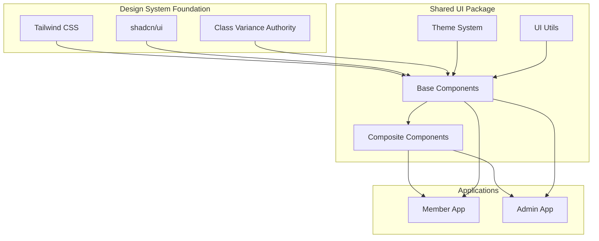

# shadcn/ui + Tailwind CSS Implementation Strategy

## Overview

shadcn/uiとTailwind CSSによる型安全なデザインシステムの実装。member/admin画面で統一されたUI/UX体験を提供し、コンポーネント駆動開発を実現します。

## Architecture Overview



## Base Setup

### Package Structure

```
packages/ui/
├── src/
│   ├── components/          # shadcn/ui コンポーネント
│   │   ├── ui/             # ベースUIコンポーネント
│   │   ├── forms/          # フォーム関連コンポーネント
│   │   ├── layout/         # レイアウトコンポーネント
│   │   └── data/           # データ表示コンポーネント
│   ├── lib/                # ユーティリティ
│   │   ├── utils.ts        # クラス名ヘルパー
│   │   ├── variants.ts     # バリアント定義
│   │   └── theme.ts        # テーマ設定
│   ├── hooks/              # カスタムフック
│   └── styles/             # スタイル定義
│       ├── globals.css     # グローバルCSS
│       └── components.css  # コンポーネント CSS
├── tailwind.config.js      # Tailwind設定
└── package.json
```

### Tailwind Configuration

```javascript
// packages/ui/tailwind.config.js
const { fontFamily } = require('tailwindcss/defaultTheme');

/** @type {import('tailwindcss').Config} */
module.exports = {
  darkMode: ['class'],
  content: [
    './src/**/*.{ts,tsx}',
    // アプリケーション側での使用を考慮
    '../../apps/*/src/**/*.{ts,tsx}',
  ],
  theme: {
    container: {
      center: true,
      padding: '2rem',
      screens: {
        '2xl': '1400px',
      },
    },
    extend: {
      colors: {
        border: 'hsl(var(--border))',
        input: 'hsl(var(--input))',
        ring: 'hsl(var(--ring))',
        background: 'hsl(var(--background))',
        foreground: 'hsl(var(--foreground))',
        primary: {
          DEFAULT: 'hsl(var(--primary))',
          foreground: 'hsl(var(--primary-foreground))',
        },
        secondary: {
          DEFAULT: 'hsl(var(--secondary))',
          foreground: 'hsl(var(--secondary-foreground))',
        },
        destructive: {
          DEFAULT: 'hsl(var(--destructive))',
          foreground: 'hsl(var(--destructive-foreground))',
        },
        muted: {
          DEFAULT: 'hsl(var(--muted))',
          foreground: 'hsl(var(--muted-foreground))',
        },
        accent: {
          DEFAULT: 'hsl(var(--accent))',
          foreground: 'hsl(var(--accent-foreground))',
        },
        popover: {
          DEFAULT: 'hsl(var(--popover))',
          foreground: 'hsl(var(--popover-foreground))',
        },
        card: {
          DEFAULT: 'hsl(var(--card))',
          foreground: 'hsl(var(--card-foreground))',
        },
        // Member/Admin用のブランディングカラー
        member: {
          50: '#eff6ff',
          100: '#dbeafe',
          500: '#3b82f6',
          600: '#2563eb',
          900: '#1e3a8a',
        },
        admin: {
          50: '#fdf2f8',
          100: '#fce7f3',
          500: '#ec4899',
          600: '#db2777',
          900: '#831843',
        },
      },
      borderRadius: {
        lg: 'var(--radius)',
        md: 'calc(var(--radius) - 2px)',
        sm: 'calc(var(--radius) - 4px)',
      },
      fontFamily: {
        sans: ['var(--font-sans)', ...fontFamily.sans],
      },
      keyframes: {
        'accordion-down': {
          from: { height: 0 },
          to: { height: 'var(--radix-accordion-content-height)' },
        },
        'accordion-up': {
          from: { height: 'var(--radix-accordion-content-height)' },
          to: { height: 0 },
        },
      },
      animation: {
        'accordion-down': 'accordion-down 0.2s ease-out',
        'accordion-up': 'accordion-up 0.2s ease-out',
      },
    },
  },
  plugins: [require('tailwindcss-animate')],
};
```

### Global CSS Variables

```css
/* packages/ui/src/styles/globals.css */
@tailwind base;
@tailwind components;
@tailwind utilities;

@layer base {
  :root {
    --background: 0 0% 100%;
    --foreground: 222.2 84% 4.9%;
    --card: 0 0% 100%;
    --card-foreground: 222.2 84% 4.9%;
    --popover: 0 0% 100%;
    --popover-foreground: 222.2 84% 4.9%;
    --primary: 221.2 83.2% 53.3%;
    --primary-foreground: 210 40% 98%;
    --secondary: 210 40% 96%;
    --secondary-foreground: 222.2 84% 4.9%;
    --muted: 210 40% 96%;
    --muted-foreground: 215.4 16.3% 46.9%;
    --accent: 210 40% 96%;
    --accent-foreground: 222.2 84% 4.9%;
    --destructive: 0 84.2% 60.2%;
    --destructive-foreground: 210 40% 98%;
    --border: 214.3 31.8% 91.4%;
    --input: 214.3 31.8% 91.4%;
    --ring: 221.2 83.2% 53.3%;
    --radius: 0.5rem;
  }

  .dark {
    --background: 222.2 84% 4.9%;
    --foreground: 210 40% 98%;
    --card: 222.2 84% 4.9%;
    --card-foreground: 210 40% 98%;
    --popover: 222.2 84% 4.9%;
    --popover-foreground: 210 40% 98%;
    --primary: 217.2 91.2% 59.8%;
    --primary-foreground: 222.2 84% 4.9%;
    --secondary: 217.2 32.6% 17.5%;
    --secondary-foreground: 210 40% 98%;
    --muted: 217.2 32.6% 17.5%;
    --muted-foreground: 215 20.2% 65.1%;
    --accent: 217.2 32.6% 17.5%;
    --accent-foreground: 210 40% 98%;
    --destructive: 0 62.8% 30.6%;
    --destructive-foreground: 210 40% 98%;
    --border: 217.2 32.6% 17.5%;
    --input: 217.2 32.6% 17.5%;
    --ring: 224.3 76.3% 94.1%;
  }

  /* Member App Theme */
  .theme-member {
    --primary: 217.2 91.2% 59.8%;
    --primary-foreground: 210 40% 98%;
    --accent: 214.3 31.8% 91.4%;
  }

  /* Admin App Theme */
  .theme-admin {
    --primary: 330.4 81.2% 60.4%;
    --primary-foreground: 210 40% 98%;
    --accent: 315 100% 97%;
  }
}

@layer base {
  * {
    @apply border-border;
  }
  body {
    @apply bg-background text-foreground;
  }
}
```

## Core Utilities

### Class Name Helper

```typescript
// packages/ui/src/lib/utils.ts
import { type ClassValue, clsx } from 'clsx';
import { twMerge } from 'tailwind-merge';

/**
 * Tailwind CSSクラス名の型安全なマージユーティリティ
 */
export function cn(...inputs: ClassValue[]): string {
  return twMerge(clsx(inputs));
}

/**
 * 条件付きクラス名の適用
 */
export function conditionalClass(
  condition: boolean,
  trueClass: string,
  falseClass: string = ''
): string {
  return condition ? trueClass : falseClass;
}

/**
 * バリアントベースのクラス名生成
 */
export function variantClass(baseClass: string, variant: string, size: string): string {
  return cn(baseClass, `${baseClass}--${variant}`, `${baseClass}--${size}`);
}
```

### Component Variants

```typescript
// packages/ui/src/lib/variants.ts
import { cva, type VariantProps } from 'class-variance-authority';

/**
 * ボタンコンポーネントのバリアント定義
 */
export const buttonVariants = cva(
  'inline-flex items-center justify-center whitespace-nowrap rounded-md text-sm font-medium ring-offset-background transition-colors focus-visible:outline-none focus-visible:ring-2 focus-visible:ring-ring focus-visible:ring-offset-2 disabled:pointer-events-none disabled:opacity-50',
  {
    variants: {
      variant: {
        default: 'bg-primary text-primary-foreground hover:bg-primary/90',
        destructive: 'bg-destructive text-destructive-foreground hover:bg-destructive/90',
        outline: 'border border-input bg-background hover:bg-accent hover:text-accent-foreground',
        secondary: 'bg-secondary text-secondary-foreground hover:bg-secondary/80',
        ghost: 'hover:bg-accent hover:text-accent-foreground',
        link: 'text-primary underline-offset-4 hover:underline',
        // Member/Admin専用バリアント
        member: 'bg-member-500 text-white hover:bg-member-600',
        admin: 'bg-admin-500 text-white hover:bg-admin-600',
      },
      size: {
        default: 'h-10 px-4 py-2',
        sm: 'h-9 rounded-md px-3',
        lg: 'h-11 rounded-md px-8',
        icon: 'h-10 w-10',
      },
    },
    defaultVariants: {
      variant: 'default',
      size: 'default',
    },
  }
);

/**
 * カードコンポーネントのバリアント定義
 */
export const cardVariants = cva('rounded-lg border bg-card text-card-foreground shadow-sm', {
  variants: {
    variant: {
      default: '',
      outline: 'border-2',
      filled: 'bg-secondary',
      member: 'border-member-200 bg-member-50/50',
      admin: 'border-admin-200 bg-admin-50/50',
    },
    size: {
      default: 'p-6',
      sm: 'p-4',
      lg: 'p-8',
    },
  },
  defaultVariants: {
    variant: 'default',
    size: 'default',
  },
});

export type ButtonVariants = VariantProps<typeof buttonVariants>;
export type CardVariants = VariantProps<typeof cardVariants>;
```

## Base Components

### Button Component

```typescript
// packages/ui/src/components/ui/button.tsx
import * as React from "react";
import { Slot } from "@radix-ui/react-slot";
import { buttonVariants, type ButtonVariants } from "@/lib/variants";
import { cn } from "@/lib/utils";

export interface ButtonProps
  extends React.ButtonHTMLAttributes<HTMLButtonElement>,
    ButtonVariants {
  asChild?: boolean;
}

/**
 * 型安全なボタンコンポーネント
 *
 * @param variant - ボタンのスタイルバリアント
 * @param size - ボタンのサイズ
 * @param asChild - 子要素をボタンとしてレンダリングするか
 */
const Button = React.forwardRef<HTMLButtonElement, ButtonProps>(
  ({ className, variant, size, asChild = false, ...props }, ref) => {
    const Comp = asChild ? Slot : "button";
    return (
      <Comp
        className={cn(buttonVariants({ variant, size, className }))}
        ref={ref}
        {...props}
      />
    );
  }
);
Button.displayName = "Button";

export { Button };
```

### Card Component

```typescript
// packages/ui/src/components/ui/card.tsx
import * as React from "react";
import { cardVariants, type CardVariants } from "@/lib/variants";
import { cn } from "@/lib/utils";

export interface CardProps
  extends React.HTMLAttributes<HTMLDivElement>,
    CardVariants {}

/**
 * カードコンテナコンポーネント
 */
const Card = React.forwardRef<HTMLDivElement, CardProps>(
  ({ className, variant, size, ...props }, ref) => (
    <div
      ref={ref}
      className={cn(cardVariants({ variant, size, className }))}
      {...props}
    />
  )
);
Card.displayName = "Card";

/**
 * カードヘッダーコンポーネント
 */
const CardHeader = React.forwardRef<
  HTMLDivElement,
  React.HTMLAttributes<HTMLDivElement>
>(({ className, ...props }, ref) => (
  <div
    ref={ref}
    className={cn("flex flex-col space-y-1.5 p-6", className)}
    {...props}
  />
));
CardHeader.displayName = "CardHeader";

/**
 * カードタイトルコンポーネント
 */
const CardTitle = React.forwardRef<
  HTMLParagraphElement,
  React.HTMLAttributes<HTMLHeadingElement>
>(({ className, ...props }, ref) => (
  <h3
    ref={ref}
    className={cn(
      "text-2xl font-semibold leading-none tracking-tight",
      className
    )}
    {...props}
  />
));
CardTitle.displayName = "CardTitle";

/**
 * カード説明コンポーネント
 */
const CardDescription = React.forwardRef<
  HTMLParagraphElement,
  React.HTMLAttributes<HTMLParagraphElement>
>(({ className, ...props }, ref) => (
  <p
    ref={ref}
    className={cn("text-sm text-muted-foreground", className)}
    {...props}
  />
));
CardDescription.displayName = "CardDescription";

/**
 * カードコンテンツコンポーネント
 */
const CardContent = React.forwardRef<
  HTMLDivElement,
  React.HTMLAttributes<HTMLDivElement>
>(({ className, ...props }, ref) => (
  <div ref={ref} className={cn("p-6 pt-0", className)} {...props} />
));
CardContent.displayName = "CardContent";

/**
 * カードフッターコンポーネント
 */
const CardFooter = React.forwardRef<
  HTMLDivElement,
  React.HTMLAttributes<HTMLDivElement>
>(({ className, ...props }, ref) => (
  <div
    ref={ref}
    className={cn("flex items-center p-6 pt-0", className)}
    {...props}
  />
));
CardFooter.displayName = "CardFooter";

export { Card, CardHeader, CardFooter, CardTitle, CardDescription, CardContent };
```

## Form Components

### Form Integration with Zod

```typescript
// packages/ui/src/components/forms/form.tsx
import * as React from "react";
import { Controller, useForm, type FieldValues, type Path } from "react-hook-form";
import { zodResolver } from "@hookform/resolvers/zod";
import { z } from "zod";
import { cn } from "@/lib/utils";

/**
 * 型安全なフォームコンポーネント
 */
interface FormProps<T extends FieldValues> {
  schema: z.ZodSchema<T>;
  onSubmit: (data: T) => void | Promise<void>;
  defaultValues?: Partial<T>;
  children: (methods: ReturnType<typeof useForm<T>>) => React.ReactNode;
  className?: string;
}

export function Form<T extends FieldValues>({
  schema,
  onSubmit,
  defaultValues,
  children,
  className,
}: FormProps<T>): JSX.Element {
  const methods = useForm<T>({
    resolver: zodResolver(schema),
    defaultValues,
  });

  return (
    <form
      onSubmit={methods.handleSubmit(onSubmit)}
      className={cn("space-y-4", className)}
    >
      {children(methods)}
    </form>
  );
}

/**
 * フィールドラベルコンポーネント
 */
export const FormLabel = React.forwardRef<
  HTMLLabelElement,
  React.LabelHTMLAttributes<HTMLLabelElement>
>(({ className, ...props }, ref) => (
  <label
    ref={ref}
    className={cn(
      "text-sm font-medium leading-none peer-disabled:cursor-not-allowed peer-disabled:opacity-70",
      className
    )}
    {...props}
  />
));
FormLabel.displayName = "FormLabel";

/**
 * フィールドエラーメッセージコンポーネント
 */
export const FormMessage = React.forwardRef<
  HTMLParagraphElement,
  React.HTMLAttributes<HTMLParagraphElement>
>(({ className, children, ...props }, ref) => {
  if (!children) return null;

  return (
    <p
      ref={ref}
      className={cn("text-sm font-medium text-destructive", className)}
      {...props}
    >
      {children}
    </p>
  );
});
FormMessage.displayName = "FormMessage";
```

### Input Components

```typescript
// packages/ui/src/components/ui/input.tsx
import * as React from "react";
import { cn } from "@/lib/utils";

export interface InputProps
  extends React.InputHTMLAttributes<HTMLInputElement> {}

/**
 * 型安全な入力コンポーネント
 */
const Input = React.forwardRef<HTMLInputElement, InputProps>(
  ({ className, type, ...props }, ref) => {
    return (
      <input
        type={type}
        className={cn(
          "flex h-10 w-full rounded-md border border-input bg-background px-3 py-2 text-sm ring-offset-background file:border-0 file:bg-transparent file:text-sm file:font-medium placeholder:text-muted-foreground focus-visible:outline-none focus-visible:ring-2 focus-visible:ring-ring focus-visible:ring-offset-2 disabled:cursor-not-allowed disabled:opacity-50",
          className
        )}
        ref={ref}
        {...props}
      />
    );
  }
);
Input.displayName = "Input";

export { Input };
```

## Layout Components

### Application Layout

```typescript
// packages/ui/src/components/layout/app-layout.tsx
import * as React from "react";
import { cn } from "@/lib/utils";

interface AppLayoutProps {
  children: React.ReactNode;
  sidebar?: React.ReactNode;
  header?: React.ReactNode;
  footer?: React.ReactNode;
  theme?: 'member' | 'admin';
  className?: string;
}

/**
 * アプリケーション全体のレイアウトコンポーネント
 */
export function AppLayout({
  children,
  sidebar,
  header,
  footer,
  theme = 'member',
  className,
}: AppLayoutProps): JSX.Element {
  return (
    <div className={cn(
      "min-h-screen bg-background",
      `theme-${theme}`,
      className
    )}>
      {header && (
        <header className="sticky top-0 z-50 w-full border-b bg-background/95 backdrop-blur supports-[backdrop-filter]:bg-background/60">
          {header}
        </header>
      )}

      <div className="flex flex-1">
        {sidebar && (
          <aside className="w-64 border-r bg-background">
            {sidebar}
          </aside>
        )}

        <main className="flex-1 p-6">
          {children}
        </main>
      </div>

      {footer && (
        <footer className="border-t bg-background">
          {footer}
        </footer>
      )}
    </div>
  );
}
```

### Navigation Components

```typescript
// packages/ui/src/components/layout/navigation.tsx
import * as React from "react";
import Link from "next/link";
import { cn } from "@/lib/utils";

interface NavigationItem {
  href: string;
  label: string;
  icon?: React.ReactNode;
  active?: boolean;
}

interface NavigationProps {
  items: NavigationItem[];
  variant?: 'member' | 'admin';
  className?: string;
}

/**
 * ナビゲーションコンポーネント
 */
export function Navigation({ items, variant = 'member', className }: NavigationProps): JSX.Element {
  return (
    <nav className={cn("space-y-2", className)}>
      {items.map((item) => (
        <Link
          key={item.href}
          href={item.href}
          className={cn(
            "flex items-center space-x-3 rounded-lg px-3 py-2 text-sm font-medium transition-colors",
            item.active
              ? cn(
                  "bg-primary text-primary-foreground",
                  variant === 'member' && "bg-member-500 text-white",
                  variant === 'admin' && "bg-admin-500 text-white"
                )
              : "text-muted-foreground hover:bg-accent hover:text-accent-foreground"
          )}
        >
          {item.icon}
          <span>{item.label}</span>
        </Link>
      ))}
    </nav>
  );
}
```

## Data Display Components

### Data Table

```typescript
// packages/ui/src/components/data/data-table.tsx
import * as React from "react";
import {
  ColumnDef,
  flexRender,
  getCoreRowModel,
  useReactTable,
  getSortedRowModel,
  SortingState,
  getFilteredRowModel,
  ColumnFiltersState,
} from "@tanstack/react-table";
import { cn } from "@/lib/utils";

interface DataTableProps<TData, TValue> {
  columns: ColumnDef<TData, TValue>[];
  data: TData[];
  searchKey?: string;
  className?: string;
}

/**
 * 型安全なデータテーブルコンポーネント
 */
export function DataTable<TData, TValue>({
  columns,
  data,
  searchKey,
  className,
}: DataTableProps<TData, TValue>): JSX.Element {
  const [sorting, setSorting] = React.useState<SortingState>([]);
  const [columnFilters, setColumnFilters] = React.useState<ColumnFiltersState>([]);

  const table = useReactTable({
    data,
    columns,
    getCoreRowModel: getCoreRowModel(),
    onSortingChange: setSorting,
    getSortedRowModel: getSortedRowModel(),
    onColumnFiltersChange: setColumnFilters,
    getFilteredRowModel: getFilteredRowModel(),
    state: {
      sorting,
      columnFilters,
    },
  });

  return (
    <div className={cn("space-y-4", className)}>
      {searchKey && (
        <div className="flex items-center py-4">
          <input
            placeholder={`Search ${searchKey}...`}
            value={(table.getColumn(searchKey)?.getFilterValue() as string) ?? ""}
            onChange={(event) =>
              table.getColumn(searchKey)?.setFilterValue(event.target.value)
            }
            className="max-w-sm rounded-md border border-input bg-background px-3 py-2 text-sm"
          />
        </div>
      )}

      <div className="rounded-md border">
        <table className="w-full">
          <thead>
            {table.getHeaderGroups().map((headerGroup) => (
              <tr key={headerGroup.id} className="border-b">
                {headerGroup.headers.map((header) => (
                  <th
                    key={header.id}
                    className="h-12 px-4 text-left align-middle font-medium text-muted-foreground"
                  >
                    {header.isPlaceholder
                      ? null
                      : flexRender(
                          header.column.columnDef.header,
                          header.getContext()
                        )}
                  </th>
                ))}
              </tr>
            ))}
          </thead>
          <tbody>
            {table.getRowModel().rows?.length ? (
              table.getRowModel().rows.map((row) => (
                <tr
                  key={row.id}
                  className="border-b hover:bg-muted/50"
                >
                  {row.getVisibleCells().map((cell) => (
                    <td key={cell.id} className="p-4 align-middle">
                      {flexRender(cell.column.columnDef.cell, cell.getContext())}
                    </td>
                  ))}
                </tr>
              ))
            ) : (
              <tr>
                <td colSpan={columns.length} className="h-24 text-center">
                  No results.
                </td>
              </tr>
            )}
          </tbody>
        </table>
      </div>
    </div>
  );
}
```

## Application Integration

### Member App Example

```typescript
// apps/member/src/components/user-profile.tsx
import { Card, CardContent, CardHeader, CardTitle } from "@/ui/components/ui/card";
import { Button } from "@/ui/components/ui/button";
import { AppLayout } from "@/ui/components/layout/app-layout";
import { Navigation } from "@/ui/components/layout/navigation";
import { User } from "@/shared/schemas/user";

interface UserProfileProps {
  user: User;
}

export function UserProfile({ user }: UserProfileProps): JSX.Element {
  const navigationItems = [
    { href: "/dashboard", label: "Dashboard", active: false },
    { href: "/profile", label: "Profile", active: true },
    { href: "/settings", label: "Settings", active: false },
  ];

  return (
    <AppLayout
      theme="member"
      sidebar={<Navigation items={navigationItems} variant="member" />}
      header={
        <div className="flex h-16 items-center px-6">
          <h1 className="text-lg font-semibold">Member Portal</h1>
        </div>
      }
    >
      <div className="space-y-6">
        <Card variant="member">
          <CardHeader>
            <CardTitle>User Profile</CardTitle>
          </CardHeader>
          <CardContent>
            <div className="space-y-4">
              <div>
                <label className="text-sm font-medium">Name</label>
                <p className="text-lg">{user.name}</p>
              </div>
              <div>
                <label className="text-sm font-medium">Email</label>
                <p className="text-lg">{user.email}</p>
              </div>
              <Button variant="member">Edit Profile</Button>
            </div>
          </CardContent>
        </Card>
      </div>
    </AppLayout>
  );
}
```

### Admin App Example

```typescript
// apps/admin/src/components/user-management.tsx
import { Card, CardContent, CardHeader, CardTitle } from "@/ui/components/ui/card";
import { Button } from "@/ui/components/ui/button";
import { DataTable } from "@/ui/components/data/data-table";
import { AppLayout } from "@/ui/components/layout/app-layout";
import { Navigation } from "@/ui/components/layout/navigation";
import { User } from "@/shared/schemas/user";
import { ColumnDef } from "@tanstack/react-table";

interface UserManagementProps {
  users: User[];
}

const columns: ColumnDef<User>[] = [
  {
    accessorKey: "name",
    header: "Name",
  },
  {
    accessorKey: "email",
    header: "Email",
  },
  {
    accessorKey: "role",
    header: "Role",
  },
  {
    accessorKey: "isActive",
    header: "Status",
    cell: ({ row }) => (
      <span className={`px-2 py-1 rounded-full text-xs ${
        row.getValue("isActive")
          ? "bg-green-100 text-green-800"
          : "bg-red-100 text-red-800"
      }`}>
        {row.getValue("isActive") ? "Active" : "Inactive"}
      </span>
    ),
  },
];

export function UserManagement({ users }: UserManagementProps): JSX.Element {
  const navigationItems = [
    { href: "/admin", label: "Dashboard", active: false },
    { href: "/admin/users", label: "User Management", active: true },
    { href: "/admin/settings", label: "Settings", active: false },
  ];

  return (
    <AppLayout
      theme="admin"
      sidebar={<Navigation items={navigationItems} variant="admin" />}
      header={
        <div className="flex h-16 items-center px-6">
          <h1 className="text-lg font-semibold">Admin Portal</h1>
        </div>
      }
    >
      <div className="space-y-6">
        <Card variant="admin">
          <CardHeader>
            <CardTitle>User Management</CardTitle>
          </CardHeader>
          <CardContent>
            <div className="space-y-4">
              <div className="flex justify-between items-center">
                <h2 className="text-xl font-semibold">All Users</h2>
                <Button variant="admin">Add User</Button>
              </div>
              <DataTable
                columns={columns}
                data={users}
                searchKey="email"
              />
            </div>
          </CardContent>
        </Card>
      </div>
    </AppLayout>
  );
}
```

## Theme System

### Dynamic Theme Switching

```typescript
// packages/ui/src/hooks/use-theme.ts
import { useEffect, useState } from 'react';

type Theme = 'light' | 'dark';
type AppTheme = 'member' | 'admin';

export function useTheme() {
  const [theme, setTheme] = useState<Theme>('light');
  const [appTheme, setAppTheme] = useState<AppTheme>('member');

  useEffect(() => {
    const root = window.document.documentElement;

    root.classList.remove('light', 'dark', 'theme-member', 'theme-admin');
    root.classList.add(theme, `theme-${appTheme}`);
  }, [theme, appTheme]);

  return {
    theme,
    appTheme,
    setTheme,
    setAppTheme,
    toggleTheme: () => setTheme(theme === 'light' ? 'dark' : 'light'),
  };
}
```

## Benefits

### 1. Member/Admin Visual Consistency

- **統一デザインシステム**: 共通コンポーネントで一貫したUX
- **ブランディング差分**: テーマカラーによる適切な視覚的区別
- **レスポンシブ対応**: 全デバイスでの統一体験

### 2. Type Safety

- **コンポーネントProps**: TypeScriptによる完全な型安全性
- **バリアント制御**: CVAによる型安全なスタイル管理
- **テーマ型定義**: テーマ切り替えの型安全性

### 3. Developer Experience

- **自動補完**: IDEでの完全なprops補完
- **デザイントークン**: CSS変数による一元的なデザイン管理
- **コンポーネント再利用**: DRY原則に基づく効率的な開発

### 4. Performance

- **Tree Shaking**: 未使用コンポーネントの除外
- **CSS最適化**: Tailwind CSSの自動purge
- **バンドル最適化**: Next.jsの最適化との連携

## Error Handling and User Feedback

### Error Boundary Component

```typescript
// packages/ui/src/components/error/error-boundary.tsx
import * as React from "react";
import { Button } from "@/components/ui/button";
import { Card, CardContent, CardDescription, CardFooter, CardHeader, CardTitle } from "@/components/ui/card";
import { AlertCircle } from "lucide-react";

interface ErrorBoundaryState {
  hasError: boolean;
  error: Error | null;
  errorInfo: React.ErrorInfo | null;
}

interface ErrorBoundaryProps {
  children: React.ReactNode;
  fallback?: (error: Error, errorInfo: React.ErrorInfo, reset: () => void) => React.ReactNode;
  onError?: (error: Error, errorInfo: React.ErrorInfo) => void;
}

/**
 * エラーバウンダリコンポーネント
 * 子コンポーネントで発生したエラーをキャッチし、フォールバックUIを表示
 */
export class ErrorBoundary extends React.Component<ErrorBoundaryProps, ErrorBoundaryState> {
  constructor(props: ErrorBoundaryProps) {
    super(props);
    this.state = {
      hasError: false,
      error: null,
      errorInfo: null,
    };
  }

  static getDerivedStateFromError(error: Error): Partial<ErrorBoundaryState> {
    return { hasError: true, error };
  }

  componentDidCatch(error: Error, errorInfo: React.ErrorInfo): void {
    console.error("ErrorBoundary caught an error:", error, errorInfo);
    this.setState({ errorInfo });

    if (this.props.onError) {
      this.props.onError(error, errorInfo);
    }
  }

  reset = (): void => {
    this.setState({
      hasError: false,
      error: null,
      errorInfo: null,
    });
  };

  render(): React.ReactNode {
    if (this.state.hasError && this.state.error && this.state.errorInfo) {
      if (this.props.fallback) {
        return this.props.fallback(this.state.error, this.state.errorInfo, this.reset);
      }

      return (
        <div className="flex min-h-[400px] items-center justify-center p-4">
          <Card className="w-full max-w-md">
            <CardHeader>
              <div className="flex items-center space-x-2">
                <AlertCircle className="h-5 w-5 text-destructive" />
                <CardTitle>Something went wrong</CardTitle>
              </div>
              <CardDescription>
                An unexpected error occurred. Please try again.
              </CardDescription>
            </CardHeader>
            <CardContent>
              {process.env.NODE_ENV === "development" && (
                <details className="mt-4 rounded-md bg-muted p-4 text-sm">
                  <summary className="cursor-pointer font-medium">
                    Error details
                  </summary>
                  <pre className="mt-2 overflow-auto">
                    {this.state.error.toString()}
                    {"\n\n"}
                    {this.state.errorInfo.componentStack}
                  </pre>
                </details>
              )}
            </CardContent>
            <CardFooter>
              <Button onClick={this.reset} className="w-full">
                Try again
              </Button>
            </CardFooter>
          </Card>
        </div>
      );
    }

    return this.props.children;
  }
}
```

### Toast Notification System

```typescript
// packages/ui/src/components/toast/toaster.tsx
import * as React from "react";
import { CheckCircle, XCircle, AlertCircle, Info } from "lucide-react";
import { cn } from "@/lib/utils";

export type ToastType = "success" | "error" | "warning" | "info";

export interface Toast {
  id: string;
  type: ToastType;
  title: string;
  description?: string;
  duration?: number;
}

interface ToasterContextValue {
  toasts: Toast[];
  showToast: (toast: Omit<Toast, "id">) => void;
  dismissToast: (id: string) => void;
}

const ToasterContext = React.createContext<ToasterContextValue | undefined>(undefined);

/**
 * トースト通知プロバイダー
 */
export function ToasterProvider({ children }: { children: React.ReactNode }): JSX.Element {
  const [toasts, setToasts] = React.useState<Toast[]>([]);

  const showToast = React.useCallback((toast: Omit<Toast, "id">) => {
    const id = Math.random().toString(36).substring(7);
    const newToast = { ...toast, id };

    setToasts((prev) => [...prev, newToast]);

    // 自動的に削除
    setTimeout(() => {
      dismissToast(id);
    }, toast.duration || 5000);
  }, []);

  const dismissToast = React.useCallback((id: string) => {
    setToasts((prev) => prev.filter((toast) => toast.id !== id));
  }, []);

  return (
    <ToasterContext.Provider value={{ toasts, showToast, dismissToast }}>
      {children}
      <ToastContainer toasts={toasts} onDismiss={dismissToast} />
    </ToasterContext.Provider>
  );
}

/**
 * トースト通知フック
 */
export function useToast() {
  const context = React.useContext(ToasterContext);
  if (!context) {
    throw new Error("useToast must be used within a ToasterProvider");
  }
  return context;
}

/**
 * トーストコンテナ
 */
function ToastContainer({
  toasts,
  onDismiss
}: {
  toasts: Toast[];
  onDismiss: (id: string) => void;
}): JSX.Element {
  return (
    <div className="fixed bottom-4 right-4 z-50 flex flex-col space-y-2">
      {toasts.map((toast) => (
        <ToastItem key={toast.id} toast={toast} onDismiss={onDismiss} />
      ))}
    </div>
  );
}

/**
 * 個別のトースト
 */
function ToastItem({
  toast,
  onDismiss
}: {
  toast: Toast;
  onDismiss: (id: string) => void;
}): JSX.Element {
  const icons = {
    success: <CheckCircle className="h-5 w-5 text-green-600" />,
    error: <XCircle className="h-5 w-5 text-red-600" />,
    warning: <AlertCircle className="h-5 w-5 text-yellow-600" />,
    info: <Info className="h-5 w-5 text-blue-600" />,
  };

  const styles = {
    success: "border-green-200 bg-green-50",
    error: "border-red-200 bg-red-50",
    warning: "border-yellow-200 bg-yellow-50",
    info: "border-blue-200 bg-blue-50",
  };

  return (
    <div
      className={cn(
        "pointer-events-auto flex w-full max-w-md rounded-lg border p-4 shadow-lg",
        styles[toast.type]
      )}
      role="alert"
    >
      <div className="flex items-start space-x-3">
        {icons[toast.type]}
        <div className="flex-1">
          <p className="text-sm font-medium text-gray-900">{toast.title}</p>
          {toast.description && (
            <p className="mt-1 text-sm text-gray-700">{toast.description}</p>
          )}
        </div>
        <button
          onClick={() => onDismiss(toast.id)}
          className="inline-flex rounded-md text-gray-400 hover:text-gray-500 focus:outline-none focus:ring-2 focus:ring-gray-500 focus:ring-offset-2"
        >
          <span className="sr-only">Dismiss</span>
          <XCircle className="h-5 w-5" />
        </button>
      </div>
    </div>
  );
}
```

### Form Error Handling

```typescript
// packages/ui/src/components/forms/form-with-error-handling.tsx
import * as React from "react";
import { useForm, type FieldValues, type Path } from "react-hook-form";
import { zodResolver } from "@hookform/resolvers/zod";
import { z } from "zod";
import { cn } from "@/lib/utils";
import { useToast } from "@/components/toast/toaster";
import { Loader2 } from "lucide-react";
import { Button } from "@/components/ui/button";

interface FormWithErrorHandlingProps<T extends FieldValues> {
  schema: z.ZodSchema<T>;
  onSubmit: (data: T) => Promise<void>;
  defaultValues?: Partial<T>;
  children: (methods: ReturnType<typeof useForm<T>>) => React.ReactNode;
  className?: string;
  successMessage?: string;
}

/**
 * エラーハンドリング機能付きフォーム
 */
export function FormWithErrorHandling<T extends FieldValues>({
  schema,
  onSubmit,
  defaultValues,
  children,
  className,
  successMessage = "Successfully submitted!",
}: FormWithErrorHandlingProps<T>): JSX.Element {
  const { showToast } = useToast();
  const [isSubmitting, setIsSubmitting] = React.useState(false);

  const methods = useForm<T>({
    resolver: zodResolver(schema),
    defaultValues,
  });

  const handleSubmit = async (data: T) => {
    setIsSubmitting(true);
    try {
      await onSubmit(data);
      showToast({
        type: "success",
        title: successMessage,
      });
      methods.reset();
    } catch (error) {
      const message = error instanceof Error
        ? error.message
        : "An unexpected error occurred";

      showToast({
        type: "error",
        title: "Submission failed",
        description: message,
      });

      // フィールド別エラーの処理
      if (error instanceof z.ZodError) {
        error.errors.forEach((err) => {
          if (err.path.length > 0) {
            methods.setError(err.path[0] as Path<T>, {
              type: "manual",
              message: err.message,
            });
          }
        });
      }
    } finally {
      setIsSubmitting(false);
    }
  };

  return (
    <form
      onSubmit={methods.handleSubmit(handleSubmit)}
      className={cn("space-y-4", className)}
    >
      {children(methods)}

      <Button
        type="submit"
        disabled={isSubmitting}
        className="w-full"
      >
        {isSubmitting && <Loader2 className="mr-2 h-4 w-4 animate-spin" />}
        {isSubmitting ? "Submitting..." : "Submit"}
      </Button>
    </form>
  );
}
```

### Loading States

```typescript
// packages/ui/src/components/loading/skeleton.tsx
import { cn } from "@/lib/utils";

interface SkeletonProps extends React.HTMLAttributes<HTMLDivElement> {
  variant?: "text" | "circular" | "rectangular";
  width?: string | number;
  height?: string | number;
}

/**
 * スケルトンローディングコンポーネント
 */
export function Skeleton({
  className,
  variant = "text",
  width,
  height,
  ...props
}: SkeletonProps): JSX.Element {
  return (
    <div
      className={cn(
        "animate-pulse bg-muted",
        variant === "text" && "h-4 w-full rounded",
        variant === "circular" && "rounded-full",
        variant === "rectangular" && "rounded-md",
        className
      )}
      style={{
        width: width || undefined,
        height: height || undefined,
      }}
      {...props}
    />
  );
}

/**
 * テーブルスケルトン
 */
export function TableSkeleton({ rows = 5 }: { rows?: number }): JSX.Element {
  return (
    <div className="w-full">
      <div className="rounded-md border">
        <table className="w-full">
          <thead>
            <tr className="border-b">
              <th className="h-12 px-4">
                <Skeleton variant="text" width="60%" />
              </th>
              <th className="h-12 px-4">
                <Skeleton variant="text" width="40%" />
              </th>
              <th className="h-12 px-4">
                <Skeleton variant="text" width="50%" />
              </th>
            </tr>
          </thead>
          <tbody>
            {Array.from({ length: rows }).map((_, i) => (
              <tr key={i} className="border-b">
                <td className="p-4">
                  <Skeleton variant="text" width="80%" />
                </td>
                <td className="p-4">
                  <Skeleton variant="text" width="60%" />
                </td>
                <td className="p-4">
                  <Skeleton variant="text" width="70%" />
                </td>
              </tr>
            ))}
          </tbody>
        </table>
      </div>
    </div>
  );
}
```

## Accessibility

### ARIA Attributes and Keyboard Navigation

```typescript
// packages/ui/src/components/ui/accessible-dialog.tsx
import * as React from "react";
import * as DialogPrimitive from "@radix-ui/react-dialog";
import { X } from "lucide-react";
import { cn } from "@/lib/utils";

interface AccessibleDialogProps {
  trigger: React.ReactNode;
  title: string;
  description?: string;
  children: React.ReactNode;
  open?: boolean;
  onOpenChange?: (open: boolean) => void;
}

/**
 * アクセシブルなダイアログコンポーネント
 * - フォーカストラップ
 * - ESCキーでの閉じる
 * - スクリーンリーダー対応
 */
export function AccessibleDialog({
  trigger,
  title,
  description,
  children,
  open,
  onOpenChange,
}: AccessibleDialogProps): JSX.Element {
  return (
    <DialogPrimitive.Root open={open} onOpenChange={onOpenChange}>
      <DialogPrimitive.Trigger asChild>
        {trigger}
      </DialogPrimitive.Trigger>
      <DialogPrimitive.Portal>
        <DialogPrimitive.Overlay
          className="fixed inset-0 z-50 bg-background/80 backdrop-blur-sm data-[state=open]:animate-in data-[state=closed]:animate-out data-[state=closed]:fade-out-0 data-[state=open]:fade-in-0"
        />
        <DialogPrimitive.Content
          className="fixed left-[50%] top-[50%] z-50 grid w-full max-w-lg translate-x-[-50%] translate-y-[-50%] gap-4 border bg-background p-6 shadow-lg duration-200 data-[state=open]:animate-in data-[state=closed]:animate-out data-[state=closed]:fade-out-0 data-[state=open]:fade-in-0 data-[state=closed]:zoom-out-95 data-[state=open]:zoom-in-95 data-[state=closed]:slide-out-to-left-1/2 data-[state=closed]:slide-out-to-top-[48%] data-[state=open]:slide-in-from-left-1/2 data-[state=open]:slide-in-from-top-[48%] sm:rounded-lg"
          onOpenAutoFocus={(e) => {
            // 最初のフォーカス可能な要素にフォーカス
            e.preventDefault();
            const firstFocusable = e.currentTarget.querySelector<HTMLElement>(
              'button, [href], input, select, textarea, [tabindex]:not([tabindex="-1"])'
            );
            firstFocusable?.focus();
          }}
        >
          <div>
            <DialogPrimitive.Title className="text-lg font-semibold leading-none tracking-tight">
              {title}
            </DialogPrimitive.Title>
            {description && (
              <DialogPrimitive.Description className="text-sm text-muted-foreground mt-2">
                {description}
              </DialogPrimitive.Description>
            )}
          </div>
          <div className="mt-4">
            {children}
          </div>
          <DialogPrimitive.Close className="absolute right-4 top-4 rounded-sm opacity-70 ring-offset-background transition-opacity hover:opacity-100 focus:outline-none focus:ring-2 focus:ring-ring focus:ring-offset-2 disabled:pointer-events-none data-[state=open]:bg-accent data-[state=open]:text-muted-foreground">
            <X className="h-4 w-4" />
            <span className="sr-only">Close</span>
          </DialogPrimitive.Close>
        </DialogPrimitive.Content>
      </DialogPrimitive.Portal>
    </DialogPrimitive.Root>
  );
}
```

### Skip Navigation

```typescript
// packages/ui/src/components/a11y/skip-navigation.tsx
export function SkipNavigation(): JSX.Element {
  return (
    <a
      href="#main-content"
      className="sr-only focus:not-sr-only focus:absolute focus:left-4 focus:top-4 focus:z-50 focus:rounded-md focus:bg-background focus:px-4 focus:py-2 focus:outline-none focus:ring-2 focus:ring-ring"
    >
      Skip to main content
    </a>
  );
}
```

### Focus Management Hook

```typescript
// packages/ui/src/hooks/use-focus-trap.ts
import { useEffect, useRef } from 'react';

/**
 * フォーカストラップフック
 * モーダルやドロワー内でフォーカスを制限
 */
export function useFocusTrap<T extends HTMLElement>(isActive: boolean) {
  const ref = useRef<T>(null);

  useEffect(() => {
    if (!isActive || !ref.current) return;

    const element = ref.current;
    const focusableElements = element.querySelectorAll<HTMLElement>(
      'button, [href], input, select, textarea, [tabindex]:not([tabindex="-1"])'
    );

    const firstFocusable = focusableElements[0];
    const lastFocusable = focusableElements[focusableElements.length - 1];

    const handleKeyDown = (e: KeyboardEvent) => {
      if (e.key !== 'Tab') return;

      if (e.shiftKey) {
        if (document.activeElement === firstFocusable) {
          e.preventDefault();
          lastFocusable.focus();
        }
      } else {
        if (document.activeElement === lastFocusable) {
          e.preventDefault();
          firstFocusable.focus();
        }
      }
    };

    element.addEventListener('keydown', handleKeyDown);
    firstFocusable?.focus();

    return () => {
      element.removeEventListener('keydown', handleKeyDown);
    };
  }, [isActive]);

  return ref;
}
```

---

_この包括的な実装により、型安全で保守性が高く、エラーハンドリングとアクセシビリティに配慮したmember/admin両アプリで統一されたデザインシステムを実現します。_
