# GitHub Flow + Atomic Commits Implementation

## Overview

GitHub Flowとatomic commitsによる効率的で安全な開発ワークフロー。TDD cycleと統合し、品質ゲートにより一貫した品質を保証する実践戦略を実装します。

## GitHub Flow Architecture

```mermaid
gitGraph
    commit id: "main: stable"
    branch feature/user-auth
    checkout feature/user-auth
    commit id: "🔴 test: failing auth test"
    commit id: "🟢 feat: minimal auth impl"
    commit id: "🔵 refactor: extract auth utils"
    commit id: "🧪 test: add edge cases"
    commit id: "📝 docs: update auth guide"
    checkout main
    merge feature/user-auth
    commit id: "main: auth feature ✅"

    branch feature/admin-crud
    checkout feature/admin-crud
    commit id: "🔴 test: admin crud failing"
    commit id: "🟢 feat: basic crud ops"
    commit id: "🔵 refactor: optimize queries"
    checkout main
    merge feature/admin-crud
    commit id: "main: admin crud ✅"
```



## Atomic Commit Strategy

### Commit Types and Patterns

```bash
# 🎯 TDD Cycle Commits
git commit -m "🔴 test: add failing user creation test

- Test creates user with valid data
- Expects user object with generated ID
- Currently fails as UserService not implemented

Relates to #123"

git commit -m "🟢 feat: implement basic user creation

- Add UserService.createUser method
- Minimal implementation to make test pass
- TODO: Add validation and error handling

Closes test failure in #123"

git commit -m "🔵 refactor: extract user validation logic

- Move validation logic to UserValidator class
- Improve error messages and type safety
- No behavior change, all tests still pass

Improves #123"

# 🏗️ Feature Development Commits
git commit -m "feat(auth): add Google OAuth integration

- Implement GoogleOAuthService
- Add OAuth callback handler
- Include error handling for invalid tokens
- Add comprehensive test coverage

Closes #124"

# 🐛 Bug Fix Commits
git commit -m "fix(api): resolve member API role filtering bug

- Member API was showing admin users incorrectly
- Add explicit role='member' filter in query
- Add regression test to prevent future issues

Fixes #125"

# 📝 Documentation Commits
git commit -m "docs: update API authentication guide

- Add Google OAuth setup instructions
- Include environment variable examples
- Add troubleshooting section for common issues

Updates #126"

# 🎨 Style/Format Commits
git commit -m "style: apply prettier formatting to auth components

- Auto-format AuthService and related files
- No functional changes
- Consistent with project style guide

Part of #127"
```

### Commit Message Convention

```typescript
// commit-message-format.ts
interface CommitMessage {
  type: 'feat' | 'fix' | 'docs' | 'style' | 'refactor' | 'test' | 'chore';
  scope?: 'api' | 'ui' | 'auth' | 'db' | 'infra' | 'workflow';
  emoji?: '🔴' | '🟢' | '🔵' | '🧪' | '📝' | '🐛' | '🎨' | '🚀';
  description: string;
  body?: string;
  footer?: string;
}

// Example usage:
const commitMsg: CommitMessage = {
  type: 'feat',
  scope: 'auth',
  emoji: '🟢',
  description: 'implement Google OAuth integration',
  body: `- Add GoogleOAuthService with token exchange
- Implement JWT generation and validation  
- Add user creation/update logic
- Include comprehensive error handling`,
  footer: 'Closes #124',
};
```

## Git Hooks Integration

### Pre-commit Hook Implementation

```bash
#!/usr/bin/env sh
# .husky/pre-commit

. "$(dirname -- "$0")/_/husky.sh"

echo "🔍 Running pre-commit quality checks..."

# 1. Format and lint staged files
echo "🎨 Prettier format..."
npx lint-staged

echo "📋 ESLint check..."
npm run lint:fix

# 2. Type check entire project
echo "🔧 TypeScript check..."
npm run type-check

# 3. Detect unused code
echo "🧠 Knip unused code detection..."
npm run knip

# 4. Run affected unit tests
echo "🧪 Unit tests..."
npm run test:unit:affected

# 5. Check for debugging code
echo "🚫 Debug code check..."
if git diff --cached --name-only | xargs grep -l "console.log\|debugger\|TODO\|FIXME" 2>/dev/null; then
  echo "❌ Found debugging code or TODO items in staged files"
  echo "Please remove debugging code or move TODOs to issues"
  exit 1
fi

# 5. Validate commit message format
echo "📝 Commit message validation..."
npm run validate:commit-msg

echo "✅ Pre-commit checks passed!"
```

### Lint-staged Configuration

```json
// .lintstagedrc.json
{
  "*.{ts,tsx}": ["prettier --write", "eslint --fix --max-warnings 0", "git add"],
  "*.{js,jsx}": ["prettier --write", "eslint --fix --max-warnings 0", "git add"],
  "*.{json,md,yml,yaml}": ["prettier --write", "git add"],
  "*.css": ["prettier --write", "stylelint --fix", "git add"]
}
```

### Knip Configuration

```typescript
// knip.config.ts
import { KnipConfig } from 'knip';

const config: KnipConfig = {
  entry: [
    'apps/*/src/index.ts',
    'apps/*/src/pages/**/*.tsx',
    'apps/*/src/app/**/*.tsx',
    'packages/*/src/index.ts',
  ],
  project: ['apps/*/src/**/*.{ts,tsx}', 'packages/*/src/**/*.{ts,tsx}'],
  ignoreDependencies: [
    // Build tools
    '@types/node',
    'typescript',
    'tsx',
    'tsup',

    // Testing
    '@testing-library/*',
    'jest',
    'vitest',
    'cypress',

    // Linting
    'eslint',
    'eslint-*',
    '@typescript-eslint/*',
    'prettier',
    'husky',
    'lint-staged',
  ],
  ignoreExportsUsedInFile: true,
  ignoreWorkspaces: [
    'packages/infra', // CDK has dynamic imports
  ],
};

export default config;
```

### NPM Scripts for Quality Maintenance

```json
// package.json scripts
{
  "scripts": {
    "format": "prettier --write \"**/*.{ts,tsx,js,jsx,json,md,yml,yaml,css}\"",
    "format:check": "prettier --check \"**/*.{ts,tsx,js,jsx,json,md,yml,yaml,css}\"",
    "lint": "eslint . --ext .ts,.tsx,.js,.jsx --max-warnings 0",
    "lint:fix": "eslint . --ext .ts,.tsx,.js,.jsx --fix --max-warnings 0",
    "knip": "knip",
    "knip:fix": "knip --fix",
    "quality:check": "npm run format:check && npm run lint && npm run knip",
    "quality:fix": "npm run format && npm run lint:fix && npm run knip:fix",
    "prepare": "husky install"
  }
}
```

### Commit Message Validation

```typescript
// scripts/validate-commit-msg.ts
#!/usr/bin/env node

import fs from 'fs';
import path from 'path';

const COMMIT_MSG_FILE = process.argv[2] || '.git/COMMIT_EDITMSG';

interface CommitValidationResult {
  valid: boolean;
  errors: string[];
  warnings: string[];
}

function validateCommitMessage(message: string): CommitValidationResult {
  const result: CommitValidationResult = {
    valid: true,
    errors: [],
    warnings: [],
  };

  const lines = message.trim().split('\n');
  const subject = lines[0];
  const body = lines.slice(2).join('\n');

  // Subject line validation
  if (subject.length === 0) {
    result.errors.push('Subject line cannot be empty');
    result.valid = false;
  }

  if (subject.length > 72) {
    result.errors.push('Subject line should be 72 characters or less');
    result.valid = false;
  }

  // Type validation
  const typePattern = /^(feat|fix|docs|style|refactor|test|chore)(\(.+\))?: .+/;
  const emojiPattern = /^(🔴|🟢|🔵|🧪|📝|🐛|🎨|🚀) .+/;

  if (!typePattern.test(subject) && !emojiPattern.test(subject)) {
    result.errors.push('Subject must follow conventional commit format or use TDD emoji');
    result.valid = false;
  }

  // TDD cycle validation
  if (subject.startsWith('🔴') && !body.includes('test')) {
    result.warnings.push('RED commits should typically include failing tests');
  }

  if (subject.startsWith('🟢') && !body.includes('implement')) {
    result.warnings.push('GREEN commits should focus on minimal implementation');
  }

  if (subject.startsWith('🔵') && !body.includes('refactor')) {
    result.warnings.push('BLUE commits should focus on refactoring');
  }

  // Body validation
  if (body.length > 0) {
    const bodyLines = body.split('\n');
    bodyLines.forEach((line, index) => {
      if (line.length > 100) {
        result.warnings.push(`Body line ${index + 3} exceeds 100 characters`);
      }
    });
  }

  // Issue reference validation
  const issuePattern = /(Closes|Fixes|Relates to) #\d+/;
  if (!issuePattern.test(message)) {
    result.warnings.push('Consider referencing an issue (Closes #123, Fixes #456, etc.)');
  }

  return result;
}

function main(): void {
  try {
    const commitMessage = fs.readFileSync(COMMIT_MSG_FILE, 'utf8');
    const validation = validateCommitMessage(commitMessage);

    if (validation.errors.length > 0) {
      console.error('❌ Commit message validation failed:');
      validation.errors.forEach(error => console.error(`  - ${error}`));
      process.exit(1);
    }

    if (validation.warnings.length > 0) {
      console.warn('⚠️  Commit message warnings:');
      validation.warnings.forEach(warning => console.warn(`  - ${warning}`));
    }

    if (validation.valid) {
      console.log('✅ Commit message is valid');
    }
  } catch (error) {
    console.error('Error validating commit message:', error);
    process.exit(1);
  }
}

if (require.main === module) {
  main();
}

export { validateCommitMessage };
```

### Pre-push Hook

```bash
#!/usr/bin/env sh
# .husky/pre-push

. "$(dirname -- "$0")/_/husky.sh"

echo "🚀 Running pre-push quality gates..."

# 1. Full test suite
echo "🧪 Running full test suite..."
npm run test:all

# 2. Integration tests
echo "🔗 Integration tests..."
npm run test:integration

# 3. E2E tests (if not too slow)
echo "🌐 Critical E2E tests..."
npm run test:e2e:critical

# 4. Security audit
echo "🔒 Security audit..."
npm audit --audit-level moderate

# 5. Bundle size check
echo "📦 Bundle size check..."
npm run build:analyze

# 6. Performance tests
echo "⚡ Performance benchmarks..."
npm run test:performance

echo "✅ Pre-push checks passed!"
```

## Branch Protection Rules

### GitHub Repository Settings

```yaml
# .github/branch-protection.yml
protection_rules:
  main:
    required_status_checks:
      strict: true
      contexts:
        - 'ci/quality-checks'
        - 'ci/tests'
        - 'ci/build'
        - 'ci/security-scan'
    enforce_admins: true
    required_pull_request_reviews:
      required_approving_review_count: 2
      dismiss_stale_reviews: true
      require_code_owner_reviews: true
      restriction_pushes: true
    restrictions:
      users: []
      teams: ['core-developers']
    allow_force_pushes: false
    allow_deletions: false
```

### CI/CD Pipeline

```yaml
# .github/workflows/quality-gates.yml
name: Quality Gates

on:
  push:
    branches: [main]
  pull_request:
    branches: [main]

jobs:
  quality-checks:
    runs-on: ubuntu-latest
    strategy:
      matrix:
        node-version: [18, 20]

    steps:
      - name: Checkout code
        uses: actions/checkout@v4
        with:
          fetch-depth: 0 # Full history for conventional commits

      - name: Setup Node.js ${{ matrix.node-version }}
        uses: actions/setup-node@v4
        with:
          node-version: ${{ matrix.node-version }}
          cache: 'npm'

      - name: Install dependencies
        run: npm ci

      - name: Validate commit messages
        if: github.event_name == 'pull_request'
        run: |
          npm run validate:commits -- ${{ github.event.pull_request.base.sha }}..${{ github.sha }}

      - name: Type check
        run: npm run type-check

      - name: ESLint
        run: npm run lint -- --max-warnings=0

      - name: Prettier check
        run: npm run format:check

      - name: Unit tests
        run: npm run test:unit -- --coverage

      - name: Integration tests
        run: npm run test:integration

      - name: Build applications
        run: npm run build

      - name: E2E tests
        run: npm run test:e2e:headless

      - name: Security audit
        run: npm audit --audit-level high

      - name: Upload coverage
        uses: codecov/codecov-action@v3
        with:
          file: ./coverage/lcov.info

  atomic-commit-check:
    runs-on: ubuntu-latest
    if: github.event_name == 'pull_request'

    steps:
      - name: Checkout code
        uses: actions/checkout@v4
        with:
          fetch-depth: 0

      - name: Validate atomic commits
        run: |
          # Check if each commit builds and tests pass
          git log --oneline ${{ github.event.pull_request.base.sha }}..${{ github.sha }} | while read commit; do
            commit_hash=$(echo $commit | cut -d' ' -f1)
            echo "Checking commit: $commit"
            git checkout $commit_hash
            npm ci
            npm run type-check
            npm run test:unit
          done
```

## Feature Development Workflow

### Branch Naming Convention

```bash
# Branch naming patterns
feature/user-authentication     # New feature
fix/api-member-role-filter     # Bug fix
refactor/auth-service-cleanup  # Code refactoring
docs/api-authentication       # Documentation
chore/update-dependencies      # Maintenance
hotfix/security-vulnerability  # Critical fix

# TDD-specific branches
tdd/user-crud-operations       # TDD cycle implementation
spike/performance-optimization # Research/experimentation
```

### TDD Workflow Integration

```bash
#!/bin/bash
# scripts/tdd-cycle.sh

# TDD Red-Green-Blue cycle automation

function tdd_red() {
  echo "🔴 Starting RED phase..."

  # Create failing test
  echo "1. Write failing test"
  read -p "Test description: " test_desc

  # Run tests to confirm failure
  npm run test:unit

  # Commit failing test
  git add .
  git commit -m "🔴 test: $test_desc

- Add failing test for new functionality
- Test should guide implementation
- Currently fails as expected

Part of TDD cycle"
}

function tdd_green() {
  echo "🟢 Starting GREEN phase..."

  # Implement minimal code to pass test
  echo "2. Write minimal implementation"
  read -p "Implementation description: " impl_desc

  # Run tests to confirm pass
  npm run test:unit

  if [ $? -eq 0 ]; then
    # Commit minimal implementation
    git add .
    git commit -m "🟢 feat: $impl_desc

- Minimal implementation to make test pass
- Focus on making test green, not optimization
- All tests now passing

Part of TDD cycle"
  else
    echo "❌ Tests still failing. Continue implementation."
    exit 1
  fi
}

function tdd_blue() {
  echo "🔵 Starting BLUE phase..."

  # Refactor code
  echo "3. Refactor implementation"
  read -p "Refactoring description: " refactor_desc

  # Run tests to ensure no regression
  npm run test:unit
  npm run lint
  npm run type-check

  if [ $? -eq 0 ]; then
    # Commit refactored code
    git add .
    git commit -m "🔵 refactor: $refactor_desc

- Improve code structure and readability
- No functional changes
- All tests still passing

Part of TDD cycle"
  else
    echo "❌ Refactoring broke tests or quality checks."
    exit 1
  fi
}

# Main TDD cycle
case "$1" in
  red|r)   tdd_red ;;
  green|g) tdd_green ;;
  blue|b)  tdd_blue ;;
  cycle|c)
    tdd_red
    tdd_green
    tdd_blue
    echo "✅ Complete TDD cycle finished!"
    ;;
  *)
    echo "Usage: $0 {red|green|blue|cycle}"
    echo "  red   - Write failing test (🔴)"
    echo "  green - Minimal implementation (🟢)"
    echo "  blue  - Refactor code (🔵)"
    echo "  cycle - Complete RED-GREEN-BLUE cycle"
    ;;
esac
```

## Pull Request Workflow

### PR Template

```markdown
<!-- .github/pull_request_template.md -->

## 📋 Description

Brief description of changes and motivation.

## 🎯 Type of Change

- [ ] 🔴 **RED**: Failing tests (TDD)
- [ ] 🟢 **GREEN**: Minimal implementation (TDD)
- [ ] 🔵 **BLUE**: Refactoring (TDD)
- [ ] ✨ **Feature**: New functionality
- [ ] 🐛 **Bug Fix**: Fixes an issue
- [ ] 📝 **Documentation**: Updates docs
- [ ] 🎨 **Style**: Code formatting
- [ ] 🔧 **Chore**: Maintenance

## 🧪 Testing

- [ ] Unit tests added/updated
- [ ] Integration tests added/updated
- [ ] E2E tests added/updated
- [ ] All tests passing
- [ ] Coverage maintained/improved

## 📝 Changes Made

### Member API

- [ ] Changes affect member API
- [ ] Member-specific tests updated

### Admin API

- [ ] Changes affect admin API
- [ ] Admin-specific tests updated

### Shared Components

- [ ] Changes affect shared packages
- [ ] Cross-package compatibility verified

## 🔒 Security Checklist

- [ ] No hardcoded secrets or credentials
- [ ] Input validation implemented
- [ ] Authorization checks in place
- [ ] SQL injection prevention
- [ ] XSS prevention

## 📱 UI/UX Changes

- [ ] Member theme consistency maintained
- [ ] Admin theme consistency maintained
- [ ] Responsive design verified
- [ ] Accessibility guidelines followed

## 🚀 Deployment

- [ ] Database migrations included
- [ ] Environment variables updated
- [ ] Infrastructure changes documented
- [ ] Rollback plan available

## 📎 Related Issues

Closes #123
Relates to #456

## 📸 Screenshots (if applicable)

<!-- Add screenshots for UI changes -->

## 🔍 Review Focus Areas

- Pay special attention to: [specific areas]
- Security implications: [details]
- Performance impact: [details]

## ✅ Pre-merge Checklist

- [ ] Branch is up to date with main
- [ ] All CI checks passing
- [ ] Code review approved
- [ ] Documentation updated
- [ ] Release notes updated (if needed)
```

### Automated PR Checks

```yaml
# .github/workflows/pr-checks.yml
name: Pull Request Checks

on:
  pull_request:
    types: [opened, synchronize, reopened]

jobs:
  pr-validation:
    runs-on: ubuntu-latest

    steps:
      - name: Checkout code
        uses: actions/checkout@v4
        with:
          fetch-depth: 0

      - name: Validate PR title
        run: |
          # Check if PR title follows conventional commit format
          echo "${{ github.event.pull_request.title }}" | \
          grep -E "^(feat|fix|docs|style|refactor|test|chore)(\(.+\))?: .+" || \
          (echo "PR title must follow conventional commit format" && exit 1)

      - name: Check commit atomicity
        run: |
          # Verify each commit in PR is atomic
          npm run validate:atomic-commits -- \
            ${{ github.event.pull_request.base.sha }}..${{ github.sha }}

      - name: Analyze changes
        run: |
          # Check if changes are focused and coherent
          npm run analyze:pr-changes

      - name: Security scan
        run: |
          # Scan for security issues in changes
          npm run security:scan-changes
```

## Quality Metrics

### Commit Quality Metrics

```typescript
// scripts/analyze-commits.ts
interface CommitAnalysis {
  totalCommits: number;
  atomicCommits: number;
  tddCommits: number;
  conventionalCommits: number;
  averageCommitSize: number;
  qualityScore: number;
}

export function analyzeCommitQuality(commits: string[]): CommitAnalysis {
  const analysis: CommitAnalysis = {
    totalCommits: commits.length,
    atomicCommits: 0,
    tddCommits: 0,
    conventionalCommits: 0,
    averageCommitSize: 0,
    qualityScore: 0,
  };

  commits.forEach(commit => {
    // Check if commit is atomic (single concern)
    if (isAtomicCommit(commit)) {
      analysis.atomicCommits++;
    }

    // Check if commit follows TDD pattern
    if (isTddCommit(commit)) {
      analysis.tddCommits++;
    }

    // Check if commit follows conventional format
    if (isConventionalCommit(commit)) {
      analysis.conventionalCommits++;
    }
  });

  // Calculate quality score
  analysis.qualityScore =
    ((analysis.atomicCommits / analysis.totalCommits) * 0.4 +
      (analysis.tddCommits / analysis.totalCommits) * 0.3 +
      (analysis.conventionalCommits / analysis.totalCommits) * 0.3) *
    100;

  return analysis;
}

function isAtomicCommit(commit: string): boolean {
  // Check if commit changes are focused on single concern
  // Implementation would analyze git diff statistics
  return true; // Simplified
}

function isTddCommit(commit: string): boolean {
  return /^(🔴|🟢|🔵)/.test(commit);
}

function isConventionalCommit(commit: string): boolean {
  return /^(feat|fix|docs|style|refactor|test|chore)(\(.+\))?: .+/.test(commit);
}
```

### Branch Health Dashboard

```typescript
// scripts/branch-health.ts
interface BranchHealth {
  name: string;
  commitsAhead: number;
  commitsBehind: number;
  lastActivity: Date;
  qualityScore: number;
  conflicts: boolean;
  ciStatus: 'passing' | 'failing' | 'pending';
}

export async function generateBranchHealthReport(): Promise<BranchHealth[]> {
  // Implementation would fetch git and CI data
  return [
    {
      name: 'feature/user-auth',
      commitsAhead: 5,
      commitsBehind: 2,
      lastActivity: new Date(),
      qualityScore: 95,
      conflicts: false,
      ciStatus: 'passing',
    },
    // ... more branches
  ];
}
```

## Benefits

### 1. Development Velocity

- **Atomic Commits**: 明確な変更履歴による効率的デバッグ
- **TDD Integration**: RED-GREEN-BLUEサイクルの構造化
- **Quality Gates**: 問題の早期発見・修正

### 2. Code Quality

- **Conventional Commits**: 一貫したコミットメッセージ
- **Automated Validation**: 品質チェックの自動化
- **Comprehensive Testing**: 全レベルでのテスト実行

### 3. Team Collaboration

- **Clear Process**: 明確で予測可能な開発プロセス
- **Code Review**: 構造化されたレビュープロセス
- **Knowledge Sharing**: コミットメッセージによる知識の記録

### 4. Risk Management

- **Rollback Safety**: アトミックコミットによる安全なロールバック
- **Change Tracking**: 詳細な変更履歴と監査証跡
- **Quality Assurance**: 多層的な品質保証メカニズム

---

_この戦略により、member/admin両アプリで統一された高品質な開発ワークフローを実現し、継続的な品質向上とチーム効率を最大化します。_
