# Project Initialization Implementation

## Overview

開発者がクローン後数分で開発を開始できる対話式プロジェクト初期化システム。オプション機能の選択的有効化とサンプル実装の提供により、即座に動作する完全な環境を構築します。

## Security Best Practices

### Secret Management

This project uses AWS Secrets Manager for secure secret storage in production environments:

1. **Never commit secrets to version control**
   - All sensitive data (API keys, passwords, tokens) must be stored in AWS Secrets Manager
   - Environment variables should only reference Secret ARNs, not actual secret values

2. **AWS Secrets Manager Integration**
   - OAuth client secrets are stored securely in AWS Secrets Manager
   - JWT secrets are auto-generated and stored in Secrets Manager
   - Secrets are accessed at runtime using IAM roles with least privilege

3. **Development vs Production**
   - Development: Can use environment variables for convenience (with clear warnings)
   - Production: Must use AWS Secrets Manager for all secrets

4. **Secret Rotation**
   - AWS Secrets Manager supports automatic secret rotation
   - JWT secrets should be rotated regularly (every 90 days recommended)
   - OAuth secrets should follow provider's rotation guidelines

5. **Access Control**
   - Use IAM policies to restrict secret access to specific Lambda functions
   - Implement separate secrets per environment (dev/staging/prod)
   - Audit secret access through CloudTrail

## Initialization Flow

```mermaid
graph TB
    START[プロジェクトクローン]

    subgraph "🎯 Interactive Setup"
        INIT[npm run init]
        OPTS[オプション機能選択]
        ENV[環境設定生成]
        DEPS[依存関係インストール]
    end

    subgraph "🏗️ Infrastructure Setup"
        CDK[CDK Bootstrap]
        DEPLOY[初期デプロイ]
        VERIFY[動作確認]
    end

    subgraph "🚀 Development Ready"
        SAMPLE[サンプル実装]
        DOCS[ドキュメント生成]
        READY[開発環境完成]
    end

    START --> INIT
    INIT --> OPTS
    OPTS --> ENV
    ENV --> DEPS
    DEPS --> CDK
    CDK --> DEPLOY
    DEPLOY --> VERIFY
    VERIFY --> SAMPLE
    SAMPLE --> DOCS
    DOCS --> READY
```



## Interactive Setup Script

### Main Initialization Script

```typescript
// scripts/init.ts
#!/usr/bin/env node

import inquirer from 'inquirer';
import chalk from 'chalk';
import ora from 'ora';
import fs from 'fs-extra';
import path from 'path';
import { execSync } from 'child_process';
import { SecretsManagerClient, CreateSecretCommand, GetSecretValueCommand } from '@aws-sdk/client-secrets-manager';

interface ProjectConfig {
  projectName: string;
  description: string;
  features: {
    asyncJob: boolean;
    schedule: boolean;
    monitoring: boolean;
    analytics: boolean;
  };
  deployment: {
    region: string;
    environment: string;
    domain?: string;
  };
  authentication: {
    googleClientId: string;
    googleClientSecretArn?: string; // ARN for AWS Secrets Manager
    useSecretsManager: boolean;
  };
  database: {
    tablePrefix: string;
  };
}

async function main(): Promise<void> {
  console.log(chalk.blue.bold('🚀 Serverless Template Project Initialization'));
  console.log(chalk.gray('Set up your project in minutes with guided configuration\n'));

  try {
    // 1. Project Configuration
    const projectConfig = await collectProjectConfig();

    // 2. Generate Environment Files
    await generateEnvironmentFiles(projectConfig);

    // 3. Install Dependencies
    await installDependencies(projectConfig);

    // 4. Setup Infrastructure
    await setupInfrastructure(projectConfig);

    // 5. Deploy Sample Implementation
    await deploySampleImplementation(projectConfig);

    // 6. Generate Documentation
    await generateDocumentation(projectConfig);

    // 7. Final Instructions
    displayFinalInstructions(projectConfig);

  } catch (error) {
    console.error(chalk.red('❌ Initialization failed:'), error);
    process.exit(1);
  }
}

async function collectProjectConfig(): Promise<ProjectConfig> {
  console.log(chalk.yellow.bold('📋 Project Configuration\n'));

  const answers = await inquirer.prompt([
    {
      type: 'input',
      name: 'projectName',
      message: 'Project name:',
      default: path.basename(process.cwd()),
      validate: (input: string) => input.length > 0 || 'Project name is required',
    },
    {
      type: 'input',
      name: 'description',
      message: 'Project description:',
      default: 'A serverless application built with Next.js and AWS',
    },
    {
      type: 'list',
      name: 'environment',
      message: 'Deployment environment:',
      choices: [
        { name: 'Development (dev)', value: 'dev' },
        { name: 'Staging (staging)', value: 'staging' },
        { name: 'Production (prod)', value: 'prod' },
      ],
      default: 'dev',
    },
    {
      type: 'list',
      name: 'region',
      message: 'AWS region:',
      choices: [
        { name: 'US East 1 (us-east-1)', value: 'us-east-1' },
        { name: 'US West 2 (us-west-2)', value: 'us-west-2' },
        { name: 'Asia Pacific Tokyo (ap-northeast-1)', value: 'ap-northeast-1' },
        { name: 'Europe Ireland (eu-west-1)', value: 'eu-west-1' },
      ],
      default: 'us-east-1',
    },
    {
      type: 'confirm',
      name: 'customDomain',
      message: 'Configure custom domain?',
      default: false,
    },
    {
      type: 'input',
      name: 'domain',
      message: 'Domain name (e.g., example.com):',
      when: (answers) => answers.customDomain,
      validate: (input: string) => {
        const domainRegex = /^[a-zA-Z0-9-]+\.[a-zA-Z]{2,}$/;
        return domainRegex.test(input) || 'Please enter a valid domain name';
      },
    },
  ]);

  console.log(chalk.yellow.bold('\n🔧 Optional Features\n'));

  const features = await inquirer.prompt([
    {
      type: 'confirm',
      name: 'asyncJob',
      message: 'Enable async job processing (SQS + Lambda)?',
      default: false,
    },
    {
      type: 'confirm',
      name: 'schedule',
      message: 'Enable scheduled tasks (EventBridge + Lambda)?',
      default: false,
    },
    {
      type: 'confirm',
      name: 'monitoring',
      message: 'Enable advanced monitoring (CloudWatch dashboards)?',
      default: true,
    },
    {
      type: 'confirm',
      name: 'analytics',
      message: 'Enable analytics (CloudWatch Insights)?',
      default: false,
    },
  ]);

  console.log(chalk.yellow.bold('\n🔐 Authentication Configuration\n'));

  const authMethod = await inquirer.prompt([
    {
      type: 'list',
      name: 'secretsMethod',
      message: 'How would you like to manage secrets?',
      choices: [
        { name: 'AWS Secrets Manager (Recommended for production)', value: 'secrets-manager' },
        { name: 'Environment variables (Development only)', value: 'env-vars' },
      ],
      default: 'secrets-manager',
    },
  ]);

  const auth: any = {
    useSecretsManager: authMethod.secretsMethod === 'secrets-manager',
  };

  if (auth.useSecretsManager) {
    console.log(chalk.cyan('\n📌 AWS Secrets Manager Setup\n'));
    console.log(chalk.gray('Secrets will be stored securely in AWS Secrets Manager.'));
    console.log(chalk.gray('You can either create a new secret or use an existing one.\n'));

    const secretsConfig = await inquirer.prompt([
      {
        type: 'list',
        name: 'secretsAction',
        message: 'Would you like to:',
        choices: [
          { name: 'Create a new secret in AWS Secrets Manager', value: 'create' },
          { name: 'Use an existing secret ARN', value: 'existing' },
        ],
      },
      {
        type: 'input',
        name: 'googleClientId',
        message: 'Google OAuth Client ID:',
        validate: (input: string) => input.length > 0 || 'Google Client ID is required',
      },
      {
        type: 'password',
        name: 'googleClientSecret',
        message: 'Google OAuth Client Secret:',
        when: (answers) => answers.secretsAction === 'create',
        validate: (input: string) => input.length > 0 || 'Google Client Secret is required',
      },
      {
        type: 'input',
        name: 'existingSecretArn',
        message: 'Existing secret ARN:',
        when: (answers) => answers.secretsAction === 'existing',
        validate: (input: string) => {
          const arnRegex = /^arn:aws:secretsmanager:[a-z0-9-]+:\d+:secret:[a-zA-Z0-9/_+=.@-]+$/;
          return arnRegex.test(input) || 'Please enter a valid AWS Secrets Manager ARN';
        },
      },
    ]);

    auth.googleClientId = secretsConfig.googleClientId;

    if (secretsConfig.secretsAction === 'create') {
      // Create secret in AWS Secrets Manager
      const secretArn = await createSecret({
        name: `${answers.projectName}-${answers.environment}-oauth-secrets`,
        region: answers.region,
        secrets: {
          googleClientSecret: secretsConfig.googleClientSecret,
        },
      });
      auth.googleClientSecretArn = secretArn;
    } else {
      auth.googleClientSecretArn = secretsConfig.existingSecretArn;
    }
  } else {
    console.log(chalk.yellow('\n⚠️  WARNING: Storing secrets in environment variables is not recommended for production!\n'));

    const envAuth = await inquirer.prompt([
      {
        type: 'input',
        name: 'googleClientId',
        message: 'Google OAuth Client ID:',
        validate: (input: string) => input.length > 0 || 'Google Client ID is required',
      },
      {
        type: 'password',
        name: 'googleClientSecret',
        message: 'Google OAuth Client Secret:',
        validate: (input: string) => input.length > 0 || 'Google Client Secret is required',
      },
    ]);

    auth.googleClientId = envAuth.googleClientId;
    auth.googleClientSecret = envAuth.googleClientSecret;
  }

  return {
    projectName: answers.projectName,
    description: answers.description,
    features: {
      asyncJob: features.asyncJob,
      schedule: features.schedule,
      monitoring: features.monitoring,
      analytics: features.analytics,
    },
    deployment: {
      region: answers.region,
      environment: answers.environment,
      domain: answers.domain,
    },
    authentication: {
      googleClientId: auth.googleClientId,
      googleClientSecretArn: auth.googleClientSecretArn,
      useSecretsManager: auth.useSecretsManager,
    },
    database: {
      tablePrefix: `${answers.projectName}-${answers.environment}`,
    },
  };
}

async function generateEnvironmentFiles(config: ProjectConfig): Promise<void> {
  const spinner = ora('Generating environment configuration files...').start();

  try {
    // Root .env file
    const rootEnv = `
# Project Configuration
PROJECT_NAME=${config.projectName}
PROJECT_DESCRIPTION=${config.description}
NODE_ENV=${config.deployment.environment}

# AWS Configuration
AWS_REGION=${config.deployment.region}
CDK_DEFAULT_REGION=${config.deployment.region}

# Features
ENABLE_ASYNC_JOB=${config.features.asyncJob}
ENABLE_SCHEDULE=${config.features.schedule}
ENABLE_MONITORING=${config.features.monitoring}
ENABLE_ANALYTICS=${config.features.analytics}

# Authentication
GOOGLE_CLIENT_ID=${config.authentication.googleClientId}
${config.authentication.useSecretsManager ?
  `# Google Client Secret is stored in AWS Secrets Manager
GOOGLE_CLIENT_SECRET_ARN=${config.authentication.googleClientSecretArn}` :
  `GOOGLE_CLIENT_SECRET=${config.authentication.googleClientSecret}`}
GOOGLE_REDIRECT_URI=https://${config.deployment.domain || 'localhost:3000'}/auth/callback

# Database
USER_TABLE_NAME=${config.database.tablePrefix}-users
FILES_BUCKET_NAME=${config.database.tablePrefix}-files

# JWT Secret
${config.authentication.useSecretsManager ?
  `# JWT Secret is stored in AWS Secrets Manager
JWT_SECRET_ARN=${await createJwtSecret(config)}` :
  `JWT_SECRET=${generateRandomSecret()}`}

# Custom Domain
${config.deployment.domain ? `CUSTOM_DOMAIN=${config.deployment.domain}` : '# CUSTOM_DOMAIN='}
`.trim();

    await fs.writeFile('.env', rootEnv);

    // Member app .env.local
    const memberEnv = `
NEXT_PUBLIC_API_URL=/api/member
NEXT_PUBLIC_APP_THEME=member
NEXT_PUBLIC_GOOGLE_CLIENT_ID=${config.authentication.googleClientId}
`.trim();

    await fs.ensureDir('apps/member');
    await fs.writeFile('apps/member/.env.local', memberEnv);

    // Admin app .env.local
    const adminEnv = `
NEXT_PUBLIC_API_URL=/api/admin
NEXT_PUBLIC_APP_THEME=admin
NEXT_PUBLIC_GOOGLE_CLIENT_ID=${config.authentication.googleClientId}
`.trim();

    await fs.ensureDir('apps/admin');
    await fs.writeFile('apps/admin/.env.local', adminEnv);

    // CDK context
    const cdkContext = {
      projectName: config.projectName,
      environment: config.deployment.environment,
      enableAsyncJob: config.features.asyncJob,
      enableSchedule: config.features.schedule,
      enableMonitoring: config.features.monitoring,
      customDomain: config.deployment.domain,
      // Security configuration
      useSecretsManager: config.authentication.useSecretsManager,
      secretsPrefix: `${config.projectName}-${config.deployment.environment}`,
    };

    await fs.writeJson('cdk.context.json', cdkContext, { spaces: 2 });

    // Create .gitignore entries for security
    const gitignoreEntries = [
      '\n# Security - Never commit these files',
      '.env',
      '.env.local',
      '.env.*.local',
      '*.pem',
      '*.key',
      'secrets.json',
      'credentials.json',
    ];

    const existingGitignore = await fs.readFile('.gitignore', 'utf-8').catch(() => '');
    if (!existingGitignore.includes('# Security - Never commit these files')) {
      await fs.appendFile('.gitignore', gitignoreEntries.join('\n'));
    }

    spinner.succeed('Environment files generated successfully');
  } catch (error) {
    spinner.fail('Failed to generate environment files');
    throw error;
  }
}

async function installDependencies(config: ProjectConfig): Promise<void> {
  const spinner = ora('Installing dependencies...').start();

  try {
    // Root dependencies
    execSync('npm install', { stdio: 'pipe' });

    // Optional dependencies based on features
    const optionalDeps: string[] = [];

    if (config.features.analytics) {
      optionalDeps.push('@aws-sdk/client-cloudwatch-logs');
    }

    if (config.features.monitoring) {
      optionalDeps.push('@aws-sdk/client-cloudwatch');
    }

    if (optionalDeps.length > 0) {
      execSync(`npm install ${optionalDeps.join(' ')}`, { stdio: 'pipe' });
    }

    spinner.succeed('Dependencies installed successfully');
  } catch (error) {
    spinner.fail('Failed to install dependencies');
    throw error;
  }
}

async function setupInfrastructure(config: ProjectConfig): Promise<void> {
  const spinner = ora('Setting up AWS infrastructure...').start();

  try {
    // CDK Bootstrap
    spinner.text = 'Bootstrapping CDK...';
    execSync('npx cdk bootstrap', { stdio: 'pipe' });

    // Verify Node.js 22 support for Lambda
    spinner.text = 'Verifying Lambda runtime support...';
    try {
      // Note: AWS Lambda Node.js 22 runtime support
      // As of project initialization, we use the latest available Node.js runtime
      // Current runtime: NODEJS_22_X (verify availability in your AWS region)
      execSync('aws lambda list-layers --query "Layers[?contains(LayerName, \'nodejs22\')]" --output json', { stdio: 'pipe' });
    } catch (error) {
      console.log(chalk.yellow('\n⚠️  Note: Ensure Node.js 22 runtime is available in your AWS region.'));
      console.log(chalk.yellow('   If not available, update CDK stack to use NODEJS_20_X instead.\n'));
    }

    // Deploy infrastructure
    spinner.text = 'Deploying infrastructure...';
    const deployCmd = `npx cdk deploy --require-approval never --context environment=${config.deployment.environment}`;
    execSync(deployCmd, { stdio: 'pipe' });

    spinner.succeed('Infrastructure deployed successfully');
  } catch (error) {
    spinner.fail('Failed to setup infrastructure');
    throw error;
  }
}

async function deploySampleImplementation(config: ProjectConfig): Promise<void> {
  const spinner = ora('Deploying sample implementation...').start();

  try {
    // Build applications
    spinner.text = 'Building applications...';
    execSync('npm run build', { stdio: 'pipe' });

    // Deploy member app
    spinner.text = 'Deploying member application...';
    execSync('cd apps/member && npm run deploy', { stdio: 'pipe' });

    // Deploy admin app
    spinner.text = 'Deploying admin application...';
    execSync('cd apps/admin && npm run deploy', { stdio: 'pipe' });

    // Run database migrations/seeding
    spinner.text = 'Seeding sample data...';
    await seedSampleData(config);

    spinner.succeed('Sample implementation deployed successfully');
  } catch (error) {
    spinner.fail('Failed to deploy sample implementation');
    throw error;
  }
}

async function seedSampleData(config: ProjectConfig): Promise<void> {
  // Create sample users for demonstration
  const sampleUsers = [
    {
      name: 'John Doe',
      email: 'john@example.com',
      role: 'member',
    },
    {
      name: 'Jane Admin',
      email: 'jane@example.com',
      role: 'admin',
    },
  ];

  // Implementation would use UserRepository to create sample users
  // This is a simplified version for the example
  console.log('Sample users would be created:', sampleUsers);
}

async function generateDocumentation(config: ProjectConfig): Promise<void> {
  const spinner = ora('Generating project documentation...').start();

  try {
    // Generate API documentation
    spinner.text = 'Generating API documentation...';
    execSync('npm run docs:api', { stdio: 'pipe' });

    // Generate component documentation
    spinner.text = 'Generating component documentation...';
    execSync('npm run docs:components', { stdio: 'pipe' });

    // Create project README
    const readmeContent = generateProjectReadme(config);
    await fs.writeFile('README.md', readmeContent);

    spinner.succeed('Documentation generated successfully');
  } catch (error) {
    spinner.fail('Failed to generate documentation');
    throw error;
  }
}

function generateProjectReadme(config: ProjectConfig): string {
  return `
# ${config.projectName}

${config.description}

## 🚀 Quick Start

This project has been initialized and deployed successfully!

### Features Enabled

${config.features.asyncJob ? '✅' : '❌'} Async Job Processing
${config.features.schedule ? '✅' : '❌'} Scheduled Tasks
${config.features.monitoring ? '✅' : '❌'} Advanced Monitoring
${config.features.analytics ? '✅' : '❌'} Analytics

### Applications

- **Member Portal**: Access member features and profile management
- **Admin Portal**: Comprehensive user and system management
- **API (Member)**: Member-specific API endpoints
- **API (Admin)**: Admin-specific API endpoints with elevated permissions

### Architecture

This application follows Clean Architecture principles with ultimate type safety:

- **Frontend**: Next.js with shadcn/ui + Tailwind CSS
- **Backend**: Next.js API routes with TypeScript
- **Lambda Runtime**: Node.js 22.x (or latest available in your region)
- **Database**: DynamoDB with single table design
- **Authentication**: Google OAuth + JWT
- **Infrastructure**: AWS CDK for IaC
- **Testing**: Jest + React Testing Library + Cypress

### Development Commands

\`\`\`bash
# Start development environment
npm run dev

# Run all tests
npm run test

# Type check
npm run type-check

# Lint code
npm run lint

# Build for production
npm run build

# Deploy infrastructure
npm run deploy:infra

# Deploy applications
npm run deploy:apps
\`\`\`

### Security Configuration

This project implements secure secret management:

- **AWS Secrets Manager**: All production secrets are stored in AWS Secrets Manager
- **Runtime Access**: Secrets are retrieved at runtime using IAM roles
- **Automatic Rotation**: Support for automatic secret rotation
- **Environment Isolation**: Separate secrets per environment (dev/staging/prod)

Example usage in your application:

\`\`\`typescript
import { SecretManager } from './scripts/init';

const secretManager = new SecretManager(process.env.AWS_REGION!);

// Retrieve Google OAuth secret
const googleClientSecret = await secretManager.getGoogleClientSecret();

// Retrieve JWT secret
const jwtSecret = await secretManager.getJwtSecret();
\`\`\`

### Environment

- **Region**: ${config.deployment.region}
- **Environment**: ${config.deployment.environment}
${config.deployment.domain ? `- **Domain**: ${config.deployment.domain}` : ''}

### Sample Data

The project includes sample users for testing:

- **Member User**: john@example.com
- **Admin User**: jane@example.com

Use Google OAuth to sign in with these accounts in your development environment.

### Next Steps

1. Customize the UI components in \`packages/ui\`
2. Add business logic in \`packages/shared\`
3. Implement additional API endpoints
4. Configure monitoring and alerting
5. Set up CI/CD pipeline

### Documentation

- [API Documentation](./docs/api.md)
- [Component Documentation](./docs/components.md)
- [Architecture Guide](./docs/ARCHITECTURE.md)
- [Development Guide](./docs/DEVELOPMENT.md)

---

Generated with ❤️ by Serverless Template
`.trim();
}

function displayFinalInstructions(config: ProjectConfig): void {
  console.log(chalk.green.bold('\n🎉 Project Initialization Complete!\n'));

  console.log(chalk.blue('📍 URLs:'));
  if (config.deployment.domain) {
    console.log(`   Member Portal: https://${config.deployment.domain}`);
    console.log(`   Admin Portal: https://${config.deployment.domain}/admin`);
  } else {
    console.log('   Member Portal: http://localhost:3000');
    console.log('   Admin Portal: http://localhost:3001');
  }

  console.log(chalk.blue('\n🔑 Sample Accounts:'));
  console.log('   Member: john@example.com');
  console.log('   Admin: jane@example.com');

  console.log(chalk.blue('\n🚀 Next Steps:'));
  console.log('   1. npm run dev        # Start development servers');
  console.log('   2. npm run test       # Run test suite');
  console.log('   3. Open applications in browser');
  console.log('   4. Sign in with Google OAuth');

  console.log(chalk.blue('\n📚 Documentation:'));
  console.log('   - API Docs: ./docs/api.md');
  console.log('   - Components: ./docs/components.md');
  console.log('   - Architecture: ./docs/ARCHITECTURE.md');

  console.log(chalk.green('\nHappy coding! 🎯\n'));
}

function generateRandomSecret(): string {
  return require('crypto').randomBytes(32).toString('hex');
}

async function createSecret(options: {
  name: string;
  region: string;
  secrets: Record<string, string>;
}): Promise<string> {
  const client = new SecretsManagerClient({ region: options.region });

  try {
    const command = new CreateSecretCommand({
      Name: options.name,
      SecretString: JSON.stringify(options.secrets),
      Description: 'OAuth and authentication secrets managed by project initialization',
      Tags: [
        { Key: 'Project', Value: options.name.split('-')[0] },
        { Key: 'Environment', Value: options.name.split('-')[1] },
        { Key: 'ManagedBy', Value: 'ProjectInit' },
      ],
    });

    const response = await client.send(command);
    return response.ARN!;
  } catch (error: any) {
    if (error.name === 'ResourceExistsException') {
      console.log(chalk.yellow('Secret already exists, retrieving ARN...'));
      // Return the ARN of existing secret
      return `arn:aws:secretsmanager:${options.region}:${await getAccountId()}:secret:${options.name}`;
    }
    throw error;
  }
}

async function createJwtSecret(config: ProjectConfig): Promise<string> {
  if (!config.authentication.useSecretsManager) {
    return '';
  }

  const secretName = `${config.projectName}-${config.deployment.environment}-jwt-secret`;
  return await createSecret({
    name: secretName,
    region: config.deployment.region,
    secrets: {
      jwtSecret: generateRandomSecret(),
    },
  });
}

async function getAccountId(): Promise<string> {
  try {
    const output = execSync('aws sts get-caller-identity --query Account --output text', {
      encoding: 'utf-8',
      stdio: 'pipe',
    });
    return output.trim();
  } catch (error) {
    console.error(chalk.red('Failed to get AWS account ID. Ensure AWS CLI is configured.'));
    throw error;
  }
}

if (require.main === module) {
  main();
}

export { ProjectConfig, main as initializeProject };

// === Runtime Secret Retrieval Example ===

/**
 * Example of how to retrieve secrets at runtime in your application
 */
export class SecretManager {
  private client: SecretsManagerClient;
  private cache: Map<string, { value: any; expiry: number }> = new Map();
  private readonly CACHE_TTL = 300000; // 5 minutes

  constructor(region: string) {
    this.client = new SecretsManagerClient({ region });
  }

  async getSecret(secretArn: string): Promise<any> {
    // Check cache first
    const cached = this.cache.get(secretArn);
    if (cached && cached.expiry > Date.now()) {
      return cached.value;
    }

    try {
      const command = new GetSecretValueCommand({
        SecretId: secretArn,
      });

      const response = await this.client.send(command);

      let secretValue: any;
      if (response.SecretString) {
        secretValue = JSON.parse(response.SecretString);
      } else if (response.SecretBinary) {
        // Handle binary secrets if needed
        const buff = Buffer.from(response.SecretBinary);
        secretValue = buff.toString('ascii');
      }

      // Cache the secret
      this.cache.set(secretArn, {
        value: secretValue,
        expiry: Date.now() + this.CACHE_TTL,
      });

      return secretValue;
    } catch (error) {
      console.error(`Failed to retrieve secret ${secretArn}:`, error);
      throw error;
    }
  }

  async getGoogleClientSecret(): Promise<string> {
    const secretArn = process.env.GOOGLE_CLIENT_SECRET_ARN;
    if (!secretArn) {
      // Fallback to environment variable in development
      if (process.env.NODE_ENV === 'development' && process.env.GOOGLE_CLIENT_SECRET) {
        return process.env.GOOGLE_CLIENT_SECRET;
      }
      throw new Error('Google Client Secret ARN not configured');
    }

    const secrets = await this.getSecret(secretArn);
    return secrets.googleClientSecret;
  }

  async getJwtSecret(): Promise<string> {
    const secretArn = process.env.JWT_SECRET_ARN;
    if (!secretArn) {
      // Fallback to environment variable in development
      if (process.env.NODE_ENV === 'development' && process.env.JWT_SECRET) {
        return process.env.JWT_SECRET;
      }
      throw new Error('JWT Secret ARN not configured');
    }

    const secrets = await this.getSecret(secretArn);
    return secrets.jwtSecret;
  }
}

// === IAM Policy Example for Lambda Functions ===

/**
 * Example IAM policy for Lambda functions to access secrets
 * Add this to your CDK stack or CloudFormation template
 */
const secretsAccessPolicy = {
  Version: '2012-10-17',
  Statement: [
    {
      Effect: 'Allow',
      Action: [
        'secretsmanager:GetSecretValue',
        'secretsmanager:DescribeSecret',
      ],
      Resource: [
        'arn:aws:secretsmanager:*:*:secret:project-name-*-oauth-secrets-*',
        'arn:aws:secretsmanager:*:*:secret:project-name-*-jwt-secret-*',
      ],
    },
    {
      Effect: 'Allow',
      Action: 'kms:Decrypt',
      Resource: '*',
      Condition: {
        StringEquals: {
          'kms:ViaService': 'secretsmanager.*.amazonaws.com',
        },
      },
    },
  ],
};

export { SecretManager, secretsAccessPolicy };
`.trim();
```
