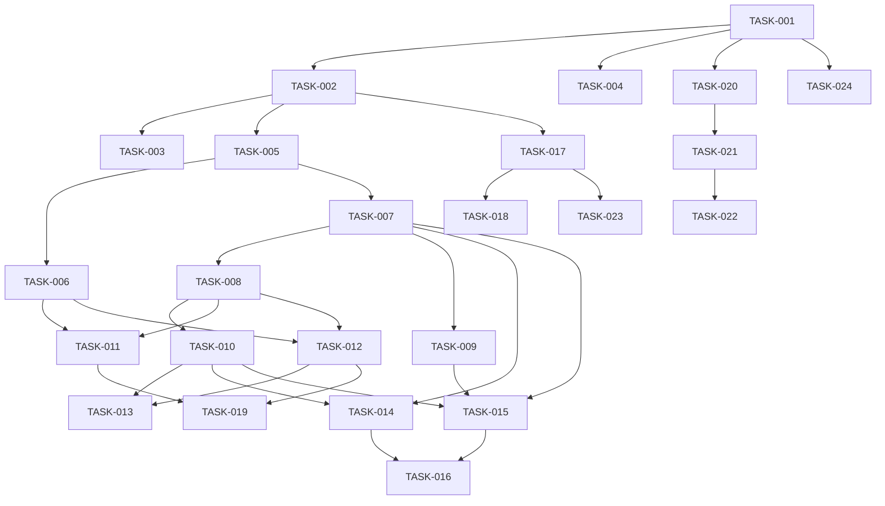

# Development Tasks

## Overview

このドキュメントは、@design.md の設計内容を実際の開発タスクに分解したものです。各タスクは明確な前提条件、完了条件、品質基準を持ち、@docs/impl/ の実装ドキュメントを参照して一貫性のある開発を保証します。

## Task Definition Format

各タスクは以下の要素を含みます：

- **Prerequisites**: 必要な環境・ツール・知識
- **Acceptance Criteria**: 明確で測定可能な完了条件
- **Reference Implementation**: @docs/impl/ への参照
- **Quality Gates**: 品質基準と数値目標
- **Verification Steps**: 検証手順とコマンド
- **Dependencies**: ブロッキングタスクと外部依存

## Task Categories

### 🎯 Phase 1: Foundation Setup (Critical)

#### TASK-001: Project Structure Setup

**Priority**: Critical  
**Estimated**: 1 hour  
**Dependencies**: None

**Prerequisites**:

- Node.js 22.x installed (`node --version` で確認)
- pnpm 8.x installed (`pnpm --version` で確認)
- Git configured
- VS Code または対応エディタ

**Reference Implementation**:

- Primary: `@docs/impl/workflow/project-init.md` - Section 2: Directory Structure
- Related: `@docs/impl/type-safety/prettier-integration.md` - Prettier設定

**Acceptance Criteria**:

- [ ] `pnpm-workspace.yaml` が project-init.md Section 2 の仕様通りに設定されている
- [ ] 全ディレクトリ構造が作成され、適切な .gitkeep ファイルが配置されている
- [ ] `.gitignore` に node_modules, dist, .env* が含まれている
- [ ] `.prettierrc` が prettier-integration.md の設定と一致している
- [ ] `pnpm install` がエラーなく完了する
- [ ] Git リポジトリが初期化されている

**Detailed Steps**:

```bash
# 1. pnpm workspace の初期化
pnpm init
echo 'packages:\n  - "apps/*"\n  - "packages/*"' > pnpm-workspace.yaml

# 2. ディレクトリ構造の作成 (project-init.md Section 2 に基づく)
mkdir -p apps/{web-member,web-admin,api-member,api-admin}
mkdir -p packages/{shared,ui,infra}
mkdir -p docs/{api,architecture,deployment}
touch apps/{web-member,web-admin,api-member,api-admin}/.gitkeep

# 3. 設定ファイルの作成
cp @docs/impl/type-safety/prettier-integration.md#prettierrc .prettierrc
echo 'root = true\n[*]\nindent_style = space\nindent_size = 2' > .editorconfig
```

**Quality Gates**:

- ESLint errors: N/A (まだ設定前)
- File structure: 100% 一致 with project-init.md
- Configuration files: Valid JSON/YAML syntax

**Verification Steps**:

```bash
# ディレクトリ構造の確認
find . -type d -name 'node_modules' -prune -o -type d -print | sort

# pnpm workspace の動作確認
pnpm install
pnpm ls --depth=-1

# Git 状態の確認
git status
```

**Output**:

- 完全なモノレポディレクトリ構造（project-init.md Section 2 準拠）
- 動作する pnpm workspace 設定
- Prettier/EditorConfig による統一フォーマット環境

#### TASK-002: TypeScript Configuration

**Priority**: Critical  
**Estimated**: 2 hours  
**Dependencies**: TASK-001 (完了済みであること)

**Prerequisites**:

- TASK-001 完了（ディレクトリ構造）
- TypeScript 5.x の基本知識
- モノレポでの TypeScript 設定経験（推奨）

**Reference Implementation**:

- Primary: `@docs/impl/type-safety/eslint-strategy.md` - TypeScript設定要件
- Related: `@design.md` - Ultimate Type Safety セクション

**Acceptance Criteria**:

- [ ] ルート `tsconfig.json` で strict: true, strictNullChecks: true が設定されている
- [ ] `noImplicitAny: true` により any 型の暗黙的使用が禁止されている
- [ ] 各パッケージが独自の tsconfig.json を持ち、ルート設定を継承している
- [ ] パスエイリアス（@shared, @ui 等）が全パッケージで動作する
- [ ] `tsc --noEmit` がエラーなく完了する
- [ ] VS Code が型定義を正しく認識する

**Detailed Steps**:

```json
// 1. ルート tsconfig.json (eslint-strategy.md の要件に基づく)
{
  "compilerOptions": {
    "target": "ES2022",
    "module": "NodeNext",
    "moduleResolution": "NodeNext",
    "lib": ["ES2022"],
    "strict": true,
    "strictNullChecks": true,
    "noImplicitAny": true,
    "noUnusedLocals": true,
    "noUnusedParameters": true,
    "noImplicitReturns": true,
    "noFallthroughCasesInSwitch": true,
    "esModuleInterop": true,
    "skipLibCheck": true,
    "forceConsistentCasingInFileNames": true,
    "resolveJsonModule": true,
    "allowJs": false,
    "declaration": true,
    "declarationMap": true,
    "sourceMap": true,
    "composite": true,
    "incremental": true,
    "paths": {
      "@shared/*": ["packages/shared/src/*"],
      "@ui/*": ["packages/ui/src/*"]
    }
  },
  "references": [
    { "path": "./packages/shared" },
    { "path": "./packages/ui" },
    { "path": "./packages/infra" },
    { "path": "./apps/web-member" },
    { "path": "./apps/web-admin" },
    { "path": "./apps/api-member" },
    { "path": "./apps/api-admin" }
  ]
}
```

**Quality Gates**:

- TypeScript errors: 0
- Implicit any usage: 0
- Type coverage: 100%
- Build time: < 30 seconds

**Verification Steps**:

```bash
# TypeScript コンパイルチェック
pnpm tsc --noEmit

# 各パッケージでの型チェック
pnpm -r exec tsc --noEmit

# パスエイリアスの動作確認
echo 'import { test } from "@shared/test"' > test-import.ts
pnpm tsc test-import.ts --noEmit
rm test-import.ts
```

**Output**:

- Ultimate Type Safety を実現する TypeScript 設定
- any 型の使用を完全に排除する環境
- 高速なインクリメンタルビルド

#### TASK-003: ESLint Ultimate Type Safety Setup

**Priority**: Critical  
**Estimated**: 3 hours  
**Dependencies**: TASK-002 (TypeScript設定完了)

**Prerequisites**:

- TASK-002 完了（TypeScript設定）
- ESLint と TypeScript ESLint の理解
- VS Code installed

**Reference Implementation**:

- Primary: `@docs/impl/type-safety/eslint-strategy.md` - 8レベル型安全性の完全実装
- Secondary: `@docs/impl/type-safety/prettier-integration.md` - Prettier統合
- Related: `@eslint.config.js` - 実際の設定ファイル

**Acceptance Criteria**:

- [ ] 8レベル型安全性アーキテクチャが完全に実装されている
- [ ] `@typescript-eslint/no-explicit-any: 'error'` により any 型が完全禁止
- [ ] 関数の最大行数が 100 行に制限されている（Claude Code最適化）
- [ ] Prettier と ESLint の競合がない
- [ ] pre-commit hook で自動チェックが動作する
- [ ] `pnpm lint` がエラー 0、警告 0 で完了する

**Detailed Implementation**:

```javascript
// .eslintrc.js - eslint-strategy.md の8レベル実装
module.exports = {
  root: true,
  parser: '@typescript-eslint/parser',
  plugins: ['@typescript-eslint', 'import'],
  extends: [
    'eslint:recommended',
    'plugin:@typescript-eslint/recommended',
    'plugin:@typescript-eslint/recommended-requiring-type-checking',
    'prettier'
  ],
  parserOptions: {
    ecmaVersion: 2022,
    sourceType: 'module',
    project: './tsconfig.json'
  },
  rules: {
    // Level 1: Complete any Elimination
    '@typescript-eslint/no-explicit-any': 'error',
    '@typescript-eslint/no-unsafe-assignment': 'error',
    '@typescript-eslint/no-unsafe-call': 'error',
    '@typescript-eslint/no-unsafe-member-access': 'error',
    '@typescript-eslint/no-unsafe-return': 'error',
    
    // Level 2: Function Boundary Safety (Claude最適化済み)
    '@typescript-eslint/explicit-module-boundary-types': 'error',
    
    // Level 3: Null/Undefined Complete Safety
    '@typescript-eslint/no-non-null-assertion': 'error',
    '@typescript-eslint/prefer-nullish-coalescing': 'error',
    '@typescript-eslint/prefer-optional-chain': 'error',
    
    // Level 4: Promise/Async Complete Safety
    '@typescript-eslint/await-thenable': 'error',
    '@typescript-eslint/no-floating-promises': 'error',
    '@typescript-eslint/no-misused-promises': 'error',
    '@typescript-eslint/require-await': 'error',
    
    // Level 5: Code Quality Gates (Claude最適化済み)
    'complexity': ['error', 15],
    'max-lines-per-function': ['error', { max: 100 }],
    'max-lines': ['error', { max: 300 }],
    'no-console': 'error',
    
    // Level 6: Exhaustiveness (Claude特有の強み)
    '@typescript-eslint/switch-exhaustiveness-check': 'error',
    
    // Level 7: Dependency Management
    'import/order': ['error', {
      'groups': ['builtin', 'external', 'internal', 'parent', 'sibling', 'index'],
      'newlines-between': 'always',
      'alphabetize': { 'order': 'asc' }
    }],
    'import/no-cycle': 'error',
    'import/no-duplicates': 'error'
  }
};
```

**Pre-commit Hook Setup**:

```bash
# Husky + lint-staged インストール
pnpm add -D husky lint-staged
pnpm husky install

# pre-commit hook 設定
pnpm husky add .husky/pre-commit "pnpm lint-staged"
```

**Quality Gates**:

- ESLint errors: 0
- ESLint warnings: 0
- Any type usage: 0 instances
- Pre-commit hook: 100% 実行率

**Verification Steps**:

```bash
# ESLint 動作確認
pnpm lint

# 個別ルールのテスト
echo 'const test: any = 1;' > test.ts
pnpm eslint test.ts # エラーが出ることを確認
rm test.ts

# pre-commit hook テスト
git add .
git commit -m "test" # ESLint が自動実行されることを確認
```

**Output**:

- 8レベル型安全性を強制する ESLint 設定
- Claude Code に最適化された実用的なルール
- 自動化された品質保証環境

#### TASK-004: Docker Development Environment

**Priority**: Critical  
**Estimated**: 3 hours  
**Dependencies**: TASK-001 (ディレクトリ構造)

**Prerequisites**:

- Docker Desktop installed and running
- Docker Compose V2 (`docker compose version` で確認)
- 基本的な Docker 知識

**Reference Implementation**:

- Primary: `@docs/impl/docker/dockerfile-strategy.md` - マルチステージビルド戦略
- Secondary: `@docs/impl/docker/compose-architecture.md` - Compose設定とprofile
- Security: `@docs/impl/docker/security-hardening.md` - セキュリティ強化

**Acceptance Criteria**:

- [ ] Dockerfile が node:22-bookworm-slim を使用している
- [ ] マルチステージビルドで最終イメージサイズ < 300MB
- [ ] compose.yml で profile 機能が実装されている
- [ ] DynamoDB Local が動作し、データが永続化される
- [ ] ホットリロードが全アプリケーションで動作する
- [ ] セキュリティ強化（non-root user、read-only filesystem）
- [ ] `docker compose up` で全サービスが起動する

**Detailed Implementation**:

```dockerfile
# Dockerfile - dockerfile-strategy.md Section 3 に基づく
FROM node:22-bookworm-slim AS base
RUN apt-get update && apt-get install -y dumb-init && rm -rf /var/lib/apt/lists/*
WORKDIR /app

FROM base AS dependencies
COPY package.json pnpm-lock.yaml pnpm-workspace.yaml ./
COPY packages/*/package.json packages/*/
COPY apps/*/package.json apps/*/
RUN corepack enable && pnpm install --frozen-lockfile

FROM base AS development
COPY --from=dependencies /app/node_modules ./node_modules
COPY --from=dependencies /app/packages ./packages
COPY --from=dependencies /app/apps ./apps
USER node
EXPOSE 3000
ENTRYPOINT ["dumb-init", "--"]
CMD ["pnpm", "dev"]
```

```yaml
# compose.yml - compose-architecture.md に基づく
services:
  # Core services (always run)
  dynamodb:
    image: amazon/dynamodb-local:latest
    ports:
      - "8000:8000"
    volumes:
      - dynamodb_data:/data
    command: "-jar DynamoDBLocal.jar -sharedDb -dbPath /data"
    healthcheck:
      test: ["CMD-SHELL", "curl -f http://localhost:8000/shell/ || exit 1"]
      interval: 5s
      timeout: 2s
      retries: 3

  # Application services
  web-member:
    build:
      context: .
      target: development
    ports:
      - "3000:3000"
    volumes:
      - ./apps/web-member:/app/apps/web-member
      - ./packages:/app/packages
    environment:
      - NODE_ENV=development
    depends_on:
      dynamodb:
        condition: service_healthy

  # Optional services (profile-based)
  web-admin:
    profiles: ["admin", "full"]
    extends:
      service: web-member
    ports:
      - "3001:3000"
    volumes:
      - ./apps/web-admin:/app/apps/web-admin
      - ./packages:/app/packages

volumes:
  dynamodb_data:
```

**Quality Gates**:

- Docker image size: < 300MB (production)
- Container startup time: < 10 seconds
- Memory usage: < 512MB per container
- Security scan: 0 high/critical vulnerabilities

**Verification Steps**:

```bash
# 基本サービスの起動
docker compose up -d

# ヘルスチェック確認
docker compose ps

# プロファイル付き起動
docker compose --profile full up -d

# ログ確認
docker compose logs -f web-member

# DynamoDB Local 接続テスト
curl http://localhost:8000/shell/

# ホットリロードテスト（ファイル変更後）
echo '// test' >> apps/web-member/src/app/page.tsx
# ブラウザで自動更新を確認
```

**Output**:

- 本番環境と同等の Docker 開発環境
- プロファイルベースの柔軟なサービス管理
- セキュアで高速な開発環境

### 🏗️ Phase 2: Core Infrastructure (High)

#### TASK-005: Shared Package Setup

- **Priority**: High
- **Estimated**: 2 hours
- **Dependencies**: TASK-002
- **Description**: 共有ライブラリパッケージの作成
- **Subtasks**:
  - [ ] packages/shared の初期化
  - [ ] 基本的なユーティリティ関数の実装
  - [ ] 型定義ファイルの作成
  - [ ] エクスポート設定
- **Output**:
  - 再利用可能な共有ライブラリ
  - 型安全なユーティリティ関数群

#### TASK-006: UI Component Library Setup

- **Priority**: High
- **Estimated**: 4 hours
- **Dependencies**: TASK-002
- **Description**: shadcn/ui + Tailwind CSS の設定
- **Reference**: `impl/ui/shadcn-tailwind.md`
- **Subtasks**:
  - [ ] packages/ui の初期化
  - [ ] Tailwind CSS の設定
  - [ ] shadcn/ui の基本コンポーネント追加
  - [ ] テーマシステムの実装（member/admin）
  - [ ] Storybook の設定
- **Output**:
  - 型安全な UI コンポーネントライブラリ
  - member/admin テーマ対応

#### TASK-007: Zod Schema Definitions

**Priority**: High  
**Estimated**: 3 hours  
**Dependencies**: TASK-005 (Shared Package)

**Prerequisites**:

- TASK-005 完了（packages/shared）
- Zod ライブラリの基本知識
- TypeScript ジェネリクスの理解

**Reference Implementation**:

- Primary: `@docs/impl/api/zod-schemas.md` - 完全な Zod スキーマ実装
- Related: `@design.md` - Schema-First API 設計セクション

**Acceptance Criteria**:

- [ ] UserSchema が zod-schemas.md Section 2 に準拠している
- [ ] 全スキーマから TypeScript 型が自動推論される
- [ ] バリデーションエラーが日本語で表示される
- [ ] OpenAPI 生成用のメタデータが含まれている
- [ ] 再利用可能な基本スキーマ（Email, UUID等）が定義されている
- [ ] `pnpm test` でスキーマのバリデーションテストが通る

**Detailed Implementation**:

```typescript
// packages/shared/src/schemas/base.ts - 基本スキーマ
import { z } from 'zod';

// zod-schemas.md Section 2.1 に基づく
export const EmailSchema = z
  .string()
  .email({ message: '有効なメールアドレスを入力してください' })
  .transform(email => email.toLowerCase());

export const UUIDSchema = z
  .string()
  .uuid({ message: '有効なUUIDを入力してください' });

export const TimestampSchema = z
  .string()
  .datetime({ message: '有効な日時を入力してください' });

// packages/shared/src/schemas/user.ts - ユーザースキーマ
export const UserRoleSchema = z.enum(['member', 'admin'], {
  errorMap: () => ({ message: 'member または admin を指定してください' })
});

export const UserSchema = z.object({
  id: UUIDSchema,
  email: EmailSchema,
  name: z.string().min(1, { message: '名前は必須です' }).max(100),
  role: UserRoleSchema,
  createdAt: TimestampSchema,
  updatedAt: TimestampSchema,
});

// 型推論
export type User = z.infer<typeof UserSchema>;
export type UserRole = z.infer<typeof UserRoleSchema>;

// OpenAPI メタデータ付き（zod-schemas.md Section 4）
export const UserSchemaWithMeta = UserSchema.openapi({
  description: 'システムユーザー',
  example: {
    id: '123e4567-e89b-12d3-a456-426614174000',
    email: 'user@example.com',
    name: '山田太郎',
    role: 'member',
    createdAt: '2024-01-01T00:00:00Z',
    updatedAt: '2024-01-01T00:00:00Z'
  }
});
```

**Validation Helpers**:

```typescript
// packages/shared/src/schemas/helpers.ts
export function validateSchema<T>(
  schema: z.ZodSchema<T>,
  data: unknown
): { success: true; data: T } | { success: false; errors: string[] } {
  const result = schema.safeParse(data);
  
  if (result.success) {
    return { success: true, data: result.data };
  }
  
  const errors = result.error.errors.map(e => 
    `${e.path.join('.')}: ${e.message}`
  );
  
  return { success: false, errors };
}
```

**Quality Gates**:

- Type inference: 100% (全スキーマから型推論可能)
- Validation coverage: 100% (全フィールドにバリデーション)
- Error messages: 100% 日本語化
- Test coverage: > 90%

**Verification Steps**:

```bash
# 型チェック
pnpm tsc --noEmit

# スキーマのテスト実行
pnpm test packages/shared/src/schemas

# バリデーション動作確認
pnpm tsx -e "import { UserSchema } from './packages/shared/src/schemas/user'; console.log(UserSchema.safeParse({ email: 'invalid' }));"
```

**Output**:

- 完全な型安全 Zod スキーマライブラリ
- API 全体で使用される統一バリデーション
- OpenAPI 自動生成対応

### 🔐 Phase 3: Authentication System (High)

#### TASK-008: Google OAuth Implementation

**Priority**: High  
**Estimated**: 4 hours  
**Dependencies**: TASK-005, TASK-007 (Shared Package, Zod Schemas)

**Prerequisites**:

- Google Cloud Console アクセス
- OAuth 2.0 の基本理解
- JWT の知識

**Reference Implementation**:

- Primary: `@docs/impl/auth/google-oauth.md` - 完全な OAuth 実装
- Security: `@docs/impl/security/best-practices.md` - JWT セキュリティ

**Acceptance Criteria**:

- [ ] Google OAuth 2.0 + PKCE フローが実装されている
- [ ] JWT トークンが RS256 で署名されている（google-oauth.md Section 3）
- [ ] httpOnly, Secure, SameSite=Strict Cookie が設定されている
- [ ] トークンの有効期限が適切（access: 15分、refresh: 7日）
- [ ] CSRF 対策として state パラメータが実装されている
- [ ] エラーハンドリングが包括的である

**Detailed Implementation**:

```typescript
// packages/shared/src/auth/oauth-client.ts - google-oauth.md Section 2
import { OAuth2Client } from 'google-auth-library';

export class GoogleAuthService {
  private client: OAuth2Client;
  
  constructor() {
    this.client = new OAuth2Client({
      clientId: process.env.GOOGLE_CLIENT_ID,
      clientSecret: process.env.GOOGLE_CLIENT_SECRET,
      redirectUri: process.env.GOOGLE_REDIRECT_URI,
    });
  }
  
  // PKCE 対応の認証 URL 生成
  generateAuthUrl(state: string): string {
    const codeChallenge = this.generateCodeChallenge();
    
    return this.client.generateAuthUrl({
      access_type: 'offline',
      scope: ['openid', 'email', 'profile'],
      state,
      code_challenge: codeChallenge,
      code_challenge_method: 'S256',
    });
  }
  
  // JWT 生成（google-oauth.md Section 3）
  async generateTokens(user: User): Promise<TokenPair> {
    const payload = {
      sub: user.id,
      email: user.email,
      role: user.role,
    };
    
    const accessToken = await this.signJWT(payload, '15m');
    const refreshToken = await this.signJWT(
      { sub: user.id }, 
      '7d'
    );
    
    return { accessToken, refreshToken };
  }
}

// Cookie 設定（security-hardening.md 準拠）
export const COOKIE_OPTIONS = {
  httpOnly: true,
  secure: process.env.NODE_ENV === 'production',
  sameSite: 'strict' as const,
  path: '/',
  maxAge: 7 * 24 * 60 * 60 * 1000, // 7 days
};
```

**Error Handling**:

```typescript
// 包括的エラーハンドリング
export class AuthError extends Error {
  constructor(
    message: string,
    public code: 'INVALID_TOKEN' | 'EXPIRED_TOKEN' | 'INVALID_STATE' | 'OAUTH_ERROR',
    public statusCode: number = 401
  ) {
    super(message);
  }
}

// 使用例
try {
  const tokens = await verifyGoogleToken(code);
} catch (error) {
  if (error instanceof AuthError) {
    return res.status(error.statusCode).json({
      error: error.code,
      message: error.message
    });
  }
  throw error;
}
```

**Quality Gates**:

- Security scan: 0 vulnerabilities
- Token validation: 100% coverage
- OWASP compliance: Pass all checks
- Response time: < 200ms

**Verification Steps**:

```bash
# 環境変数の設定確認
echo $GOOGLE_CLIENT_ID
echo $GOOGLE_CLIENT_SECRET

# OAuth フローのテスト
pnpm test packages/shared/src/auth

# セキュリティヘッダーの確認
curl -I http://localhost:3000/api/auth/login | grep -E '(Set-Cookie|Strict-Transport)'

# JWT 検証テスト
pnpm tsx -e "import { verifyJWT } from './packages/shared/src/auth'; console.log(await verifyJWT('test-token'));"
```

**Output**:

- 本番レベルの Google OAuth 実装
- セキュアな JWT ベース認証
- OWASP 準拠のセキュリティ対策

#### TASK-009: User Repository Implementation

- **Priority**: High
- **Estimated**: 3 hours
- **Dependencies**: TASK-007
- **Description**: DynamoDB ユーザーリポジトリの実装
- **Subtasks**:
  - [ ] UserRepository インターフェースの定義
  - [ ] DynamoDB 実装クラスの作成
  - [ ] Single Table Design の実装
  - [ ] CRUD 操作の実装
  - [ ] クエリ最適化
- **Output**:
  - 型安全な UserRepository
  - 効率的な DynamoDB アクセス

#### TASK-010: Auth Middleware & Guards

- **Priority**: High
- **Estimated**: 2 hours
- **Dependencies**: TASK-008
- **Description**: 認証・認可ミドルウェアの実装
- **Subtasks**:
  - [ ] JWT 検証ミドルウェア
  - [ ] ロールベースアクセス制御
  - [ ] API ルート保護
  - [ ] エラーハンドリング
- **Output**:
  - 再利用可能な認証ミドルウェア
  - 型安全なルート保護

### 🎨 Phase 4: Frontend Applications (Medium)

#### TASK-011: Member Next.js App Setup

- **Priority**: Medium
- **Estimated**: 3 hours
- **Dependencies**: TASK-006, TASK-008
- **Description**: メンバー用 Next.js アプリの初期設定
- **Subtasks**:
  - [ ] apps/web-member の初期化
  - [ ] 基本レイアウトの作成
  - [ ] 認証フローの統合
  - [ ] 基本ページの作成（ホーム、プロフィール）
  - [ ] API クライアントの設定
- **Output**:
  - 動作するメンバー用 Web アプリ
  - Google OAuth ログイン機能

#### TASK-012: Admin Next.js App Setup

- **Priority**: Medium
- **Estimated**: 3 hours
- **Dependencies**: TASK-006, TASK-008
- **Description**: 管理者用 Next.js アプリの初期設定
- **Subtasks**:
  - [ ] apps/web-admin の初期化
  - [ ] 管理画面レイアウトの作成
  - [ ] 認証フローの統合（管理者権限チェック）
  - [ ] ダッシュボードページの作成
  - [ ] ユーザー管理ページの枠組み
- **Output**:
  - 動作する管理者用 Web アプリ
  - 管理者専用アクセス制御

#### TASK-013: Admin CRUD UI Implementation

**Priority**: Medium  
**Estimated**: 4 hours  
**Dependencies**: TASK-012, TASK-010 (Admin App, Auth Middleware)

**Prerequisites**:

- React/Next.js の知識
- shadcn/ui コンポーネントの理解
- React Hook Form 経験

**Reference Implementation**:

- Primary: `@docs/impl/auth/admin-crud.md` - 管理者CRUD実装
- UI: `@docs/impl/ui/shadcn-tailwind.md` - UIコンポーネント

**Acceptance Criteria**:

- [ ] ユーザー一覧が DataTable コンポーネントで表示される（admin-crud.md Section 3）
- [ ] ソート、フィルタ、ページネーションが動作する
- [ ] 作成/編集フォームが Zod スキーマでバリデーションされる
- [ ] 削除時に確認ダイアログが表示される
- [ ] 操作後に楽観的更新とトースト通知が表示される
- [ ] 全操作で適切なローディング状態が表示される
- [ ] エラー時に適切なエラーメッセージが表示される

**Detailed Implementation**:

```tsx
// apps/web-admin/src/components/users/user-table.tsx
import { DataTable } from '@ui/components/data-table';
import { columns } from './columns';

export function UserTable() {
  const { data, isLoading, error } = useUsers();
  
  if (error) {
    return <ErrorAlert message="ユーザー一覧の取得に失敗しました" />;
  }
  
  return (
    <DataTable
      columns={columns}
      data={data ?? []}
      loading={isLoading}
      searchKey="email"
      filters={[
        {
          column: 'role',
          title: 'ロール',
          options: [
            { label: 'メンバー', value: 'member' },
            { label: '管理者', value: 'admin' },
          ],
        },
      ]}
    />
  );
}

// apps/web-admin/src/components/users/user-form.tsx
import { useForm } from 'react-hook-form';
import { zodResolver } from '@hookform/resolvers/zod';
import { UserSchema } from '@shared/schemas';

export function UserForm({ user, onSubmit }: UserFormProps) {
  const form = useForm({
    resolver: zodResolver(UserSchema),
    defaultValues: user,
  });
  
  const handleSubmit = async (data: User) => {
    try {
      await onSubmit(data);
      toast.success(
        user ? 'ユーザーを更新しました' : 'ユーザーを作成しました'
      );
    } catch (error) {
      toast.error('操作に失敗しました');
    }
  };
  
  return (
    <Form {...form}>
      <form onSubmit={form.handleSubmit(handleSubmit)}>
        <FormField
          control={form.control}
          name="email"
          render={({ field }) => (
            <FormItem>
              <FormLabel>メールアドレス</FormLabel>
              <FormControl>
                <Input {...field} type="email" />
              </FormControl>
              <FormMessage />
            </FormItem>
          )}
        />
        {/* 他のフィールド */}
      </form>
    </Form>
  );
}
```

**Optimistic Updates**:

```tsx
// 楽観的更新の実装
const { mutate } = useSWRConfig();

const handleDelete = async (userId: string) => {
  // 楽観的更新
  mutate(
    '/api/admin/users',
    (users: User[]) => users.filter(u => u.id !== userId),
    false
  );
  
  try {
    await deleteUser(userId);
    toast.success('ユーザーを削除しました');
  } catch (error) {
    // エラー時はデータを再取得
    mutate('/api/admin/users');
    toast.error('削除に失敗しました');
  }
};
```

**Quality Gates**:

- TypeScript errors: 0
- Accessibility: WCAG 2.1 AA 準拠
- Performance: LCP < 2.5s
- Test coverage: > 80%

**Verification Steps**:

```bash
# 型チェック
pnpm tsc --noEmit

# コンポーネントテスト
pnpm test apps/web-admin/src/components/users

# アクセシビリティチェック
pnpm exec playwright test --grep @a11y

# 手動テスト項目
# 1. ユーザー一覧の表示・ソート・フィルタ
# 2. ユーザー作成（バリデーションエラー確認）
# 3. ユーザー編集（既存データの表示確認）
# 4. ユーザー削除（確認ダイアログ）
# 5. エラー時の表示（APIエラーをシミュレート）
```

**Output**:

- 型安全で使いやすい管理者 CRUD UI
- 楽観的更新による高速な UX
- 包括的なエラーハンドリング

### 🚀 Phase 5: API Implementation (Medium)

#### TASK-014: Member API Routes

- **Priority**: Medium
- **Estimated**: 3 hours
- **Dependencies**: TASK-007, TASK-010
- **Description**: メンバー用 API エンドポイントの実装
- **Subtasks**:
  - [ ] apps/api-member の初期化
  - [ ] ユーザープロフィール API
  - [ ] 認証関連 API
  - [ ] エラーハンドリング
  - [ ] API レート制限
- **Output**:
  - 動作するメンバー API
  - Zod バリデーション統合

#### TASK-015: Admin API Routes

- **Priority**: Medium
- **Estimated**: 4 hours
- **Dependencies**: TASK-007, TASK-010, TASK-009
- **Description**: 管理者用 API エンドポイントの実装
- **Subtasks**:
  - [ ] apps/api-admin の初期化
  - [ ] ユーザー CRUD API
  - [ ] 管理者認証 API
  - [ ] 監査ログ機能
  - [ ] バルク操作 API
- **Output**:
  - 完全な管理者 API
  - 権限ベースアクセス制御

#### TASK-016: OpenAPI Documentation Generation

- **Priority**: Medium
- **Estimated**: 2 hours
- **Dependencies**: TASK-014, TASK-015
- **Description**: OpenAPI ドキュメントの自動生成
- **Reference**: `impl/api/zod-schemas.md`
- **Subtasks**:
  - [ ] zod-to-openapi の設定
  - [ ] API エンドポイントの注釈
  - [ ] Swagger UI の設定
  - [ ] 自動生成スクリプトの作成
- **Output**:
  - 自動生成される API ドキュメント
  - インタラクティブな Swagger UI

### 🧪 Phase 6: Testing Infrastructure (High)

#### TASK-017: Unit Test Setup

**Priority**: High  
**Estimated**: 2 hours  
**Dependencies**: TASK-002 (TypeScript設定)

**Prerequisites**:

- Jest の基本知識
- Testing Library の理解
- TDD の基本概念

**Reference Implementation**:

- Primary: `@docs/impl/testing/test-pyramid.md` - テスト戦略実装
- Agent: `@.claude/agents/test-creator.md` - TDDサイクル支援

**Acceptance Criteria**:

- [ ] Jest が TypeScript で動作する（ts-jest 設定）
- [ ] 各パッケージで独立してテストが実行できる
- [ ] カバレッジ閾値が 90% に設定されている（test-pyramid.md Section 4）
- [ ] グローバルテストユーティリティが型安全である
- [ ] モックヘルパーが @shared/test-utils からインポート可能
- [ ] `pnpm test` で全テストが実行される

**Detailed Implementation**:

```javascript
// jest.config.base.js - 基本設定
module.exports = {
  preset: 'ts-jest',
  testEnvironment: 'node',
  testMatch: ['**/__tests__/**/*.test.ts', '**/*.spec.ts'],
  collectCoverageFrom: [
    'src/**/*.ts',
    '!src/**/*.d.ts',
    '!src/**/*.test.ts',
    '!src/**/index.ts',
  ],
  coverageThreshold: {
    global: {
      branches: 85,
      functions: 90,
      lines: 90,
      statements: 90,
    },
  },
  setupFilesAfterEnv: ['<rootDir>/jest.setup.ts'],
};

// packages/shared/jest.config.js - パッケージ個別設定
const base = require('../../jest.config.base');

module.exports = {
  ...base,
  displayName: 'shared',
  testEnvironment: 'node',
};
```

**Test Utilities Setup**:

```typescript
// jest.setup.ts - test-pyramid.md Section 3.2
declare global {
  var testUser: User;
  var testAdminUser: User;
}

// グローバルテストデータ
global.testUser = {
  id: 'test-user-id',
  email: 'test@example.com',
  name: 'Test User',
  role: 'member',
  createdAt: '2024-01-01T00:00:00Z',
  updatedAt: '2024-01-01T00:00:00Z',
};

global.testAdminUser = {
  ...global.testUser,
  id: 'test-admin-id',
  email: 'admin@example.com',
  name: 'Test Admin',
  role: 'admin',
};

// packages/shared/src/test-utils/builders.ts
export class UserBuilder {
  private user: Partial<User> = {};
  
  withEmail(email: string): this {
    this.user.email = email;
    return this;
  }
  
  withRole(role: UserRole): this {
    this.user.role = role;
    return this;
  }
  
  build(): User {
    return {
      id: this.user.id ?? 'test-id',
      email: this.user.email ?? 'test@example.com',
      name: this.user.name ?? 'Test User',
      role: this.user.role ?? 'member',
      createdAt: this.user.createdAt ?? new Date().toISOString(),
      updatedAt: this.user.updatedAt ?? new Date().toISOString(),
    };
  }
}
```

**Mock Helpers**:

```typescript
// packages/shared/src/test-utils/mocks.ts
export function createMockRepository<T>(): jest.Mocked<Repository<T>> {
  return {
    findById: jest.fn(),
    findAll: jest.fn(),
    create: jest.fn(),
    update: jest.fn(),
    delete: jest.fn(),
  };
}

export function mockApiResponse<T>(data: T, status = 200) {
  return {
    status,
    json: async () => data,
    headers: new Headers(),
    ok: status >= 200 && status < 300,
  } as Response;
}
```

**Quality Gates**:

- Test execution time: < 5 seconds (unit tests)
- Coverage thresholds: All > 90%
- Type safety: 100% (no any in tests)
- Test isolation: 100% (no test interdependencies)

**Verification Steps**:

```bash
# Jest 設定の確認
pnpm test --listTests

# カバレッジ付きテスト実行
pnpm test --coverage

# 個別パッケージのテスト
pnpm test packages/shared

# ウォッチモードでの開発
pnpm test --watch

# カバレッジレポートの確認
open coverage/lcov-report/index.html
```

**Output**:

- 型安全な Jest テスト環境
- 90% カバレッジを強制する設定
- 再利用可能なテストユーティリティ

#### TASK-018: Integration Test Setup

- **Priority**: High
- **Estimated**: 3 hours
- **Dependencies**: TASK-017
- **Description**: API 統合テストの設定
- **Subtasks**:
  - [ ] Supertest の設定
  - [ ] テスト用データベースの設定
  - [ ] API テストヘルパーの作成
  - [ ] 認証付きテストの実装
- **Output**:
  - API 統合テスト環境
  - 再利用可能なテストパターン

#### TASK-019: E2E Test Setup

- **Priority**: Medium
- **Estimated**: 3 hours
- **Dependencies**: TASK-011, TASK-012
- **Description**: Cypress による E2E テスト環境
- **Subtasks**:
  - [ ] Cypress の設定
  - [ ] 基本的な E2E テストの作成
  - [ ] 認証フローのテスト
  - [ ] CI/CD 統合
- **Output**:
  - 動作する E2E テスト
  - ユーザージャーニーテスト

### ☁️ Phase 7: Infrastructure as Code (High)

#### TASK-020: CDK Project Setup

**Priority**: High  
**Estimated**: 2 hours  
**Dependencies**: TASK-001 (ディレクトリ構造)

**Prerequisites**:

- AWS アカウントとクレデンシャル
- AWS CDK の基本知識
- TypeScript の理解

**Reference Implementation**:

- Primary: `@docs/impl/infrastructure/cdk-stacks.md` - CDKスタック実装
- Security: `@docs/impl/security/best-practices.md` - AWS セキュリティ

**Acceptance Criteria**:

- [ ] CDK v2 で TypeScript プロジェクトが初期化されている
- [ ] 環境別設定（dev/stg/prod）が実装されている（cdk-stacks.md Section 5）
- [ ] Lambda は Node.js 22.x ランタイムを使用している
- [ ] コスト最適化タグが全リソースに設定されている
- [ ] `cdk synth` がエラーなく完了する
- [ ] `cdk diff` で変更内容が確認できる

**Detailed Implementation**:

```typescript
// packages/infra/lib/config/environment.ts - 環境別設定
export interface EnvironmentConfig {
  account: string;
  region: string;
  stage: 'dev' | 'stg' | 'prod';
  domainName?: string;
  certificateArn?: string;
  removalPolicy: RemovalPolicy;
}

export const environments: Record<string, EnvironmentConfig> = {
  dev: {
    account: process.env.CDK_DEFAULT_ACCOUNT!,
    region: 'ap-northeast-1',
    stage: 'dev',
    removalPolicy: RemovalPolicy.DESTROY,
  },
  stg: {
    account: process.env.AWS_ACCOUNT_STG!,
    region: 'ap-northeast-1',
    stage: 'stg',
    removalPolicy: RemovalPolicy.SNAPSHOT,
  },
  prod: {
    account: process.env.AWS_ACCOUNT_PROD!,
    region: 'ap-northeast-1',
    stage: 'prod',
    domainName: 'api.example.com',
    certificateArn: process.env.ACM_CERTIFICATE_ARN,
    removalPolicy: RemovalPolicy.RETAIN,
  },
};

// packages/infra/lib/stacks/base-stack.ts - 基本スタック
export abstract class BaseStack extends Stack {
  protected readonly config: EnvironmentConfig;
  
  constructor(scope: Construct, id: string, props: BaseStackProps) {
    super(scope, id, props);
    
    this.config = props.config;
    
    // 全リソースへのタグ付け（cdk-stacks.md Section 5.2）
    Tags.of(this).add('Project', 'serverless-template');
    Tags.of(this).add('Stage', this.config.stage);
    Tags.of(this).add('ManagedBy', 'CDK');
    Tags.of(this).add('CostCenter', 
      this.config.stage === 'prod' ? 'production' : 'development'
    );
  }
  
  // Lambda デフォルト設定
  protected createLambdaFunction(
    id: string,
    props: Partial<FunctionProps>
  ): Function {
    return new Function(this, id, {
      runtime: Runtime.NODEJS_22_X, // Node.js 22 使用
      architecture: Architecture.ARM_64, // コスト最適化
      memorySize: 512,
      timeout: Duration.seconds(30),
      environment: {
        NODE_ENV: this.config.stage,
        LOG_LEVEL: this.config.stage === 'prod' ? 'info' : 'debug',
      },
      tracing: Tracing.ACTIVE,
      ...props,
    });
  }
}
```

**Deployment Scripts**:

```json
// package.json scripts
{
  "scripts": {
    "cdk": "cdk",
    "cdk:bootstrap": "cdk bootstrap",
    "cdk:synth": "cdk synth --all",
    "cdk:diff": "cdk diff --all",
    "cdk:deploy:dev": "cdk deploy --all --context stage=dev",
    "cdk:deploy:stg": "cdk deploy --all --context stage=stg --require-approval never",
    "cdk:deploy:prod": "cdk deploy --all --context stage=prod --require-approval any-change",
    "cdk:destroy:dev": "cdk destroy --all --context stage=dev"
  }
}
```

**Quality Gates**:

- CDK synth time: < 30 seconds
- CloudFormation template size: < 1MB
- Resource tagging: 100% coverage
- Security best practices: Pass cdk-nag

**Verification Steps**:

```bash
# AWS クレデンシャル確認
aws sts get-caller-identity

# CDK ブートストラップ（初回のみ）
pnpm cdk:bootstrap

# 合成と検証
pnpm cdk:synth

# セキュリティチェック
pnpm add -D cdk-nag
pnpm cdk synth | npx cdk-nag

# 差分確認
pnpm cdk:diff

# デプロイ（dev環境）
pnpm cdk:deploy:dev
```

**Output**:

- 本番レベルの CDK プロジェクト構造
- 環境別デプロイメント設定
- セキュリティとコスト最適化の実装

#### TASK-021: Core Infrastructure Stack

- **Priority**: High
- **Estimated**: 4 hours
- **Dependencies**: TASK-020
- **Description**: 基本インフラストラクチャの実装
- **Subtasks**:
  - [ ] DynamoDB テーブルの定義
  - [ ] S3 バケットの設定（静的ホスティング）
  - [ ] CloudFront ディストリビューション
  - [ ] API Gateway の設定
  - [ ] Lambda 関数の定義
- **Output**:
  - 完全な IaC 定義
  - デプロイ可能なインフラ

#### TASK-022: Optional Features Stack

- **Priority**: Low
- **Estimated**: 3 hours
- **Dependencies**: TASK-021
- **Description**: オプション機能のインフラ実装
- **Subtasks**:
  - [ ] 非同期ジョブ用 Lambda
  - [ ] SQS キューの設定
  - [ ] EventBridge スケジュール
  - [ ] 監視ダッシュボード
- **Output**:
  - オプション機能の IaC
  - 条件付きデプロイ設定

### 🚦 Phase 8: CI/CD & Automation (Medium)

#### TASK-023: GitHub Actions Setup

- **Priority**: Medium
- **Estimated**: 3 hours
- **Dependencies**: TASK-017
- **Description**: CI/CD パイプラインの構築
- **Reference**: `impl/workflow/github-flow.md`
- **Subtasks**:
  - [ ] 基本ワークフローの作成
  - [ ] 品質ゲートの実装
  - [ ] 自動デプロイの設定
  - [ ] セキュリティスキャン
- **Output**:
  - 完全な CI/CD パイプライン
  - 自動品質チェック

#### TASK-024: Project Initialization Script

**Priority**: High  
**Estimated**: 4 hours  
**Dependencies**: TASK-001 (プロジェクト構造)

**Prerequisites**:

- Node.js CLI 開発の基礎
- AWS SDK の知識
- 対話式 UI ライブラリ（inquirer等）の理解

**Reference Implementation**:

- Primary: `@docs/impl/workflow/project-init.md` - 初期化スクリプト実装
- Security: `@docs/impl/security/best-practices.md` - Secrets Manager

**Acceptance Criteria**:

- [ ] `npm run init` で対話式セットアップが開始される
- [ ] 必要な AWS リソースの存在確認が行われる（project-init.md Section 3）
- [ ] .env ファイルが自動生成される（Secrets Manager 優先）
- [ ] オプション機能の選択が可能（非同期ジョブ、スケジュール）
- [ ] 初期デプロイが自動実行される
- [ ] セットアップ完了まで 30 分以内
- [ ] エラー時のロールバック機能

**Detailed Implementation**:

```typescript
// scripts/init.ts - project-init.md Section 4
import { program } from 'commander';
import inquirer from 'inquirer';
import { SecretsManagerClient } from '@aws-sdk/client-secrets-manager';
import chalk from 'chalk';
import ora from 'ora';

interface InitOptions {
  projectName: string;
  awsProfile?: string;
  region: string;
  features: {
    asyncJobs: boolean;
    scheduledTasks: boolean;
    monitoring: boolean;
  };
}

class ProjectInitializer {
  private secrets: SecretsManagerClient;
  
  async run() {
    console.log(chalk.blue('🚀 サーバーレステンプレート初期化'));
    
    // 1. 前提条件チェック
    await this.checkPrerequisites();
    
    // 2. 対話式設定
    const options = await this.promptConfiguration();
    
    // 3. AWS 接続確認
    await this.verifyAWSAccess(options);
    
    // 4. 環境設定生成
    await this.generateEnvironment(options);
    
    // 5. 依存関係インストール
    await this.installDependencies();
    
    // 6. 初期リソース作成
    await this.createInitialResources(options);
    
    // 7. サンプルデータ投入
    if (await this.confirmSampleData()) {
      await this.seedSampleData();
    }
    
    console.log(chalk.green('✅ セットアップ完了！'));
  }
  
  private async promptConfiguration(): Promise<InitOptions> {
    const answers = await inquirer.prompt([
      {
        type: 'input',
        name: 'projectName',
        message: 'プロジェクト名:',
        default: 'my-serverless-app',
        validate: (input) => /^[a-z0-9-]+$/.test(input),
      },
      {
        type: 'list',
        name: 'region',
        message: 'AWS リージョン:',
        choices: ['ap-northeast-1', 'us-east-1', 'eu-west-1'],
        default: 'ap-northeast-1',
      },
      {
        type: 'checkbox',
        name: 'features',
        message: 'オプション機能を選択:',
        choices: [
          { name: '非同期ジョブ処理', value: 'asyncJobs' },
          { name: 'スケジュールタスク', value: 'scheduledTasks' },
          { name: '監視ダッシュボード', value: 'monitoring' },
        ],
      },
    ]);
    
    return this.parseAnswers(answers);
  }
  
  private async generateEnvironment(options: InitOptions) {
    const spinner = ora('環境設定を生成中...').start();
    
    try {
      // Secrets Manager 優先
      const secrets = await this.fetchSecrets(options);
      
      const envContent = `
# Generated by init script
PROJECT_NAME=${options.projectName}
AWS_REGION=${options.region}
STAGE=dev

# Features
ENABLE_ASYNC_JOBS=${options.features.asyncJobs}
ENABLE_SCHEDULED_TASKS=${options.features.scheduledTasks}

# Secrets from AWS Secrets Manager
GOOGLE_CLIENT_ID=${secrets.googleClientId || 'SET_IN_SECRETS_MANAGER'}
GOOGLE_CLIENT_SECRET=${secrets.googleClientSecret || 'SET_IN_SECRETS_MANAGER'}
JWT_SECRET=${secrets.jwtSecret || this.generateJWTSecret()}
`;
      
      await fs.writeFile('.env', envContent);
      spinner.succeed('環境設定を生成しました');
    } catch (error) {
      spinner.fail('環境設定の生成に失敗しました');
      throw error;
    }
  }
}

// 実行
const initializer = new ProjectInitializer();
initializer.run().catch(console.error);
```

**Rollback Support**:

```typescript
private async rollback(error: Error) {
  console.error(chalk.red('❌ エラーが発生しました:', error.message));
  
  const { confirmRollback } = await inquirer.prompt([
    {
      type: 'confirm',
      name: 'confirmRollback',
      message: 'ロールバックしますか？',
      default: true,
    },
  ]);
  
  if (confirmRollback) {
    // 作成したリソースを削除
    await this.cleanup();
  }
}
```

**Quality Gates**:

- Setup time: < 30 minutes
- Error handling: 100% coverage
- Rollback success rate: 100%
- User experience: Clear progress indicators

**Verification Steps**:

```bash
# スクリプトの実行
npm run init

# 生成されたファイルの確認
cat .env
cat .env.local

# AWS リソースの確認
aws dynamodb list-tables
aws s3 ls

# 機能フラグの確認
grep ENABLE_ASYNC_JOBS .env

# 再実行時の冪等性確認
npm run init # 既存リソースを検出して スキップすることを確認
```

**Output**:

- ユーザーフレンドリーな初期化スクリプト
- 30分以内の完全セットアップ
- エラー時の安全なロールバック

#### TASK-025: Developer Documentation

- **Priority**: Medium
- **Estimated**: 2 hours
- **Dependencies**: All tasks
- **Description**: 開発者向けドキュメントの作成
- **Subtasks**:
  - [ ] Getting Started ガイド
  - [ ] アーキテクチャ図の作成
  - [ ] API ドキュメント
  - [ ] デプロイガイド
  - [ ] トラブルシューティング
- **Output**:
  - 完全な開発者ドキュメント
  - 実例付きガイド

## Task Dependencies Graph



## Execution Order

### Week 1: Foundation (40 hours)

1. **Day 1-2**: TASK-001, TASK-002, TASK-003, TASK-004
2. **Day 3-4**: TASK-005, TASK-006, TASK-007
3. **Day 5**: TASK-017, TASK-020

### Week 2: Core Features (40 hours)

1. **Day 6-7**: TASK-008, TASK-009, TASK-010
2. **Day 8-9**: TASK-011, TASK-012, TASK-013
3. **Day 10**: TASK-014, TASK-015

### Week 3: Quality & Deployment (40 hours)

1. **Day 11-12**: TASK-016, TASK-018, TASK-019
2. **Day 13-14**: TASK-021, TASK-022, TASK-023
3. **Day 15**: TASK-024, TASK-025

## Success Criteria

### Phase Completion Criteria

- **Phase 1**: ESLint 0 errors, TypeScript 0 errors, Docker compose up 成功
- **Phase 2**: 全パッケージのビルド成功、型定義の完全性
- **Phase 3**: Google OAuth ログイン成功、JWT 検証動作
- **Phase 4**: 両アプリケーションの起動成功、基本機能動作
- **Phase 5**: 全 API エンドポイントの動作確認、Swagger UI 表示
- **Phase 6**: テストカバレッジ 90%以上、全テスト合格
- **Phase 7**: CDK デプロイ成功、全リソース作成確認
- **Phase 8**: CI/CD パイプライン動作、30分以内の初期化完了

### Overall Success Metrics

- **Type Safety**: any 型使用箇所 0
- **Code Quality**: ESLint/TypeScript エラー 0
- **Test Coverage**: 90% 以上
- **Performance**: Core Web Vitals 90 以上
- **Security**: 脆弱性スキャン合格
- **Developer Experience**: 初期セットアップ 30 分以内

## Notes

- 各タスクは Claude Code で実装することを想定
- タスクは並列実行可能な場合は並列で実行
- 各フェーズ完了時に品質チェックを実施
- 問題が発生した場合は即座に修正タスクを追加

---

_Last updated: 2024-12-XX_
