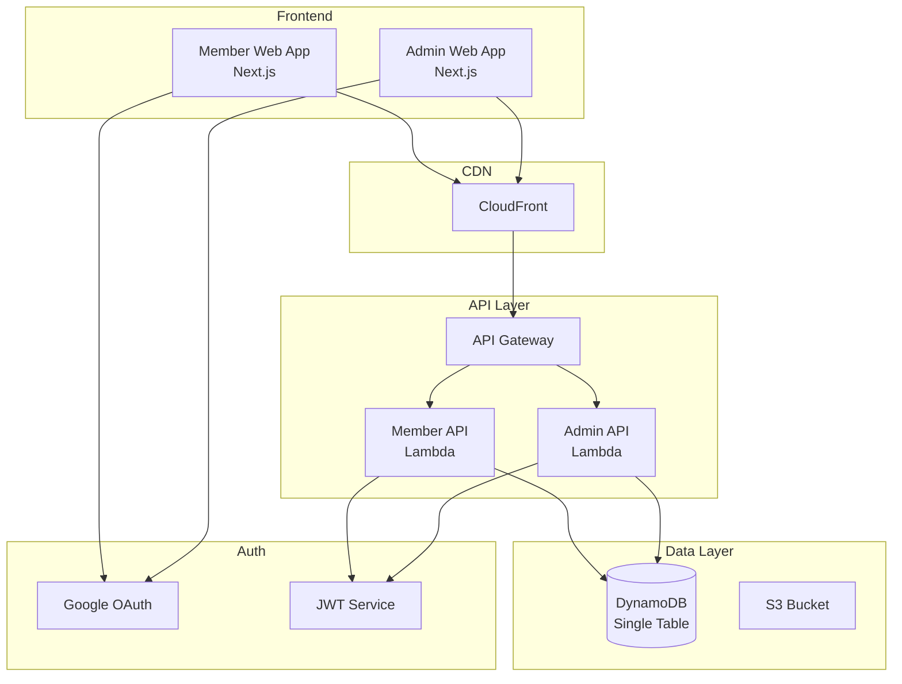

# TASK-025: Developer Documentation

**Priority**: Medium  
**Estimated**: 2 hours  
**Dependencies**: All tasks

## Prerequisites

- 技術文書作成の経験
- Markdown の知識
- アーキテクチャ図作成ツールの使用経験

## Reference Implementation

- Primary: `@docs/impl/documentation/readme-template.md` - READMEテンプレート
- Secondary: `@docs/impl/documentation/api-docs.md` - APIドキュメント

## Acceptance Criteria

- [ ] Getting Started ガイドが作成されている
- [ ] アーキテクチャ図が作成されている
- [ ] API ドキュメントが完成している
- [ ] デプロイガイドが作成されている
- [ ] トラブルシューティングガイドがある
- [ ] 実例付きで説明されている

## Detailed Implementation

### Main README
```markdown
# Ultimate Type Safety Serverless Template


エンタープライズグレードのサーバーレスアプリケーションテンプレート。完全な型安全性、ゼロランタイムエラー、30分以内のセットアップを実現。

## 🚀 Features

- **完全な型安全性**: 8レベルのESLint設定でanyを完全排除
- **モノレポ構造**: pnpm workspaceによる効率的なパッケージ管理
- **認証システム**: Google OAuth + JWT による安全な認証
- **マルチテナント**: メンバー用・管理者用の独立したアプリケーション
- **Infrastructure as Code**: AWS CDK v2による完全なIaC
- **自動化**: GitHub Actions による CI/CD パイプライン

## 📋 Prerequisites

- Node.js 22.x
- pnpm 8.x
- Docker Desktop
- AWS アカウント
- Google Cloud Console アクセス（OAuth用）

## 🏃 Quick Start

```bash
# リポジトリのクローン
git clone https://github.com/user/serverless-template.git
cd serverless-template

# 依存関係のインストール
pnpm install

# 初期セットアップ（対話式）
pnpm init

# 開発環境の起動
docker compose up -d
pnpm dev
```

アプリケーションは以下のURLでアクセス可能:
- メンバーアプリ: http://localhost:3000
- 管理者アプリ: http://localhost:3001
- メンバーAPI: http://localhost:3100
- 管理者API: http://localhost:3101

## 🏗️ Project Structure

```
.
├── apps/                    # アプリケーション
│   ├── web-member/         # メンバー用Next.jsアプリ
│   ├── web-admin/          # 管理者用Next.jsアプリ
│   ├── api-member/         # メンバー用API
│   └── api-admin/          # 管理者用API
├── packages/               # 共有パッケージ
│   ├── shared/            # 共有ユーティリティ・型定義
│   ├── ui/                # UIコンポーネントライブラリ
│   ├── infra/             # CDKインフラストラクチャ
│   └── functions/         # Lambda関数
├── docs/                   # ドキュメント
│   └── impl/              # 実装ガイド
├── scripts/               # ユーティリティスクリプト
└── .github/               # GitHub Actions
```

## 🔧 Development

### Available Scripts

```bash
# 開発サーバー起動
pnpm dev

# 型チェック
pnpm type-check

# リント
pnpm lint

# テスト実行
pnpm test
pnpm test:integration
pnpm test:e2e

# ビルド
pnpm build

# CDKデプロイ
pnpm cdk deploy
```

### Environment Variables

```env
# .env.example
PROJECT_NAME=my-serverless-app
AWS_REGION=ap-northeast-1
STAGE=dev

# Google OAuth
GOOGLE_CLIENT_ID=your-client-id
GOOGLE_CLIENT_SECRET=your-client-secret

# JWT
JWT_SECRET=your-jwt-secret

# Optional Features
ENABLE_ASYNC_JOBS=false
ENABLE_SCHEDULED_TASKS=false
```

## 📚 Documentation

- [Getting Started Guide](docs/getting-started.md)
- [Architecture Overview](docs/architecture.md)
- [API Documentation](docs/api.md)
- [Deployment Guide](docs/deployment.md)
- [Troubleshooting](docs/troubleshooting.md)

## 🚀 Deployment

### Development Environment

```bash
pnpm cdk deploy --context stage=dev
```

### Production Environment

```bash
pnpm cdk deploy --context stage=prod --require-approval any-change
```

詳細は[Deployment Guide](docs/deployment.md)を参照。

## 🧪 Testing

```bash
# ユニットテスト
pnpm test

# 統合テスト
pnpm test:integration

# E2Eテスト
pnpm test:e2e

# カバレッジレポート
pnpm test --coverage
```

## 🔒 Security

- JWT RS256署名
- httpOnly Cookieでのトークン管理
- OWASP Top 10準拠
- AWS IAM最小権限原則

## 📝 License

MIT License - see [LICENSE](LICENSE) file for details.

## 🤝 Contributing

[Contributing Guide](CONTRIBUTING.md)を参照してください。

## 💬 Support

- GitHub Issues: バグ報告・機能要望
- Discussions: 質問・議論
- Email: support@example.com
```

### Architecture Overview
```markdown
# Architecture Overview

## System Architecture



## Technology Stack

### Frontend
- **Framework**: Next.js 14 (App Router)
- **UI Library**: shadcn/ui + Tailwind CSS
- **State Management**: React Context + SWR
- **Type Safety**: TypeScript 5.6

### Backend
- **Runtime**: Node.js 22 on AWS Lambda
- **API**: REST API with API Gateway
- **Database**: DynamoDB (Single Table Design)
- **Authentication**: Google OAuth 2.0 + JWT

### Infrastructure
- **IaC**: AWS CDK v2
- **CI/CD**: GitHub Actions
- **Monitoring**: CloudWatch + X-Ray
- **Security**: AWS WAF + Secrets Manager

## Design Patterns

### Single Table Design (DynamoDB)

| PK | SK | GSI1PK | GSI1SK | Attributes |
|---|---|---|---|---|
| USER#123 | USER#123 | EMAIL#user@example.com | USER#123 | name, role, createdAt |
| USER#123 | SESSION#456 | - | - | token, expiresAt |

### Clean Architecture Layers

```
┌─────────────────────────────────┐
│      Presentation Layer         │ ← Next.js Pages/Components
├─────────────────────────────────┤
│      Application Layer          │ ← Use Cases/Services
├─────────────────────────────────┤
│        Domain Layer             │ ← Entities/Business Logic
├─────────────────────────────────┤
│     Infrastructure Layer        │ ← Database/External APIs
└─────────────────────────────────┘
```

## Security Architecture

- **Authentication**: Google OAuth 2.0 with PKCE
- **Authorization**: Role-based (member/admin)
- **Token Management**: JWT RS256 in httpOnly cookies
- **API Security**: Rate limiting, CORS, input validation
- **Infrastructure**: VPC isolation, encryption at rest/transit
```

### API Documentation
```markdown
# API Documentation

Base URLs:
- Member API: `https://api.example.com/member`
- Admin API: `https://api.example.com/admin`

## Authentication

All API requests require authentication via JWT token in httpOnly cookie.

```http
Cookie: auth-token=<jwt-token>
```

## Member API Endpoints

### Get Profile
```http
GET /api/profile
```

Response:
```json
{
  "data": {
    "id": "123e4567-e89b-12d3-a456-426614174000",
    "email": "user@example.com",
    "name": "John Doe",
    "role": "member",
    "createdAt": "2024-01-01T00:00:00Z",
    "updatedAt": "2024-01-01T00:00:00Z"
  }
}
```

### Update Profile
```http
PUT /api/profile
Content-Type: application/json

{
  "name": "Jane Doe"
}
```

## Admin API Endpoints

### List Users
```http
GET /api/users?limit=20&cursor=xxx&role=member
```

Response:
```json
{
  "data": [
    {
      "id": "123e4567-e89b-12d3-a456-426614174000",
      "email": "user@example.com",
      "name": "John Doe",
      "role": "member",
      "createdAt": "2024-01-01T00:00:00Z"
    }
  ],
  "pagination": {
    "limit": 20,
    "nextCursor": "eyJQSyI6IlVTRVIjMTIzIn0="
  }
}
```

### Create User
```http
POST /api/users
Content-Type: application/json

{
  "email": "newuser@example.com",
  "name": "New User",
  "role": "member"
}
```

## Error Responses

```json
{
  "error": "Validation error",
  "details": [
    {
      "field": "email",
      "message": "Invalid email format"
    }
  ]
}
```

## Rate Limiting

- 60 requests per minute per IP
- 429 Too Many Requests with Retry-After header

## OpenAPI Specification

Interactive documentation available at:
- Member API: https://api.example.com/member/docs
- Admin API: https://api.example.com/admin/docs
```

### Deployment Guide
```markdown
# Deployment Guide

## Prerequisites

1. AWS Account with appropriate permissions
2. AWS CLI configured
3. CDK bootstrapped in target region
4. Environment variables set

## Environment Setup

### 1. AWS Credentials

```bash
# Configure AWS profile
aws configure --profile serverless-template

# Export profile
export AWS_PROFILE=serverless-template
```

### 2. Secrets Management

```bash
# Create secrets in AWS Secrets Manager
aws secretsmanager create-secret \
  --name /serverless-template/dev/google-oauth \
  --secret-string '{
    "clientId": "your-client-id",
    "clientSecret": "your-client-secret"
  }'
```

### 3. Environment Variables

```bash
# Copy example and edit
cp .env.example .env
```

## Deployment Steps

### Development Environment

```bash
# 1. Install dependencies
pnpm install

# 2. Build applications
pnpm build

# 3. Run CDK diff to preview changes
pnpm cdk diff --context stage=dev

# 4. Deploy
pnpm cdk deploy --context stage=dev
```

### Production Environment

```bash
# 1. Update production config
export AWS_PROFILE=serverless-template-prod

# 2. Deploy with manual approval
pnpm cdk deploy --context stage=prod --require-approval any-change

# 3. Run smoke tests
pnpm test:smoke --env=prod
```

## Post-Deployment

### 1. Verify Resources

```bash
# Check CloudFormation stacks
aws cloudformation list-stacks --stack-status-filter CREATE_COMPLETE

# Verify API endpoints
curl https://api.example.com/health
```

### 2. Configure DNS

1. Get CloudFront distribution domain
2. Create CNAME record in Route53
3. Update certificate if needed

### 3. Monitor Deployment

- CloudWatch Dashboard: https://console.aws.amazon.com/cloudwatch
- X-Ray Service Map: https://console.aws.amazon.com/xray
- Cost Explorer: Monitor deployment costs

## Rollback Procedure

```bash
# 1. Identify previous version
aws cloudformation list-stack-resources \
  --stack-name prod-serverless-template

# 2. Rollback to previous version
pnpm cdk deploy --context stage=prod \
  --rollback --version-number=previous

# 3. Verify rollback
pnpm test:smoke --env=prod
```

## Troubleshooting

### Common Issues

1. **Deployment Timeout**
   - Increase Lambda timeout in CDK
   - Check CloudWatch logs

2. **Permission Errors**
   - Verify IAM roles
   - Check resource policies

3. **Domain Issues**
   - Verify certificate validation
   - Check DNS propagation
```

### Troubleshooting Guide
```markdown
# Troubleshooting Guide

## Common Issues

### Development Environment

#### Docker Issues

**Problem**: Docker containers won't start
```bash
docker compose up
# Error: Cannot connect to Docker daemon
```

**Solution**:
1. Ensure Docker Desktop is running
2. Reset Docker credentials: `docker logout && docker login`
3. Clean up: `docker system prune -a`

#### Type Errors

**Problem**: TypeScript errors after package updates
```bash
pnpm type-check
# Error: Type 'X' is not assignable to type 'Y'
```

**Solution**:
1. Clear TypeScript cache: `pnpm tsc --build --clean`
2. Reinstall dependencies: `rm -rf node_modules && pnpm install`
3. Update type definitions: `pnpm add -D @types/node@latest`

### API Issues

#### Authentication Failures

**Problem**: 401 Unauthorized errors
```json
{
  "error": "Unauthorized"
}
```

**Solution**:
1. Check JWT expiration
2. Verify cookie settings
3. Confirm Google OAuth credentials

#### CORS Errors

**Problem**: CORS policy blocking requests

**Solution**:
1. Verify API Gateway CORS configuration
2. Check allowed origins in CDK
3. Ensure credentials: 'include' in fetch

### Database Issues

#### DynamoDB Throttling

**Problem**: ProvisionedThroughputExceededException

**Solution**:
1. Switch to on-demand billing
2. Implement exponential backoff
3. Review access patterns

### Deployment Issues

#### CDK Deployment Failures

**Problem**: CloudFormation stack rollback

**Solution**:
1. Check CloudFormation events
2. Review IAM permissions
3. Validate environment variables

```bash
# Debug deployment
cdk deploy --verbose --debug
```

## Debug Commands

### Logs

```bash
# Application logs
pnpm logs:member
pnpm logs:admin

# Lambda logs
aws logs tail /aws/lambda/dev-member-api --follow

# CDK logs
cdk doctor
```

### Health Checks

```bash
# API health
curl -I https://api.example.com/health

# Database connection
aws dynamodb describe-table --table-name dev-serverless-template
```

### Performance

```bash
# Lambda metrics
aws cloudwatch get-metric-statistics \
  --namespace AWS/Lambda \
  --metric-name Duration \
  --dimensions Name=FunctionName,Value=dev-member-api \
  --start-time 2024-01-01T00:00:00Z \
  --end-time 2024-01-02T00:00:00Z \
  --period 300 \
  --statistics Average
```

## Support Channels

1. **GitHub Issues**: Bug reports and feature requests
2. **Stack Overflow**: Tag with `serverless-template`
3. **Discord**: Real-time community support
4. **Email**: support@example.com

## Useful Resources

- [AWS Lambda Best Practices](https://docs.aws.amazon.com/lambda/latest/dg/best-practices.html)
- [Next.js Debugging](https://nextjs.org/docs/advanced-features/debugging)
- [DynamoDB Troubleshooting](https://docs.aws.amazon.com/amazondynamodb/latest/developerguide/Programming.Errors.html)
```

## Quality Gates

- Documentation completeness: 100%
- Code examples: Working and tested
- Diagrams: Clear and accurate
- Links: All valid and accessible

## Verification Steps

```bash
# Markdownリント
pnpm add -D markdownlint-cli
npx markdownlint docs/**/*.md

# リンクチェック
pnpm add -D markdown-link-check
find docs -name "*.md" -exec npx markdown-link-check {} \;

# スペルチェック
pnpm add -D cspell
npx cspell "docs/**/*.md"

# ドキュメントビルド（Docusaurus等を使用する場合）
cd docs-site
pnpm build
pnpm serve
```

## Output

- 完全な開発者ドキュメント
- 実例付きガイド
- トラブルシューティング手順

## Progress

- [ ] Started
- [ ] Implementation complete
- [ ] Verified
- [ ] Documented